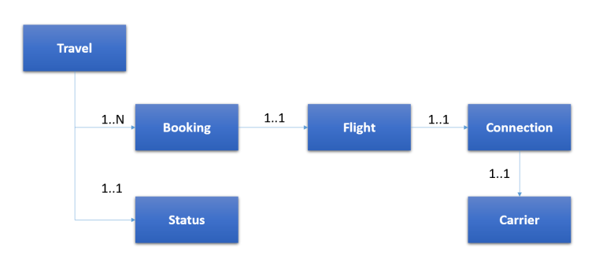
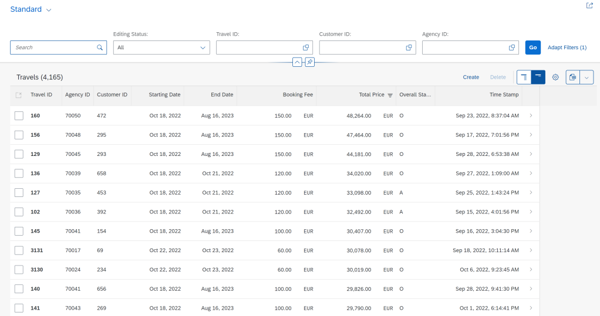
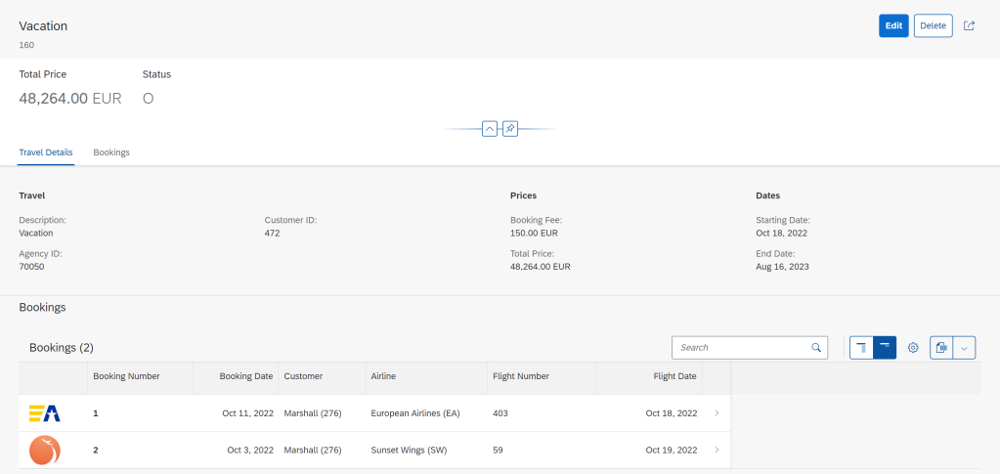
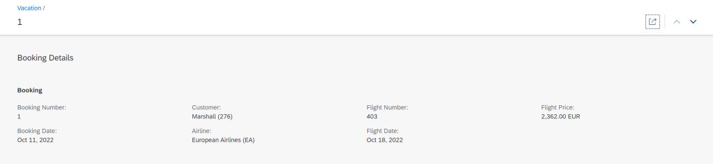
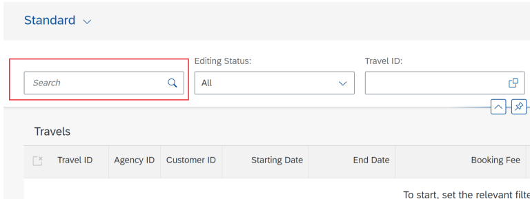
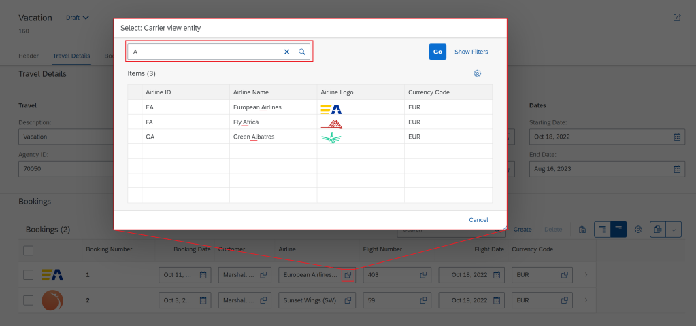
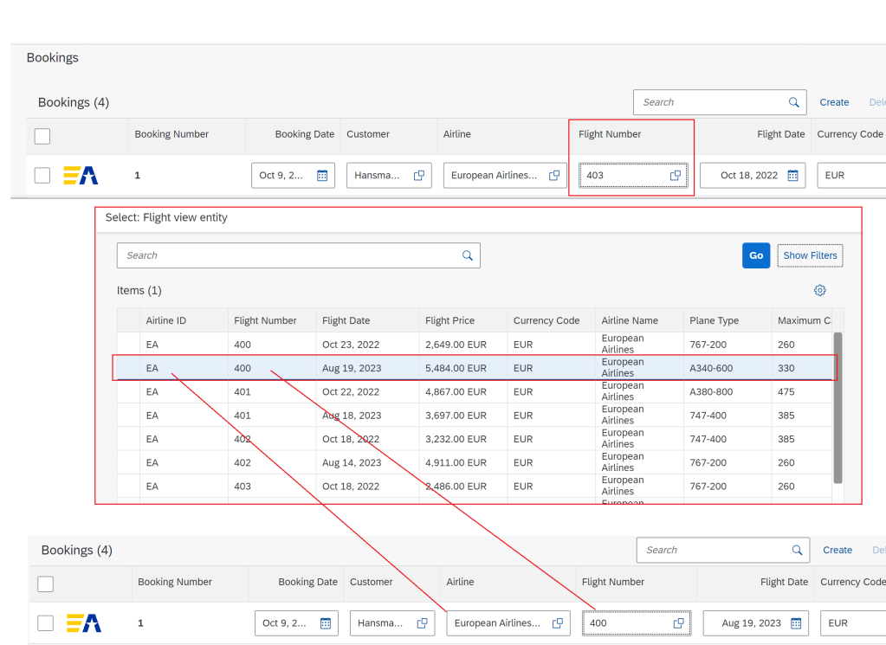

# ABAP RESTful Application Programming Model [14] – Travel Service – Understanding CDS Entities

In this post, you will understand CDS Entities in more detail. This will cover below.

1. Data Model Overview
2. Application Overview
3. Supporting CDS View Entities
4. Root View Entity, Child View Entity, and parent-child / composition relationship
5. Annotations used within entities and the impact on the application
6. New Keywords used within entities

## Travel Application
### Data Model



### List Page for Travels



### Navigation to Object Page for Travel



### Navigation to Object Page for Booking



## Supporting CDS View Entities
These entities are used to provide additional details about the main entities i.e. Travel and Booking. The application is built around the root entity Travel which contains multiple bookings.

```
Here is the source of CDS Entities. Any statements or annotations that we should be paying attention to are mentioned in the table below each CDS Entity source.
```

### Carrier

```
@AccessControl.authorizationCheck: #NOT_REQUIRED
@EndUserText.label: 'Carrier view entity'
@Search.searchable: true
define view entity zi_fe_carr_001811
  as select from zfe_acarr_001811 as Airline
  association [0..1] to I_Currency as _Currency on $projection.CurrencyCode = _Currency.Currency
{
      @Search.defaultSearchElement: true
      @ObjectModel.text.element: [ 'Name' ]
  key Airline.carrier_id      as AirlineID,
      @Search.defaultSearchElement: true
      @Search.fuzzinessThreshold: 0.7
      @Semantics.text: true
      Airline.name            as Name,
      @Semantics.imageUrl: true
      Airline.carrier_pic_url as AirlinePicURL,
      Airline.currency_code   as CurrencyCode,
      _Currency

}
```

|||
|:-:|:-:|
|@AccessControl.authorizationCheck: #NOT_REQUIRED	| No authorization check is required|
|@Search.searchable: true @Search.defaultSearchElement: true @Search.fuzzinessThreshold: 0.7	| Annotations at the header level and field level to enable automatic search from the filter bar. (See below – Image1) |
|@Semantics.imageUrl: true | Annotation for setting image URL property|



Image1 Default search box (This is only for demonstration – this is not for the same entity)

### Connection

```
@AccessControl.authorizationCheck: #NOT_REQUIRED
@EndUserText.label: 'Connection view entity'
@Search.searchable: true
define view entity zi_fe_conn_001811

  as select from zfe_aconn_001811 as Connection
  association [1..1] to zi_fe_carr_001811 as _Airline on $projection.AirlineID = _Airline.AirlineID
{
      @Search.defaultSearchElement: true
      @Search.fuzzinessThreshold: 0.8
      @ObjectModel.text.association: '_Airline'
      @Consumption.valueHelpDefinition: [ {
        entity: {
          name: 'zi_fe_carr_001811',
          element: 'AirlineID'
        }
      } ]
  key Connection.carrier_id      as AirlineID,
  key Connection.connection_id   as ConnectionID,
      @Consumption.valueHelpDefinition: [ {
        entity: {
          name: '/DMO/I_Airport',
          element: 'AirportID'
        }
      } ]
      Connection.airport_from_id as DepartureAirport,
      @Consumption.valueHelpDefinition: [ {
        entity: {
          name: '/DMO/I_Airport',
          element: 'AirportID'
        }
      } ]
      Connection.airport_to_id   as DestinationAirport,
      Connection.departure_time  as DepartureTime,
      Connection.arrival_time    as ArrivalTime,
      //@Semantics.quantity.unitOfMeasure: 'DistanceUnit'
      //Connection.distance as Distance,
      //Connection.distance_unit as DistanceUnit,
      _Airline

}
```

Note: The properties Distance and DistanceUnit are commented out due to data-related issues.

```
@ObjectModel.text.association: '_Airline'
@Consumption.valueHelpDefinition: [ {
entity: {
name: 'zi_fe_carr_001811',
element: 'AirlineID'
}
} ]
key Connection.carrier_id as AirlineID,

Value help (F4 help in SAP GUI terms) is enabled with this annotation. For the search, the text can also be used from association _Airline. See below Image2
```



Image2 F4 help and search


### Flight

```
@AccessControl.authorizationCheck: #NOT_REQUIRED
@EndUserText.label: 'Flight view entity'
@Search.searchable: true
define view entity zi_fe_flig_001811

  as select from zfe_aflig_001811 as Flight
  association [1]    to zi_fe_carr_001811 as _Airline    on  $projection.AirlineID    = _Airline.AirlineID
  association [1]    to zi_fe_conn_001811 as _Connection on  $projection.ConnectionID = _Connection.ConnectionID
                                                         and $projection.AirlineID    = _Connection.AirlineID
  association [0..1] to I_Currency        as _Currency   on  $projection.CurrencyCode = _Currency.Currency
{
      @Search.defaultSearchElement: true
      @Search.fuzzinessThreshold: 0.8
      @ObjectModel.text.association: '_Airline'
      @Consumption.valueHelpDefinition: [ {
        entity: {
          name: 'zi_fe_carr_001811',
          element: 'AirlineID'
        }
      } ]
  key Flight.carrier_id     as AirlineID,

      @Search.defaultSearchElement: true
      @Search.fuzzinessThreshold: 0.8
      @Consumption.valueHelpDefinition: [ {
        entity: {
          name: 'zi_fe_conn_001811',
          element: 'ConnectionID'
        },
        additionalBinding: [ {
          element: 'AirlineID',
          localElement: 'AirlineID'
        } ]
      } ]
  key Flight.connection_id  as ConnectionID,

  key Flight.flight_date    as FlightDate,

      @Semantics.amount.currencyCode: 'CurrencyCode'
      Flight.price          as Price,

      Flight.currency_code  as CurrencyCode,
      Flight.plane_type_id  as PlaneType,
      Flight.seats_max      as MaximumSeats,
      Flight.seats_occupied as OccupiedSeats,
      _Airline,
      _Connection,
      _Currency

}
```

```
key Flight.carrier_id as AirlineID,
@Search.defaultSearchElement: true
@Search.fuzzinessThreshold: 0.8
@Consumption.valueHelpDefinition: [ {
    entity: {
        name: 'zi_fe_conn_001811',
        element: 'ConnectionID'
    },
    additionalBinding: [ {
        element: 'AirlineID',
        localElement: 'AirlineID'
    } ]
} ]
key Flight.connection_id as ConnectionID,
```
	Value help (F4 help in SAP GUI terms) is enabled with this annotation.

    The additionalBinding key-word is used to populate additional properties on the screen. Refer Image3



Image3 When Flight Number is selected, Airline ID is automatically populated.

### Status

```
@AccessControl.authorizationCheck: #NOT_REQUIRED
@EndUserText.label: 'Travel Status view entity'
define view entity zi_fe_stat_001811

  as select from zfe_astat_001811 as Status
{
      @UI.textArrangement: #TEXT_ONLY
      @ObjectModel.text.element: [ 'TravelStatusText' ]
  key Status.travel_status_id   as TravelStatusId,
      @UI.hidden: true
      Status.travel_status_text as TravelStatusText

}
```

```
@UI.hidden: true	
This field will not be displayed in UI
```

## Primary Entities
Travel and Booking are the primary entities of this application. The application looks like below.

### Base Entities
- For the primary entities, we have base views and then we have consumption layer entities which are the projection of the base entities.
- Travel and Booking form a parent-child relationship and both entities have to be activated together as they are dependent on each other

```
@AccessControl.authorizationCheck: #NOT_REQUIRED
@Metadata.allowExtensions: true
@EndUserText.label: 'CDS View forTravel'
define root view entity ZI_FE_Travel_001811
  as select from zfe_atrav_001811
  association [0..1] to /DMO/I_Agency        as _Agency       on $projection.AgencyID = _Agency.AgencyID
  association [0..1] to I_Currency           as _Currency     on $projection.CurrencyCode = _Currency.Currency
  association [0..1] to /DMO/I_Customer      as _Customer     on $projection.CustomerID = _Customer.CustomerID
  association [0..1] to zi_fe_stat_001811    as _TravelStatus on $projection.OverallStatus = _TravelStatus.TravelStatusId
  composition [0..*] of ZI_FE_Booking_001811 as _Booking
{
  key travel_uuid           as TravelUUID,
      travel_id             as TravelID,
      agency_id             as AgencyID,
      customer_id           as CustomerID,
      begin_date            as BeginDate,
      end_date              as EndDate,
      @Semantics.amount.currencyCode: 'CurrencyCode'
      booking_fee           as BookingFee,
      @Semantics.amount.currencyCode: 'CurrencyCode'
      total_price           as TotalPrice,
      currency_code         as CurrencyCode,
      description           as Description,
      overall_status        as OverallStatus,
      @Semantics.user.createdBy: true
      created_by            as CreatedBy,
      @Semantics.systemDateTime.createdAt: true
      created_at            as CreatedAt,
      @Semantics.user.lastChangedBy: true
      last_changed_by       as LastChangedBy,
      @Semantics.systemDateTime.lastChangedAt: true
      last_changed_at       as LastChangedAt,
      @Semantics.systemDateTime.localInstanceLastChangedAt: true
      local_last_changed_at as LocalLastChangedAt,
      _Booking,
      _Agency,
      _Currency,
      _Customer,
      _TravelStatus
}
```

|   |   |
|:-:|:-:|
|@Metadata.allowExtensions: true |Annotation to allow Metadata Extension |
|define root view entity | Used to define the parent entity (Travel)|
|composition [0..*] of ZI_FE_Booking_001811 as _Booking | A special type of association with child|
|@Semantics.amount.currencyCode: 'CurrencyCode' | Annotation for providing currency reference field |
|@Semantics.user.createdBy: true	|Annotation for the field – created by|
|@Semantics.systemDateTime.createdAt: true	|Annotation for the field – created at|
|@Semantics.systemDateTime.lastChangedAt: true @Semantics.systemDateTime.localInstanceLastChangedAt: true	|Annotation for the field – last changed at|

```
@AccessControl.authorizationCheck: #CHECK
@Metadata.allowExtensions: true
@EndUserText.label: 'CDS View forBooking'
define view entity ZI_FE_Booking_001811

  as select from zfe_abook_001811
  association to parent ZI_FE_Travel_001811 as _Travel on $projection.TravelUUID = _Travel.TravelUUID
  association [1..1] to zi_fe_conn_001811 as _Connection on  $projection.CarrierID    = _Connection.AirlineID
                                                         and $projection.ConnectionID = _Connection.ConnectionID
  association [1..1] to zi_fe_flig_001811          as _Flight     on  $projection.CarrierID    = _Flight.AirlineID
                                                                  and $projection.ConnectionID = _Flight.ConnectionID
                                                                  and $projection.FlightDate   = _Flight.FlightDate
  association [1..1] to zi_fe_carr_001811          as _Carrier    on  $projection.CarrierID = _Carrier.AirlineID
  association [0..1] to I_Currency                 as _Currency   on  $projection.CurrencyCode = _Currency.Currency
  association [1..1] to /DMO/I_Customer            as _Customer   on  $projection.CustomerID = _Customer.CustomerID
{
  key booking_uuid          as BookingUUID,
      travel_uuid           as TravelUUID,
      booking_id            as BookingID,
      booking_date          as BookingDate,
      customer_id           as CustomerID,
      carrier_id            as CarrierID,
      connection_id         as ConnectionID,
      flight_date           as FlightDate,
      @Semantics.amount.currencyCode: 'CurrencyCode'
      flight_price          as FlightPrice,
      currency_code         as CurrencyCode,
      @Semantics.user.createdBy: true
      created_by            as CreatedBy,
      @Semantics.user.lastChangedBy: true
      last_changed_by       as LastChangedBy,
      @Semantics.systemDateTime.localInstanceLastChangedAt: true
      local_last_changed_at as LocalLastChangedAt,
      _Travel,
      _Connection,
      _Flight,
      _Carrier,
      _Currency,
      _Customer

}
```

```
association to parent ZI_FE_Travel_001811	Annotation to parent Root View Entity
```

### Consumption Entities

```
@AccessControl.authorizationCheck: #CHECK
@Metadata.allowExtensions: true
@EndUserText.label: 'Projection View forTravel'
@ObjectModel.semanticKey: [ 'TravelID' ]
@Search.searchable: true
define root view entity ZC_FE_Travel_001811

  as projection on ZI_FE_Travel_001811
{
  key TravelUUID,
      @Search.defaultSearchElement: true
      @Search.fuzzinessThreshold: 0.90
      TravelID,
      @Consumption.valueHelpDefinition: [ {
        entity: {
          name: '/DMO/I_Agency',
          element: 'AgencyID'
        }
      } ]
      AgencyID,
      CustomerID,
      BeginDate,
      EndDate,
      @Semantics.amount.currencyCode: 'CurrencyCode'
      BookingFee,
      @Semantics.amount.currencyCode: 'CurrencyCode'
      TotalPrice,
      @Consumption.valueHelpDefinition: [ {
        entity: {
          name: 'I_Currency',
          element: 'Currency'
        }
      } ]
      CurrencyCode,
      Description,
      OverallStatus,
      CreatedBy,
      CreatedAt,
      LastChangedBy,
      LastChangedAt,
      LocalLastChangedAt,
      _Booking : redirected to composition child ZC_FE_Booking_001811,
      _Agency,
      _Currency,
      _Customer,
      _TravelStatus

}
```
```
define root view entity ZC_FE_Travel_001811 as projection on ZI_FE_Travel_001811	

The root view entity is a projection on another root view entity

_Booking : redirected to composition child ZC_FE_Booking_001811	

In the projection list, reference to the child is mandatory
```

```
@AccessControl.authorizationCheck: #CHECK
@Metadata.allowExtensions: true
@EndUserText.label: 'Projection View forBooking'
@ObjectModel.semanticKey: [ 'BookingID' ]
@Search.searchable: true
define view entity ZC_FE_Booking_001811

  as projection on ZI_FE_Booking_001811
{
  key BookingUUID,
      TravelUUID,
      @Search.defaultSearchElement: true
      @Search.fuzzinessThreshold: 0.90
      BookingID,
      BookingDate,

      @Consumption.valueHelpDefinition: [ {
        entity: {
          name: '/DMO/I_Customer',
          element: 'CustomerID'
        }
      } ]
      @EndUserText.label: 'Customer'
      @ObjectModel.text.element: ['LastName']
      CustomerID,
      _Customer.LastName as LastName,

      @Consumption.valueHelpDefinition: [ {
        entity: {
          name: 'zi_fe_carr_001811',
          element: 'AirlineID'
        }
      } ]
      @EndUserText.label: 'Airline'
      @ObjectModel.text.element: ['CarrierName']
      CarrierID,
      _Carrier.Name      as CarrierName,

      @Consumption.valueHelpDefinition: [ {
        entity: {
          name: 'zi_fe_flig_001811',
          element: 'ConnectionID'
        },
        additionalBinding: [ {
          localElement: 'FlightDate',
          element: 'FlightDate'
        }, {
          localElement: 'CarrierID',
          element: 'AirlineID'
        }, {
          localElement: 'FlightPrice',
          element: 'Price'
        }, {
          localElement: 'CurrencyCode',
          element: 'CurrencyCode'
        } ]
      } ]
      ConnectionID,
      FlightDate,
      @Semantics.amount.currencyCode: 'CurrencyCode'
      FlightPrice,
      @Consumption.valueHelpDefinition: [ {
        entity: {
          name: 'I_Currency',
          element: 'Currency'
        }
      } ]
      CurrencyCode,
      CreatedBy,
      LastChangedBy,
      LocalLastChangedAt,
      _Travel : redirected to parent ZC_FE_Travel_001811,
      _Connection,
      _Flight,
      _Carrier,
      _Currency,
      _Customer

}
```

```
define view entity ZC_FE_Booking_001811 as projection on ZI_FE_Booking_001811	

The view entity is a projection on another view entity

_Travel : redirected to parent ZC_FE_Travel_001811	

In the projection list, reference to the parent is mandatory
```

Both these projection entities are dependent on each other and should be activated together when created for the first time. This is only applicable when you are manually creating such entities.