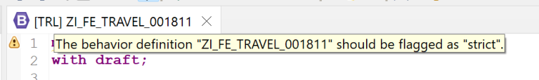

# ABAP RESTful Application Programming Model [15] – Travel Service – Behavior Definition

In this post, we will understand the Behavior Definition. This application is based on Managed Scenario.

## Behavior Definition

- One application is based on one Behavior Definition. Even if we have multiple entities involved where CRUD operations are implemented, we will have a single behavior definition where the behavior for multiple entities will be defined.
- The Behavior Definition is also created at two levels. We have a base definition and then we have its projection as well. This is similar to CDS View Entities.

Let us look at the source code.

```
managed;
with draft;

define behavior for ZI_FE_Travel_001811 alias Travel
implementation in class ZBP_I_FE_Travel_001811 unique
persistent table zfe_atrav_001811
draft table zfe_dtrav_001811
etag master LocalLastChangedAt
lock master total etag LastChangedAt

{
  field ( readonly ) TravelID;
  field ( numbering : managed ) TravelUUID;

  create;
  update;
  delete;

  draft action Edit;
  draft action Activate;
  draft action Discard;
  draft action Resume;
  draft determine action Prepare;

  mapping for ZFE_ATRAV_001811
  {
    TravelUUID = TRAVEL_UUID;
    TravelID = TRAVEL_ID;
    AgencyID = AGENCY_ID;
    CustomerID = CUSTOMER_ID;
    BeginDate = BEGIN_DATE;
    EndDate = END_DATE;
    BookingFee = BOOKING_FEE;
    TotalPrice = TOTAL_PRICE;
    CurrencyCode = CURRENCY_CODE;
    Description = DESCRIPTION;
    OverallStatus = OVERALL_STATUS;
    CreatedBy = CREATED_BY;
    CreatedAt = CREATED_AT;
    LastChangedBy = LAST_CHANGED_BY;
    LastChangedAt = LAST_CHANGED_AT;
    LocalLastChangedAt = LOCAL_LAST_CHANGED_AT;
  }

  association _Booking { create; with draft; }
  determination CalculateTravelID on save { create; }
}

define behavior for ZI_FE_Booking_001811 alias Booking
implementation in class ZBP_I_FE_Booking_001811 unique
persistent table zfe_abook_001811
draft table zfe_dbook_001811
etag master LocalLastChangedAt
lock dependent by _Travel

{
  field ( readonly )
  TravelUUID,
  BookingID;

  field ( numbering : managed )
  BookingUUID;


  update;
  delete;

  mapping for ZFE_ABOOK_001811
  {
    BookingUUID = BOOKING_UUID;
    TravelUUID = TRAVEL_UUID;
    BookingID = BOOKING_ID;
    BookingDate = BOOKING_DATE;
    CustomerID = CUSTOMER_ID;
    CarrierID = CARRIER_ID;
    ConnectionID = CONNECTION_ID;
    FlightDate = FLIGHT_DATE;
    FlightPrice = FLIGHT_PRICE;
    CurrencyCode = CURRENCY_CODE;
    CreatedBy = CREATED_BY;
    LastChangedBy = LAST_CHANGED_BY;
    LocalLastChangedAt = LOCAL_LAST_CHANGED_AT;
  }

  association _Travel { with draft; }

  determination CalculateBookingID on save { create; }
}
```

Now, let us understand each part. For better understanding, the mapping part is collapsed.

managed;


The keyword managed means this is a managed scenario. Here, RAP Framework takes care of CRUD operations. The other scenario is called Unmanaged where the developer has to write the code to handle CRUD operations.

With the managed keyword, it is mandatory to specify the persistent tables for each entity.

    persistent table zfe_atrav_001811
    persistent table zfe_abook_001811

The line also shows a warning symbol. The warning says that the definition should be flagged as strict.



strict applies additional syntax checks to behavior definitions, any outdated syntax can not be used and implicit operations are required to be declared explicitly. There are two modes currently.

- Strict mode version 1, specified using strict
- Strict mode version 2, specified using strict(2)

Use the latest mode i.e. strict(2) in all your developments. The reason it is not used here is that we generated the service using SAP provided generator which generated the code without the strict keyword.

with draft;


with draft is used for enabling draft functionality. Along with this statement, we also need to specify the draft tables for both entities.

    draft table zfe_dtrav_001811
    draft table zfe_dbook_001811

The draft actions should also be mentioned.

    draft action Edit;   
    draft action Activate;   
    draft action Discard;   
    draft action Resume;   
    draft determine action Prepare;

```
Draft Action

draft action Edit;	
- Copies the content from persistent table to the draft table

draft action Activate;	
- Copies the content of the draft database table to the persistent database table and clears the draft database table

draft action Discard;	
- Clears all entries from the draft database table

draft action Resume;	
- Sets a lock for an entity instance on the persistent database table

draft determine action Prepare;	
- Determine actions allow the consumer to execute determinations and validations. Draft determine action is draft equivalent of the determine actions.
```

Reference : [ABAP language help](https://help.sap.com/doc/abapdocu_cp_index_htm/CLOUD/en-US/abenbdl_draft_action.htm)


The draft tables should not be created manually. Use quick-fix functionality to create the draft tables. The draft table has all the fields from the persistent table and the field "%admin" which is the addition for draft management.


The draft functionality can be observed by creating a new Travel or editing existing travel. Let us see how the draft functionality works.

Start the application. Display any Travel by clicking on the row.


Click on Edit.


You can see the draft is created. At the bottom right, you can also see discard draft button along with Save.


You can discard draft from here.


Go back to edit and change some data in draft mode. If the application is disconnected at this point and you restart the application, the draft can be seen on the list page as well.


Once the data is saved. Draft is cleared.

    define behavior for ZI_FE_Travel_001811 alias Travel

The statement specifies the Root View entity for which the behavior is defined. If we have child entities, then we have this statement for the child entity as well.


    implementation in class ZJP_I_FE_Travel_001811 unique

This statement specifies the implementation class where additional determinations and validation can be implemented. In unmanaged scenario, the class implements all actions as well.

The mandatory addition unique defines that each operation can be implemented exactly once.


The class is only abstract class and the actual code can be found in the Local Types tab. We will see more on this in subsequent posts.


    etag master LocalLastChangedAt;

Defines an entity as ETag master and assigns a field for change logging. The dependent entity can use etag dependent by _Assoc as well.


    lock master total etag LastChangedAt

This statement specifies locking mechanism. Lock master entities are locked on each locking request of one of their lock-dependent entities.


    field ( readonly ) TravelID;

This statement marks the readonly fields. All the fields mentioned after field ( readonly ) will become read-only on application.


This can be seen in edit mode on the application. The property TravelUUID is not shown as per the metadata extension, so even though the behavior definition mentions it as read-only, it is not visible on the application.


All the field options available are as below.

```
field(readonly) Field1, Field2, ...	            Read-only fields
field(mandatory) Field1, Field2, ...	        Mandatory fields
field(suppress) Field1, Field2, ...	            Supressed fields
field(features:instance) Field1, Field2, ...	feature instance fields can be visible based on conditions
field(mandatory:create) Field1, Field2, ...	    mandatory in create mode
field(readonly:update) Field1, Field2, ...	    read-only in update mode
```

    field ( numbering : managed ) TravelUUID;
Defines managed internal numbering for the field. The field is automatically assigned values upon creation of new record. This field has to be a primary key fields with ABAP type raw(16) (UUID).

Similar statement is used for booking entity as well.

    field ( numbering : managed ) BookingUUID;


    create; | update; | delete;

For root entity, we can have create, update and delete operations. For child or dependent entities, we can only specify update and delete as create is dependent on the parent or the root.


    mapping for ZFE_ATRAV_001811

The mapping between entity properties and table fields is provided here. This is similar to the CDS View Entity. We typically use CamelCase for entity properties for better readability. In ABAP we use _ as separator as it is not case sensitive.


When the mappings are expanded they look like below.


    association _Booking { create; with draft; }

Associations to child or parent are specified. We do not need to specify associations for supporting entities which are added in the data model only to provide value helps, names and descriptions.

The create operation for child entity i.e. booking is mentioned in this line.

    association _Booking { create; with draft; }
    association _Travel { with draft; }


    determination CalculateTravelID on save { create; }

A determination modifies fields are properties at different points in time during the runtime. Currently the options are on modify or on save. We can also specify trigger conditions – { create; update; delete } i.e. when a specific operation is carried out or on { field; } when value of a field is changed by create or update operation.

    determination CalculateTravelID on save { create; }
    determination CalculateBookingID on save { create; }


The determination is implemented in the class. Here we have empty methods created by the generator.


So, when we create a new Travel, it will not generate a new travel id. Below two Unnamed objects are created using this application preview and we can see that the number is not generated.


Ideally, we should have a number range generating the next Travel id, but since this is a test application – let us just implement incremental number.

The latest travel id can be seen below..


Implement below code in the method.

```
"Get latest travel id and increment by 1

SELECT FROM zfe_atrav_001811
  FIELDS MAX( travel_id ) INTO @DATA(lv_travelid).
lv_travelid = lv_travelid + 1.

"Modify the entity

MODIFY ENTITIES OF zi_fe_travel_001811 IN LOCAL MODE
  ENTITY travel
  UPDATE FROM VALUE #( FOR travel IN keys
                     ( traveluuid = travel-%key-traveluuid
                       travelid = lv_travelid
                       %control-travelid  = if_abap_behv=>mk-on ) ).
```


Create a new Travel.


The travel id is generated.


Similar, code can be implemented in Booking entity to get the booking ids.

```
CLASS lhc_booking DEFINITION INHERITING FROM cl_abap_behavior_handler.
  PRIVATE SECTION.
    METHODS:
      calculatebookingid FOR DETERMINE ON SAVE
        IMPORTING
          keys FOR  booking~calculatebookingid .
    METHODS : get_new_booking_id IMPORTING iv_bookuuid      TYPE sysuuid_x16
                                 RETURNING VALUE(rv_bookid) TYPE /dmo/booking_id.
ENDCLASS.

CLASS lhc_booking IMPLEMENTATION.
  METHOD calculatebookingid.

    "Get latest booking id within the travel and increment by 1

    SELECT FROM zfe_atrav_001811
      FIELDS MAX( travel_id ) INTO @DATA(lv_travelid).
    lv_travelid = lv_travelid + 1.

    "Modify the entity

    MODIFY ENTITIES OF zi_fe_travel_001811 IN LOCAL MODE
      ENTITY booking
      UPDATE FROM VALUE #( FOR booking IN keys
                         ( bookinguuid = booking-%key-bookinguuid
                           bookingid   = get_new_booking_id( booking-%key-bookinguuid )
                           %control-bookingid = if_abap_behv=>mk-on ) ).


  ENDMETHOD.

  METHOD get_new_booking_id.
    SELECT SINGLE FROM zfe_abook_001811
      FIELDS travel_uuid
      WHERE booking_uuid = @iv_bookuuid
      INTO @DATA(lv_travel_uuid).
    IF sy-subrc EQ 0.

      SELECT FROM zfe_abook_001811
      FIELDS MAX( booking_id )
      WHERE travel_uuid = @lv_travel_uuid
      INTO @rv_bookid.

      rv_bookid = rv_bookid + 1.

    ELSE.
      SELECT SINGLE FROM zfe_dbook_001811
        FIELDS traveluuid
        WHERE bookinguuid = @iv_bookuuid
        INTO @lv_travel_uuid.
      IF sy-subrc EQ 0.
        SELECT FROM zfe_dbook_001811
        FIELDS MAX( bookingid )
        WHERE traveluuid = @lv_travel_uuid
        INTO @rv_bookid.

        rv_bookid = rv_bookid + 1.
      ENDIF.

    ENDIF.
  ENDMETHOD.

ENDCLASS.
```


The modification of the entities and keys will be discussed in more details in subsequent posts.

Once we understand the base behavior definition, the projection is very easy.

## Projection Behavior Definition
Source code

```
projection;
use draft;

define behavior for ZC_FE_Travel_001811 alias Travel

{
  use create;
  use update;
  use delete;

  use action Edit;
  use action Activate;
  use action Discard;
  use action Resume;
  use action Prepare;

  use association _Booking { create; with draft; }
}

define behavior for ZC_FE_Booking_001811 alias Booking

{
  use update;
  use delete;

  use association _Travel { with draft; }
}
```


Projection contains the operations, draft details and associations.