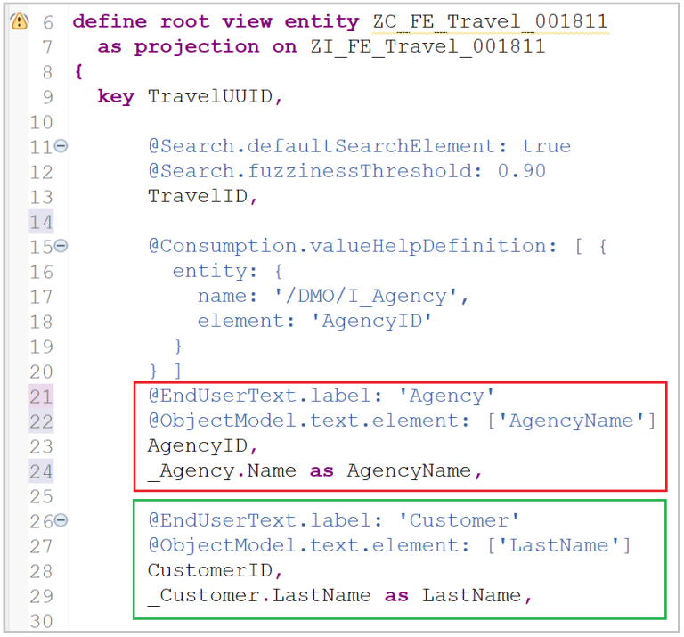

# ABAP RESTful Application Programming Model [16] – Travel Service – Miscellaneous Improvements

The next step after Behavior definition is to create Service Definition and Service binding. However, these steps are simple and the artifacts are covered in the post ‘Travel Service – Generated Objects‘. So we are going to look at the application instead and see what we add to the service built.

This post will explore a few more keywords, annotations, and class method implementations that will improve the application functionality.

## Travel List Page
For the Travel List Page, Agency ID and Customer ID fields are on the List as well as in the Filter Bar.


Agency ID and Customer ID fields can be enhanced with the Agency Name and Customer Name with below code. As the Ids and names both are going to be displayed we need to change the label as well (@EndUserText.label).



```
@Consumption.valueHelpDefinition: [ {
  entity: {
    name: '/DMO/I_Agency',
    element: 'AgencyID'
  }
} ]
@EndUserText.label: 'Agency'
@ObjectModel.text.element: ['AgencyName']        
AgencyID,
_Agency.Name as AgencyName,
      
@EndUserText.label: 'Customer'
@ObjectModel.text.element: ['LastName']      
CustomerID,
_Customer.LastName as LastName,
```

Activate and refresh the page.


The value help for Agency is not working at this point, when you click the value help nothing happens and the Customer value help is a generic pop-up. This can be seen in below.

The generic pop-up is only helpful if you are going to get actual values without showing options.


## Adding value help for Customer ID
The annotation @Consumption.valueHelpDefinition is added for CustomerID field.

```
@Consumption.valueHelpDefinition: [ {
  entity: {
    name: '/DMO/I_Customer',
    element: 'CustomerID'
  }
} ]      
@EndUserText.label: 'Customer'
@ObjectModel.text.element: ['LastName']      
CustomerID,
_Customer.LastName as LastName,
```


Activate and refresh the page. Now the customer value help shows the customer values from assigned entity.


## Why agency value help is not working?

Annotation for value help is already added as below. This is linked to Entity /DMO/I_Agency.


If we look closely into the entity it has a field attachment which is of type largeObject which causes an issue if it is displayed in the search help.


When you press F12 on the application page, and go to console, then press the value help button, we get error in the console which also points to the attachment field.


To resolve the issue, we can create another CDS view entity ZC_FE_AGENCY_001811 for the value help with /DMO/I_Agency as the data source.


```
@AccessControl.authorizationCheck: #NOT_REQUIRED
@EndUserText.label: 'Agency View - CDS Data Model'
@Search.searchable: true
define view entity ZC_FE_AGENCY_001811
  as select from /DMO/I_Agency as Agency
{

  key AgencyID,
      Name,
      Street,
      PostalCode,
      City,
      CountryCode,
      PhoneNumber,
      EMailAddress,
      WebAddress
}
```

Then use this new CDS view entity to assign the value help.


Activate the CDS view entity and refresh the page. Agency value help appears.


## Getting the status text

Overall status column only shows the code which can also be improved to show status text.


```
@ObjectModel.text.element: ['TravelStatusText']        
OverallStatus,
_TravelStatus.TravelStatusText as TravelStatusText,
```

Activate the CDS view entity and refresh the page. Status text appears.


## Travel Object Page
Note that the changes done for list page will also automatically affect the Object Page for changes like value help.

## Fields displayed multiple times in update mode
The description is displayed two times on the object page. The 2nd occurrence can be removed.


```
...
annotate view ZC_FE_Travel_001811 with
{
...
...
  @UI.identification: [{ position: 10 }]
  Description;
...
```
This part is changed to show the description on the List page instead of twice on the object page.

```
...
annotate view ZC_FE_Travel_001811 with
{
...
...
  @UI.lineItem: [{ position: 15 }]
  Description;
...
```

Description appears on list page.


Description only shown once on object page.


Similarly, Total Price field is appearing 2 times on the page which is also changed. This is used as both datapoint and field from fieldgroup in the Metadata Extension ZC_FE_Travel_001811.


The fieldgroup is removed.


Now, the Total price is shown only once.


## Display only fields

The total price should also be display only as it is total of individual flight prices and the booking fee. So let us make it display only. This is done in Behavior Definition ZI_FE_Travel_001811.

    field ( readonly ) TravelID, TotalPrice;


## Field determination

The next question is how will it be updated? The answer is using Determination. The Total price should be sum of all flight prices and booking fee. So it should be updated when either of them is modified.

To achieve this determination is added at Travel and Booking entities respectively.

```
"Travel
determination CalculateTotalPrice on modify { field BookingFee; }

"Booking
determination CalculateTotalPrice on modify { field FlightPrice; }
```


These are implemented in the respective implementation classes using quick fix feature from Eclipse.


Class code

```
CLASS lhc_travel DEFINITION INHERITING FROM cl_abap_behavior_handler.
  PRIVATE SECTION.
    METHODS:
      calculatetravelid FOR DETERMINE ON SAVE
        IMPORTING
          keys FOR  travel~calculatetravelid,
      calculatetotalprice FOR DETERMINE ON MODIFY
        IMPORTING keys FOR travel~calculatetotalprice.
ENDCLASS.

CLASS lhc_travel IMPLEMENTATION.
  METHOD calculatetravelid.

    "Get latest travel id and increment by 1

    SELECT FROM zfe_atrav_001811
      FIELDS MAX( travel_id ) INTO @DATA(lv_travelid).
    lv_travelid = lv_travelid + 1.

    "Modify the entity

    MODIFY ENTITIES OF zi_fe_travel_001811 IN LOCAL MODE
      ENTITY travel
      UPDATE FROM VALUE #( FOR travel IN keys
                         ( traveluuid = travel-%key-traveluuid
                           travelid = lv_travelid
                           %control-travelid  = if_abap_behv=>mk-on ) ).

  ENDMETHOD.

  METHOD calculatetotalprice.

    DATA : lv_total_price TYPE zi_fe_travel_001811-totalprice VALUE '100'.

    READ ENTITIES OF zi_fe_travel_001811 IN LOCAL MODE
      ENTITY travel
      FIELDS ( bookingfee )
      WITH CORRESPONDING #( keys )
      RESULT DATA(travel_in).

    READ ENTITIES OF zi_fe_travel_001811 IN LOCAL MODE
      ENTITY travel BY \_booking
      FIELDS ( flightprice )
      WITH CORRESPONDING #( travel_in )
      RESULT DATA(bookings_in).

    LOOP AT travel_in ASSIGNING FIELD-SYMBOL(<fs_travel>).
      <fs_travel>-totalprice = <fs_travel>-bookingfee.
      LOOP AT bookings_in INTO DATA(ls_booking) WHERE traveluuid = <fs_travel>-traveluuid.
        <fs_travel>-totalprice = <fs_travel>-totalprice + ls_booking-flightprice .
      ENDLOOP.
    ENDLOOP.

    MODIFY ENTITIES OF zi_fe_travel_001811 IN LOCAL MODE
       ENTITY travel
         UPDATE FIELDS ( totalprice )
         WITH CORRESPONDING #( travel_in ).

  ENDMETHOD.

ENDCLASS.
```


Class code

```
CLASS lhc_booking DEFINITION INHERITING FROM cl_abap_behavior_handler.
  PRIVATE SECTION.
    METHODS:
      calculatebookingid FOR DETERMINE ON SAVE
        IMPORTING
          keys FOR  booking~calculatebookingid ,
      calculatetotalprice FOR DETERMINE ON MODIFY
        IMPORTING keys FOR booking~calculatetotalprice.
    METHODS : get_new_booking_id IMPORTING iv_bookuuid      TYPE sysuuid_x16
                                 RETURNING VALUE(rv_bookid) TYPE /dmo/booking_id.
ENDCLASS.

CLASS lhc_booking IMPLEMENTATION.
  METHOD calculatebookingid.

    "Get latest booking id within the travel and increment by 1

    SELECT FROM zfe_atrav_001811
      FIELDS MAX( travel_id ) INTO @DATA(lv_travelid).
    lv_travelid = lv_travelid + 1.

    "Modify the entity

    MODIFY ENTITIES OF zi_fe_travel_001811 IN LOCAL MODE
      ENTITY booking
      UPDATE FROM VALUE #( FOR booking IN keys
                         ( bookinguuid = booking-%key-bookinguuid
                           bookingid   = get_new_booking_id( booking-%key-bookinguuid )
                           %control-bookingid = if_abap_behv=>mk-on ) ).


  ENDMETHOD.

  METHOD get_new_booking_id.
    SELECT SINGLE FROM zfe_abook_001811
      FIELDS travel_uuid
      WHERE booking_uuid = @iv_bookuuid
      INTO @DATA(lv_travel_uuid).
    IF sy-subrc EQ 0.

      SELECT FROM zfe_abook_001811
      FIELDS MAX( booking_id )
      WHERE travel_uuid = @lv_travel_uuid
      INTO @rv_bookid.

      rv_bookid = rv_bookid + 1.

    ELSE.
      SELECT SINGLE FROM zfe_dbook_001811
        FIELDS traveluuid
        WHERE bookinguuid = @iv_bookuuid
        INTO @lv_travel_uuid.
      IF sy-subrc EQ 0.
        SELECT FROM zfe_dbook_001811
        FIELDS MAX( bookingid )
        WHERE traveluuid = @lv_travel_uuid
        INTO @rv_bookid.

        rv_bookid = rv_bookid + 1.
      ENDIF.

    ENDIF.
  ENDMETHOD.

  METHOD calculatetotalprice.

    DATA : lv_total_price TYPE zi_fe_travel_001811-totalprice.

    READ ENTITIES OF zi_fe_travel_001811 IN LOCAL MODE
      ENTITY booking
      FIELDS ( traveluuid flightprice )
      WITH CORRESPONDING #( keys )
      RESULT DATA(bookings_in).

    IF bookings_in IS NOT INITIAL.

      READ ENTITIES OF zi_fe_travel_001811 IN LOCAL MODE
        ENTITY travel
        FIELDS ( bookingfee )
        WITH VALUE #( ( traveluuid = bookings_in[ 1 ]-traveluuid ) )
        RESULT DATA(travel_in).

      IF travel_in IS NOT INITIAL.
        READ ENTITIES OF zi_fe_travel_001811 IN LOCAL MODE
          ENTITY travel BY \_booking
          FIELDS ( flightprice )
          WITH CORRESPONDING #( travel_in )
          RESULT DATA(bookings_all).

        LOOP AT travel_in ASSIGNING FIELD-SYMBOL(<fs_travel>).
          <fs_travel>-totalprice = <fs_travel>-bookingfee.
          LOOP AT bookings_all INTO DATA(ls_booking) WHERE traveluuid = <fs_travel>-traveluuid.
            <fs_travel>-totalprice = <fs_travel>-totalprice + ls_booking-flightprice .
          ENDLOOP.
        ENDLOOP.

        MODIFY ENTITIES OF zi_fe_travel_001811 IN LOCAL MODE
           ENTITY travel
             UPDATE FIELDS ( totalprice )
             WITH CORRESPONDING #( travel_in ).
      ENDIF.
    ENDIF.
  ENDMETHOD.

ENDCLASS.
```

Activate the behavior definition and classes. Refresh the application page.


Change the booking fee to say 50 EUR and Flight price to 3000 EUR each. Click on save.


Note: In actual UI5 application, it is possible to refresh the property without saving to click on save. If I find a way to do it in RAP review, I will update this. As of now, we click on save.

Price gets updated correctly.


For simplicity currency conversion is not considered, however it is possible and may be required in real time scenarios.

## Providing drop-down input to Overall Status

Add size category annotation in CDS View entity for status – zi_fe_stat_001811.

```
@AccessControl.authorizationCheck: #NOT_REQUIRED
@EndUserText.label: 'Travel Status view entity'
@ObjectModel.resultSet.sizeCategory: #XS
define view entity zi_fe_stat_001811
  as select from zfe_astat_001811 as Status
{
      @UI.textArrangement: #TEXT_ONLY
      @ObjectModel.text.element: [ 'TravelStatusText' ]
  key Status.travel_status_id   as TravelStatusId,
//      @UI.hidden: true
      Status.travel_status_text as TravelStatusText
}
```

@UI.textArrangement: #TEXT_ONLY is already used for overallstatus in metedata extension – but validate it once.

```
annotate view ZC_FE_Travel_001811 with
{ 
  ...
  ...
  @UI.lineItem: [{ position: 80 }]
  @UI.selectionField: [{ position: 40 }]
  @UI.textArrangement: #TEXT_ONLY
  @UI.dataPoint: { qualifier: 'StatusData', title: 'Status' }
  OverallStatus;
  ...
  ...
```

Add value help in CDS Root View Entity ZC_FE_Travel_001811

```
  @Consumption.valueHelpDefinition: [ {
    entity: {
      name: 'ZI_FE_STAT_001811',
      element: 'TravelStatusId'
    }   
  } ]
  @ObjectModel.text.element: ['TravelStatusText']        
  OverallStatus,
  _TravelStatus.TravelStatusText as TravelStatusText,
```

Activate everything and refresh the app page. Overall status is changed to dropdown.


The application now looks much more user friendly. Additionally, we can add validations and messages but I will cover that in subsequent posts.