# ABAP RESTful Application Programming Model [17] – Managed with unmanaged save

ABAP RESTful Application Programming Model currently has three scenarios. The scenarios are defined based on what the developer has to implement i.e. what the developer manages vs what SAP RAP Framework manages.

In this post, you will learn about implementing Managed with unmanaged save. The data model used for this application is Carrier and Connection entities from the SAP Flight model.

## Managed
The CRUD operations are managed by SAP.

## Unmanaged
The CRUD operations are implemented by Developer in the class associated with the behavior definition.

## Managed with unmanaged save
The CRUD operations are managed by SAP, however, the developer can decide to implement CRUD operations for one of the entities from the data model.

## Create CDS View Entities
Create below two CDS View entities and activate them together. As these entities refer to each other, you have to activate these together. The images for better readability and code text for copying both are provided.

### ZJP_I_CARRIER

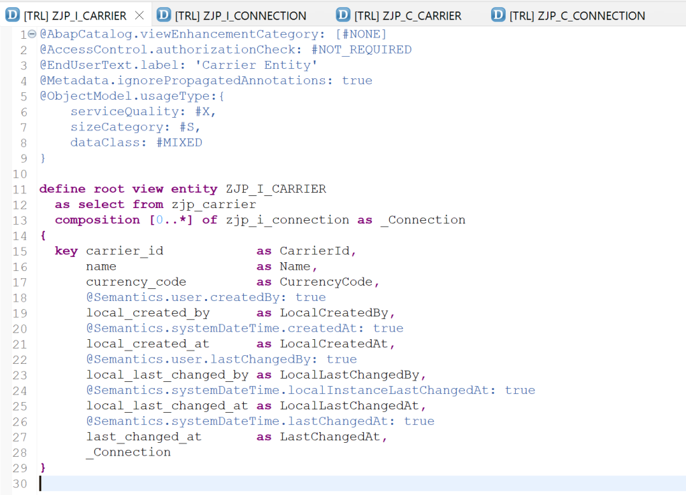

```
@AbapCatalog.viewEnhancementCategory: [#NONE]
@AccessControl.authorizationCheck: #NOT_REQUIRED
@EndUserText.label: 'Carrier Entity'
@Metadata.ignorePropagatedAnnotations: true
@ObjectModel.usageType:{
    serviceQuality: #X,
    sizeCategory: #S,
    dataClass: #MIXED
}

define root view entity ZJP_I_CARRIER
  as select from zjp_carrier
  composition [0..*] of zjp_i_connection as _Connection
{
  key carrier_id            as CarrierId,
      name                  as Name,
      currency_code         as CurrencyCode,
      @Semantics.user.createdBy: true
      local_created_by      as LocalCreatedBy,
      @Semantics.systemDateTime.createdAt: true
      local_created_at      as LocalCreatedAt,
      @Semantics.user.lastChangedBy: true
      local_last_changed_by as LocalLastChangedBy,
      @Semantics.systemDateTime.localInstanceLastChangedAt: true
      local_last_changed_at as LocalLastChangedAt,
      @Semantics.systemDateTime.lastChangedAt: true
      last_changed_at       as LastChangedAt,
      _Connection
}
```

### ZJP_I_CONNECTION

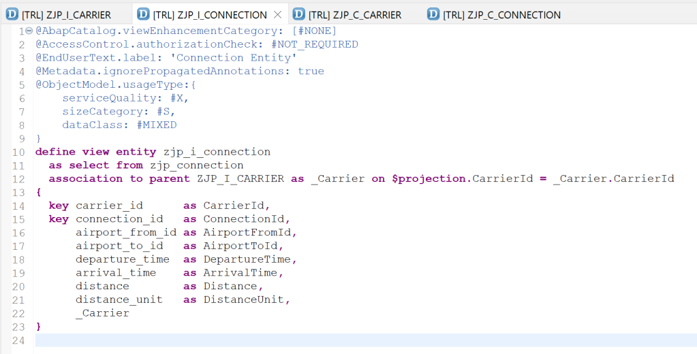

```
@AbapCatalog.viewEnhancementCategory: [#NONE]
@AccessControl.authorizationCheck: #NOT_REQUIRED
@EndUserText.label: 'Connection Entity'
@Metadata.ignorePropagatedAnnotations: true
@ObjectModel.usageType:{
    serviceQuality: #X,
    sizeCategory: #S,
    dataClass: #MIXED
}
define view entity zjp_i_connection
  as select from zjp_connection
  association to parent ZJP_I_CARRIER as _Carrier on $projection.CarrierId = _Carrier.CarrierId
{
  key carrier_id      as CarrierId,
  key connection_id   as ConnectionId,
      airport_from_id as AirportFromId,
      airport_to_id   as AirportToId,
      departure_time  as DepartureTime,
      arrival_time    as ArrivalTime,
      distance        as Distance,
      distance_unit   as DistanceUnit,
      _Carrier
}
```

Create Projection entities for the two entities above.

### ZJP_C_CARRIER

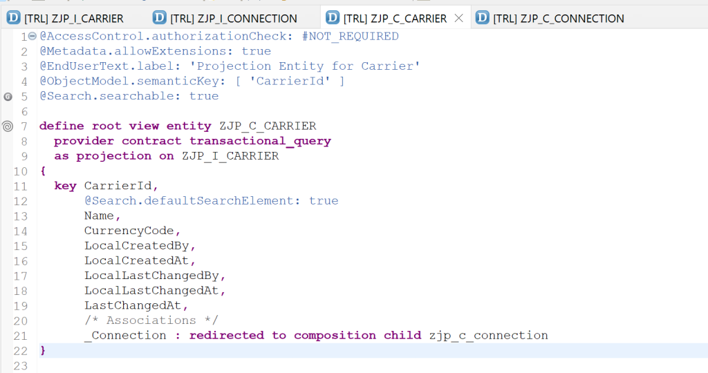

```
@AccessControl.authorizationCheck: #NOT_REQUIRED
@Metadata.allowExtensions: true
@EndUserText.label: 'Projection Entity for Carrier'
@ObjectModel.semanticKey: [ 'CarrierId' ]
@Search.searchable: true

define root view entity ZJP_C_CARRIER
  provider contract transactional_query
  as projection on ZJP_I_CARRIER
{
  key CarrierId,
      @Search.defaultSearchElement: true
      Name,
      CurrencyCode,
      LocalCreatedBy,
      LocalCreatedAt,
      LocalLastChangedBy,
      LocalLastChangedAt,
      LastChangedAt,
      /* Associations */
      _Connection : redirected to composition child zjp_c_connection
}
```

### ZJP_C_CONNECTION

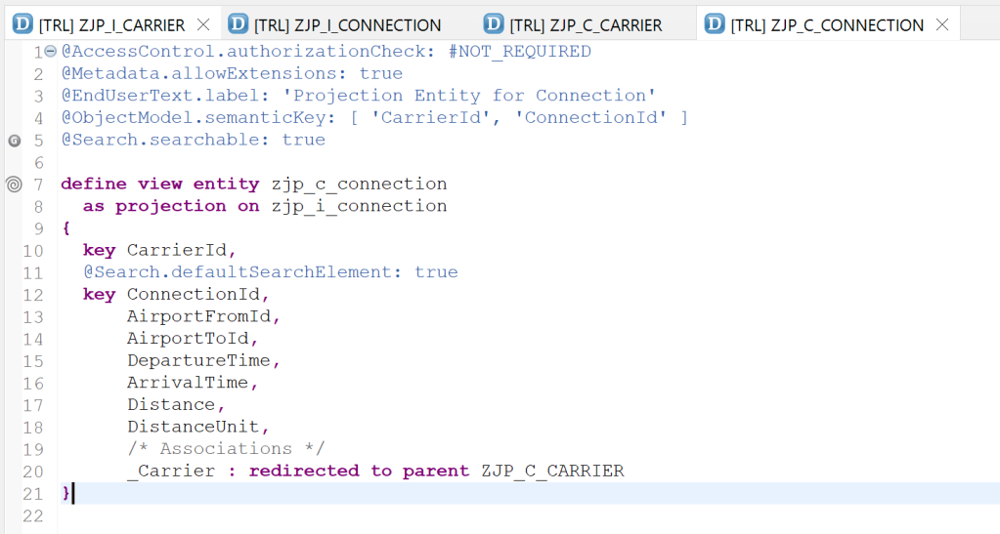

```
@AccessControl.authorizationCheck: #NOT_REQUIRED
@Metadata.allowExtensions: true
@EndUserText.label: 'Projection Entity for Connection'
@ObjectModel.semanticKey: [ 'CarrierId', 'ConnectionId' ]
@Search.searchable: true

define view entity zjp_c_connection
  as projection on zjp_i_connection
{
  key CarrierId,
  @Search.defaultSearchElement: true
  key ConnectionId,
      AirportFromId,
      AirportToId,
      DepartureTime,
      ArrivalTime,
      Distance,
      DistanceUnit,
      /* Associations */
      _Carrier : redirected to parent ZJP_C_CARRIER
}
```

## Create Metadata Extensions
Create metadata definitions for these CDS View Entities.

### ZJP_C_CARRIER

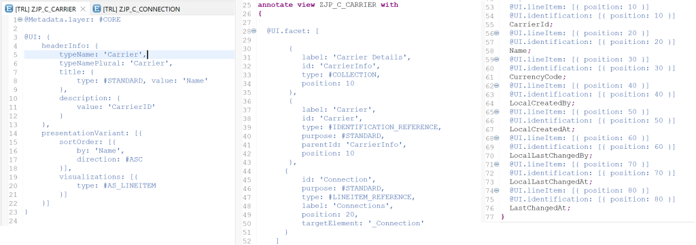

```
@Metadata.layer: #CORE

@UI: {
    headerInfo: {
        typeName: 'Carrier',
        typeNamePlural: 'Carrier',
        title: {
            type: #STANDARD, value: 'Name'
        },
        description: {
            value: 'CarrierID'
        }
    },
    presentationVariant: [{
        sortOrder: [{
            by: 'Name',
            direction: #ASC
        }],
        visualizations: [{
            type: #AS_LINEITEM
        }]
    }]
}

annotate view ZJP_C_CARRIER with
{

  @UI.facet: [

       {
          label: 'Carrier Details',
          id: 'CarrierInfo',
          type: #COLLECTION,
          position: 10
       },
       {
          label: 'Carrier',
          id: 'Carrier',
          type: #IDENTIFICATION_REFERENCE,
          purpose: #STANDARD,
          parentId: 'CarrierInfo',
          position: 10
       },
      {
          id: 'Connection',
          purpose: #STANDARD,
          type: #LINEITEM_REFERENCE,
          label: 'Connections',
          position: 20,
          targetElement: '_Connection'
      }
    ]
  @UI.lineItem: [{ position: 10 }]
  @UI.identification: [{ position: 10 }]
  CarrierId;
  @UI.lineItem: [{ position: 20 }]
  @UI.identification: [{ position: 20 }]
  Name;
  @UI.lineItem: [{ position: 30 }]
  @UI.identification: [{ position: 30 }]
  CurrencyCode;
  @UI.lineItem: [{ position: 40 }]
  @UI.identification: [{ position: 40 }]
  LocalCreatedBy;
  @UI.lineItem: [{ position: 50 }]
  @UI.identification: [{ position: 50 }]
  LocalCreatedAt;
  @UI.lineItem: [{ position: 60 }]
  @UI.identification: [{ position: 60 }]
  LocalLastChangedBy;
  @UI.lineItem: [{ position: 70 }]
  @UI.identification: [{ position: 70 }]
  LocalLastChangedAt;
  @UI.lineItem: [{ position: 80 }]
  @UI.identification: [{ position: 80 }]
  LastChangedAt;
}
```

### ZJP_C_CONNECTION


```
@Metadata.layer: #CORE

@UI: {
    headerInfo: {
        typeName: 'Connection',
        typeNamePlural: 'Connections',
        title: {
            type: #STANDARD, value: 'ConnectionId'
        }
    },
    presentationVariant: [{
        sortOrder: [{
            by: 'ConnectionId',
            direction: #ASC
        }],
        visualizations: [{
            type: #AS_LINEITEM
        }]
    }]
}

annotate view zjp_c_connection with
{

  @UI.facet: [
       {
          label: 'Connection Details',
          id: 'ConnectionInfo',
          type: #COLLECTION,
          position: 10
       },
       {
          label: 'Connection',
          id: 'Connection',
          type: #IDENTIFICATION_REFERENCE,
          purpose: #STANDARD,
          parentId: 'ConnectionInfo',
          position: 10
       }
    ]


  @UI.lineItem: [ { position: 10 } ]
  @UI.identification: [{ position: 10 }]
  CarrierId;
  @UI.lineItem: [ { position: 20 } ]
  @UI.identification: [{ position: 20 }]
  ConnectionId;
  @UI.lineItem: [ { position: 30 } ]
  @UI.identification: [{ position: 30 }]
  AirportFromId;
  @UI.lineItem: [ { position: 40 } ]
  @UI.identification: [{ position: 40 }]
  AirportToId;
  @UI.lineItem: [ { position: 50 } ]
  @UI.identification: [{ position: 50 }]
  DepartureTime;
  @UI.lineItem: [ { position: 60 } ]
  @UI.identification: [{ position: 60 }]
  ArrivalTime;
  @UI.lineItem: [ { position: 70 } ]
  @UI.identification: [{ position: 70 }]
  Distance;
  @UI.lineItem: [ { position: 80 } ]
  @UI.identification: [{ position: 80 }]
  DistanceUnit;
}
```

## Create Behavior Definition
Behavior definition will be common for both Carrier and Connection entities.

### ZJP_I_CARRIER

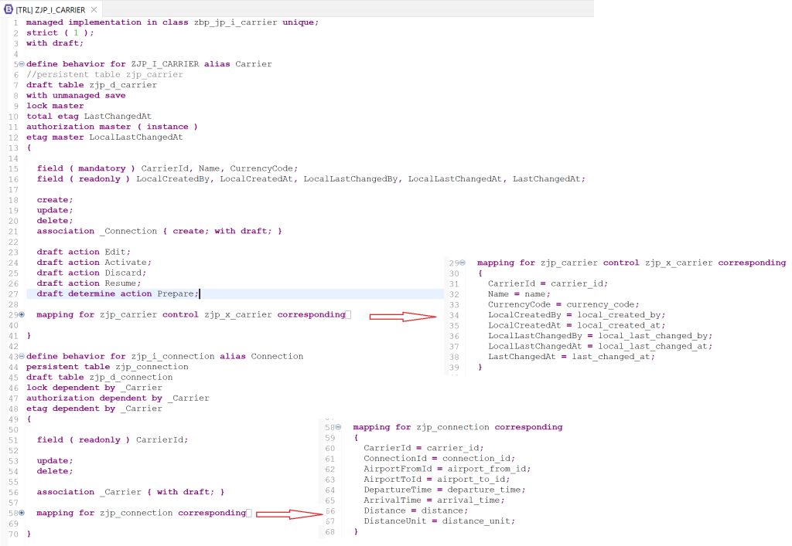

```
managed implementation in class zbp_jp_i_carrier unique;
strict ( 1 );
with draft;

define behavior for ZJP_I_CARRIER alias Carrier
//persistent table zjp_carrier
draft table zjp_d_carrier
with unmanaged save
lock master
total etag LastChangedAt
authorization master ( instance )
etag master LocalLastChangedAt
{

  field ( mandatory ) CarrierId, Name, CurrencyCode;
  field ( readonly ) LocalCreatedBy, LocalCreatedAt, LocalLastChangedBy, LocalLastChangedAt, LastChangedAt;

  create;
  update;
  delete;
  association _Connection { create; with draft; }

  draft action Edit;
  draft action Activate;
  draft action Discard;
  draft action Resume;
  draft determine action Prepare;

  mapping for zjp_carrier control zjp_x_carrier corresponding
  {
    CarrierId = carrier_id;
    Name = name;
    CurrencyCode = currency_code;
    LocalCreatedBy = local_created_by;
    LocalCreatedAt = local_created_at;
    LocalLastChangedBy = local_last_changed_by;
    LocalLastChangedAt = local_last_changed_at;
    LastChangedAt = last_changed_at;
  }

}

define behavior for zjp_i_connection alias Connection
persistent table zjp_connection
draft table zjp_d_connection
lock dependent by _Carrier
authorization dependent by _Carrier
etag dependent by _Carrier
{

  field ( readonly ) CarrierId;

  update;
  delete;

  association _Carrier { with draft; }

  mapping for zjp_connection corresponding
  {
    CarrierId = carrier_id;
    ConnectionId = connection_id;
    AirportFromId = airport_from_id;
    AirportToId = airport_to_id;
    DepartureTime = departure_time;
    ArrivalTime = arrival_time;
    Distance = distance;
    DistanceUnit = distance_unit;
  }

}
```

The change here is that instead of a persistent table, we mention with unmanaged save .

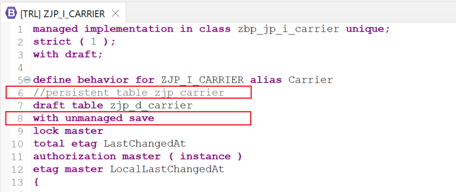

Then, the operations are implemented in the class in Local Types tab.

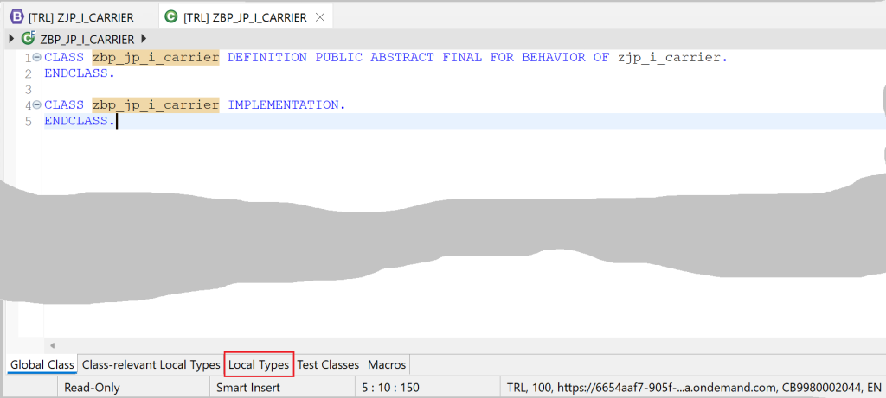

The behavior handler class is empty and authorizations can be implemented.

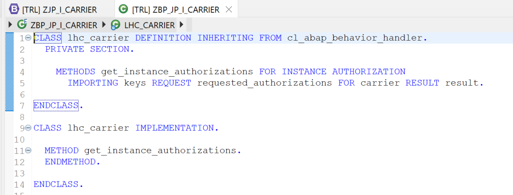

The save method from the behavior saver class should be implemented for create, update and delete operations.

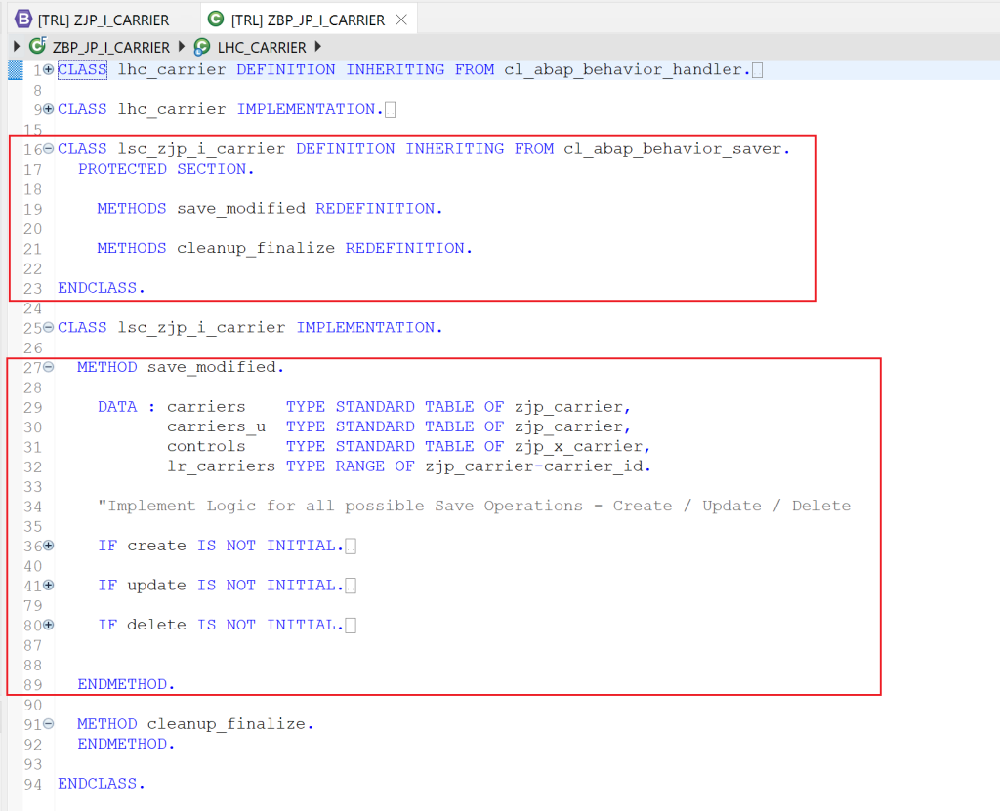

```
CLASS lhc_carrier DEFINITION INHERITING FROM cl_abap_behavior_handler.
  PRIVATE SECTION.

    METHODS get_instance_authorizations FOR INSTANCE AUTHORIZATION
      IMPORTING keys REQUEST requested_authorizations FOR carrier RESULT result.

ENDCLASS.

CLASS lhc_carrier IMPLEMENTATION.

  METHOD get_instance_authorizations.
  ENDMETHOD.

ENDCLASS.

CLASS lsc_zjp_i_carrier DEFINITION INHERITING FROM cl_abap_behavior_saver.
  PROTECTED SECTION.

    METHODS save_modified REDEFINITION.

    METHODS cleanup_finalize REDEFINITION.

ENDCLASS.

CLASS lsc_zjp_i_carrier IMPLEMENTATION.

  METHOD save_modified.

    DATA : carriers    TYPE STANDARD TABLE OF zjp_carrier,
           carriers_u  TYPE STANDARD TABLE OF zjp_carrier,
           controls    TYPE STANDARD TABLE OF zjp_x_carrier,
           lr_carriers TYPE RANGE OF zjp_carrier-carrier_id.

    "Implement Logic for all possible Save Operations - Create / Update / Delete

    IF create IS NOT INITIAL.
      carriers = CORRESPONDING #( create-carrier MAPPING FROM ENTITY ).
      INSERT zjp_carrier FROM TABLE @carriers.
    ENDIF.

    IF update IS NOT INITIAL.
      carriers = CORRESPONDING #( update-carrier MAPPING FROM ENTITY ).
      controls = CORRESPONDING #( update-carrier MAPPING FROM ENTITY USING CONTROL ).

      SELECT * FROM zjp_carrier
        FOR ALL ENTRIES IN @carriers
        WHERE carrier_id = @carriers-carrier_id
        INTO TABLE @DATA(carriers_o).
      IF sy-subrc EQ 0.

        carriers_u =
          VALUE #(
            FOR i = 1 WHILE i LE lines( carriers )
            LET
              control =
                VALUE #( controls[ i ] OPTIONAL )
              carrier   =
                VALUE #( carriers[ i ] OPTIONAL )
              carrier_o =
                VALUE #( carriers_o[ carrier_id = carrier-carrier_id ] OPTIONAL )
            IN
            ( carrier_id            = carrier-carrier_id
              name                  = COND #( WHEN control-name IS NOT INITIAL
                                              THEN carrier-name
                                              ELSE carrier_o-name )
              currency_code         = COND #( WHEN control-currency_code IS NOT INITIAL
                                              THEN carrier-currency_code
                                              ELSE carrier_o-currency_code )
              local_created_by      = carrier_o-local_created_by
              local_created_at      = carrier_o-local_created_at
              local_last_changed_by = COND #( WHEN control-local_last_changed_by IS NOT INITIAL
                                              THEN carrier-local_last_changed_by
                                              ELSE carrier_o-local_last_changed_by )
              local_last_changed_at = COND #( WHEN control-local_last_changed_at IS NOT INITIAL
                                              THEN carrier-local_last_changed_at
                                              ELSE carrier_o-local_last_changed_at )
              last_changed_at       = COND #( WHEN control-last_changed_at IS NOT INITIAL
                                              THEN carrier-last_changed_at
                                              ELSE carrier_o-last_changed_at )

             ) ).


      ELSE.
        carriers_u = carriers.
      ENDIF.

      UPDATE zjp_carrier FROM TABLE @carriers_u.
    ENDIF.

    IF delete IS NOT INITIAL.
      lr_carriers = VALUE #( FOR ls_carrier_id IN delete-carrier
                           ( sign = 'I' option ='EQ' low = ls_carrier_id-carrierid )
                           ).

      DELETE FROM zjp_carrier WHERE carrier_id IN @lr_carriers.
    ENDIF.


  ENDMETHOD.

  METHOD cleanup_finalize.
  ENDMETHOD.

ENDCLASS.
```

Now let us understand the code.

### save_modified
Method save modified is a redefinition of the same method from class cl_abap_behavior_saver.

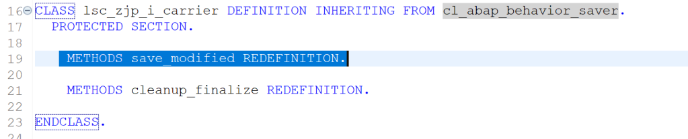

The signature of the method can be seen in the class - cl_abap_behavior_saver. The importing parameters are create, update and delete. The exporting parameters are reported and failed.

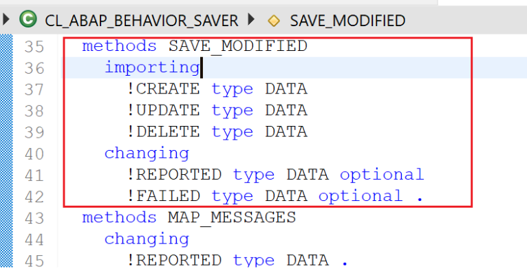

### create
Get the data from the entity using key-words MAPPING FROM ENTITY. Here, INSERT is directly used for demonstration but in actual scenarios a create BAPI would be used.

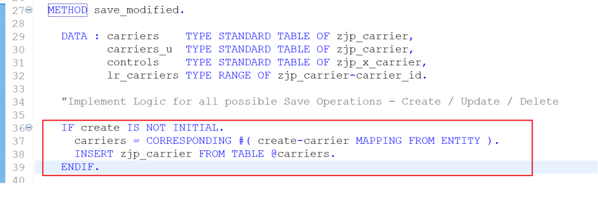

### update
As we are managing the updates, we need to ensure that the earlier information is not wiped-off. So, the table control is used to understand which data is changed and query on existing data is used to get values for unchanged fields to keep the data.

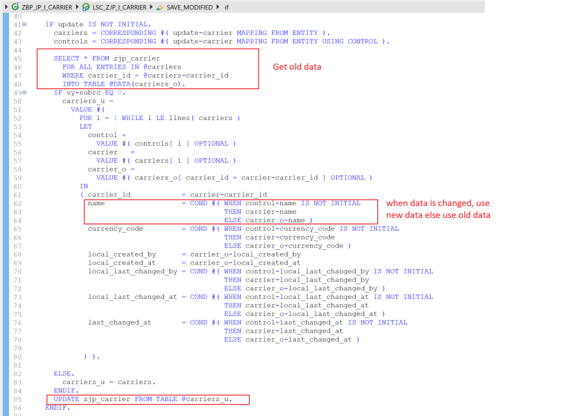

### delete
The delete table only has keys, so a range is created for the keys to be deleted and then the delete operation is called.

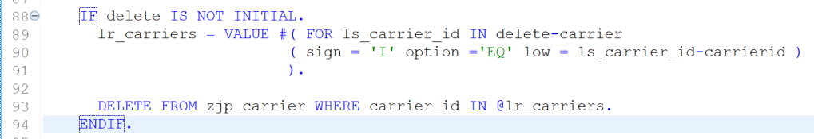

### reported
This table can be populated if any fields are getting calculated in the save method and the information needs to be passed back to the application. This part is same as unmanaged and is covered in ABAP RESTful Application Programming Model [6] – Unmanaged Scenario Part 3

### failed
This table can be populated if any record is failed due to any error and the error needs to be passed back. This part is same as unmanaged and is covered in ABAP RESTful Application Programming Model [6] – Unmanaged Scenario Part 3

## Behavior Definition Projection
The projection for the behavior definition.

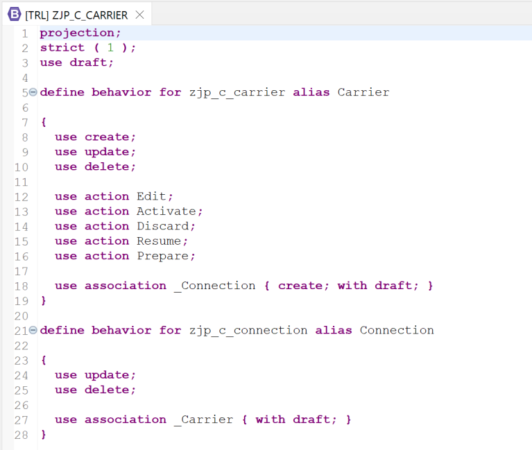

```
projection;
strict ( 1 );
use draft;

define behavior for zjp_c_carrier alias Carrier

{
  use create;
  use update;
  use delete;

  use action Edit;
  use action Activate;
  use action Discard;
  use action Resume;
  use action Prepare;

  use association _Connection { create; with draft; }
}

define behavior for zjp_c_connection alias Connection

{
  use update;
  use delete;

  use association _Carrier { with draft; }
}
```

## Service Definition

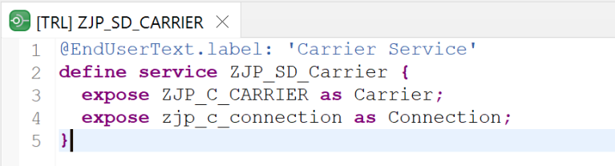

```
@EndUserText.label: 'Carrier Service'
define service ZJP_SD_Carrier {
  expose ZJP_C_CARRIER as Carrier;
  expose zjp_c_connection as Connection;
}
```

## Service Binding
OData V4 version is selected for this binding.


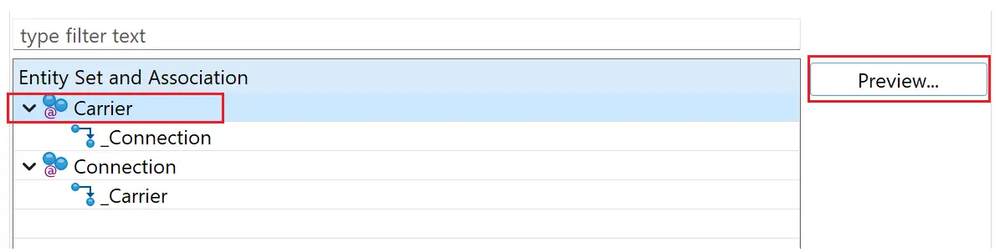

## Application Preview
### List Page – Carriers


### Object Page – Carriers

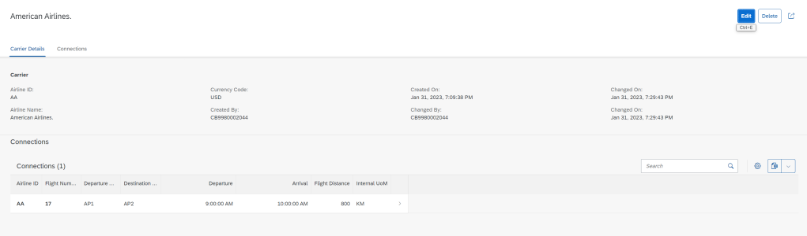

### Object Page – Connections

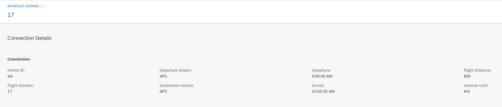

All create, update delete functionalities along with draft functionalities will work in this application. Below video shows the testing of all operations.

Implementation of Managed Scenario with unmanaged save is complete.