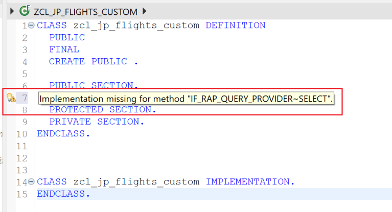
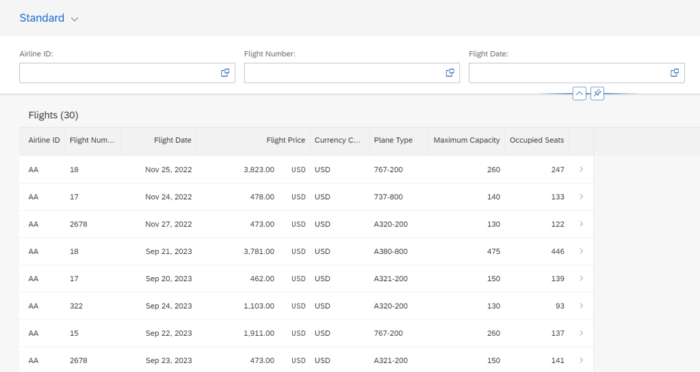

# ABAP RESTful Application Programming Model [18] – Custom Entity

In this post, you will learn ‘How to implement a Custom Entity in ABAP RESTful Application Programming’.

## What is Custom Entity?

CDS view entities read data from the database with a table or other CDS view entity as a source. In contrast, a Custom Entity is a wrapper for ABAP code-based implementation that provides the data instead.

A custom entity is implemented in the ABAP class.

## Data Model used for this post
Data from /dmo/flight is fetched in the class. This example uses a select query to fetch the data. However, we can call BAPI, function modules, or other methods to get the data.


## Create a class
Start new class creation. Provide Name and Description and click Next.


Choose TR.


The class is generated.


Add interface if_rap_query_provider to the class and implement the method select from the interface.

```
CLASS zcl_jp_flights_custom DEFINITION
  PUBLIC
  FINAL
  CREATE PUBLIC .

  PUBLIC SECTION.
    INTERFACES if_rap_query_provider.
  PROTECTED SECTION.
  PRIVATE SECTION.
ENDCLASS.

CLASS zcl_jp_flights_custom IMPLEMENTATION.
ENDCLASS.
```

When you take the cursor over the warning icon, it displays the warning that the implementation for the method SELECT is missing.



Use the quick-fix functionality to implement the method.


Now complete the class with the below code.

```
CLASS zcl_jp_flights_custom DEFINITION
  PUBLIC
  FINAL
  CREATE PUBLIC .

  PUBLIC SECTION.
    INTERFACES if_rap_query_provider.
  PROTECTED SECTION.
  PRIVATE SECTION.
ENDCLASS.

CLASS zcl_jp_flights_custom IMPLEMENTATION.
  METHOD if_rap_query_provider~select.
    IF io_request->is_data_requested( ).

      DATA(lv_top)     = io_request->get_paging( )->get_page_size( ).
      IF lv_top < 0.
        lv_top = 1.
      ENDIF.

      DATA(lv_skip)    = io_request->get_paging( )->get_offset( ).

      DATA(lt_sort)    = io_request->get_sort_elements( ).

      DATA : lv_orderby TYPE string.
      LOOP AT lt_sort INTO DATA(ls_sort).
        IF ls_sort-descending = abap_true.
          lv_orderby = |'{ lv_orderby } { ls_sort-element_name } DESCENDING '|.
        ELSE.
          lv_orderby = |'{ lv_orderby } { ls_sort-element_name } ASCENDING '|.
        ENDIF.
      ENDLOOP.
      IF lv_orderby IS INITIAL.
        lv_orderby = 'CARRIER_ID'.
      ENDIF.

      DATA(lv_conditions) =  io_request->get_filter( )->get_as_sql_string( ).

      SELECT FROM /dmo/flight
        FIELDS carrier_id, connection_id, flight_date, price, currency_code, plane_type_id, seats_max, seats_occupied
        WHERE (lv_conditions)
        ORDER BY (lv_orderby)
        INTO TABLE @DATA(flights)
        UP TO @lv_top ROWS OFFSET @lv_skip.

      IF io_request->is_total_numb_of_rec_requested(  ).
        io_response->set_total_number_of_records( lines( flights ) ).
        io_response->set_data( flights ).
      ENDIF.

    ENDIF.
  ENDMETHOD.

ENDCLASS.
```

Activate the class.

## Create a Custom Entity
Create a new Data definition. Enter the Name and the Description and click Next. Choose TR on the next screen.


Choose a template for Custom Entity and click Finish.


In this example, we are not going to use parameters, so update the code as below.

```
@EndUserText.label: 'Custom Entity for Flight Data'

@ObjectModel: {
    query: {
        implementedBy: 'ABAP:ZCL_JP_FLIGHTS_CUSTOM'
    }
}

@UI: {
  headerInfo: {
    typeName: 'Flight',
    typeNamePlural: 'Flights',
    title: { value: 'carrier_id' },
    description: { value: 'connection_id' }
  }
}

define root custom entity ZCE_JP_FLIGHT_CUSTOM
{
      @UI.facet      : [
           {
             id      :  'Flight_Data',
             purpose :  #STANDARD,
             type    :  #IDENTIFICATION_REFERENCE,
             label   :  'Flights',
             position: 10 }
         ]

      @UI.lineItem   : [{ position: 10 }]
      @UI.selectionField : [{position: 10}]
      @UI.identification: [{position: 10}]
  key carrier_id     : /dmo/carrier_id;

      @UI.lineItem   : [{ position: 20 }]
      @UI.selectionField : [{position: 20}]
      @UI.identification: [{position: 20}]
  key connection_id  : /dmo/connection_id;

      @UI.lineItem   : [{ position: 30 }]
      @UI.selectionField : [{position: 30}]
      @UI.identification: [{position: 30}]
  key flight_date    : /dmo/flight_date;

      @UI.lineItem   : [{ position: 40 }]
      @UI.identification: [{position: 40}]
      @Semantics.amount.currencyCode : 'currency_code'
      price          : /dmo/flight_price;

      @UI.lineItem   : [{ position: 50 }]
      @UI.identification: [{position: 50}]
      currency_code  : /dmo/currency_code;

      @UI.lineItem   : [{ position: 60 }]
      @UI.identification: [{position: 60}]
      plane_type_id  : /dmo/plane_type_id;

      @UI.lineItem   : [{ position: 70 }]
      @UI.identification: [{position: 70}]
      seats_max      : /dmo/plane_seats_max;

      @UI.lineItem   : [{ position: 80 }]
      @UI.identification: [{position: 80}]
      seats_occupied : /dmo/plane_seats_occupied;

}
```

Differences from the CDS View Entity are highlighted below.

- In the object model, we mention the class name which implements the query or the method that provides the data
- Define statement is define root custom entity or define custom entity
- Rest of the annotations are similar to CDS view entity


Activate the custom entity.

## Create Service Definition
Create a new Service Definition. Enter the Name and the Description and click Next. Choose TR on the next screen.


Complete the code as below.

```
@EndUserText.label: 'Service definition from custom entity'
define service ZSD_JP_FLIGHT_CUSTOM {
  expose ZCE_JP_FLIGHT_CUSTOM as Flight;
}
```


Activate the service definition.

## Create Service Binding
Create a new service binding. Enter the Name, the Description, and the Binding Type. Then click Next. Choose TR on the next screen.


Activate the service binding.


Publish the Service binding.


Click on the Entity flight and click on the preview button.


Click Go


The data is displayed. Here any row can be clicked to display the object page.




Filters can be tested as well.


Sorting.


## Method Code Explained
The method code is as below


Check if the data is requested.

    IF io_request->is_data_requested( ).
Get Skip and Top values. These values are used for providing records as per the pagination details provided in the request. For a single read operation with keys, the top value sent is -1, which is changed to 1 so that the query does not result in short dump.

```
  DATA(lv_top)     = io_request->get_paging( )->get_page_size( ).
  IF lv_top < 0.
    lv_top = 1.
  ENDIF.

  DATA(lv_skip)    = io_request->get_paging( )->get_offset( ).

  DATA(lt_sort)    = io_request->get_sort_elements( ).
```

Handle Sorting.

```
  DATA(lt_sort)    = io_request->get_sort_elements( ).

  DATA : lv_orderby TYPE string.
  LOOP AT lt_sort INTO DATA(ls_sort).
    IF ls_sort-descending = abap_true.
      lv_orderby = |'{ lv_orderby } { ls_sort-element_name } DESCENDING '|.
    ELSE.
      lv_orderby = |'{ lv_orderby } { ls_sort-element_name } ASCENDING '|.
    ENDIF.
  ENDLOOP.
  IF lv_orderby IS INITIAL.
    lv_orderby = 'CARRIER_ID'.
  ENDIF.
```

Get filter conditions

```
  DATA(lv_conditions) =  io_request->get_filter( )->get_as_sql_string( ).
```

Apply all request details to select data.

```
  SELECT FROM /dmo/flight
    FIELDS carrier_id, connection_id, flight_date, price, currency_code, plane_type_id, seats_max, seats_occupied
    WHERE (lv_conditions)
    ORDER BY (lv_orderby)
    INTO TABLE @DATA(flights)
    UP TO @lv_top ROWS OFFSET @lv_skip.
```

Pass the data back in response.

```
  IF io_request->is_total_numb_of_rec_requested(  ).
    io_response->set_total_number_of_records( lines( flights ) ).
    io_response->set_data( flights ).
  ENDIF.
```

From the code, you can see that, unlike the CDS View Entity, all operations like filter, sorting, and paging are implemented in the code. This is very similar to Odata using SEGW.

Note: Create, update, and delete operations are not feasible using custom entity as of now and I will update this in case this changes.

Reference: https://blogs.sap.com/2019/03/01/how-to-implement-a-custom-entity-in-the-abap-restful-programming-model-using-remote-function-modules/