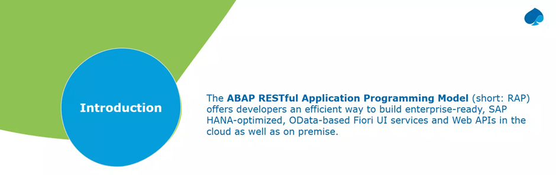
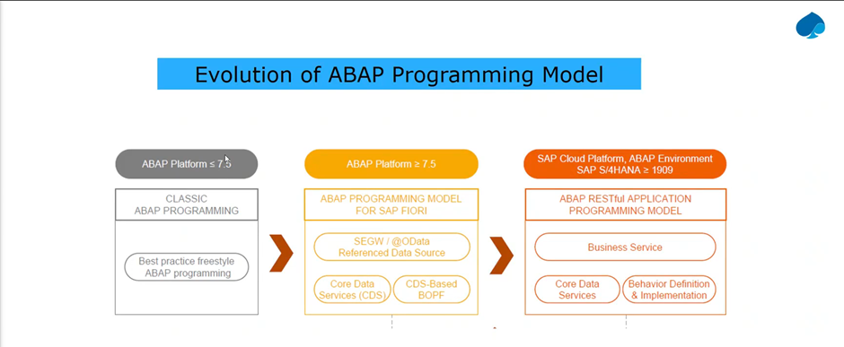
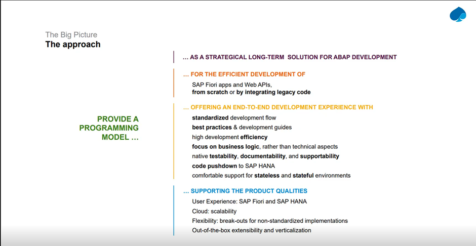
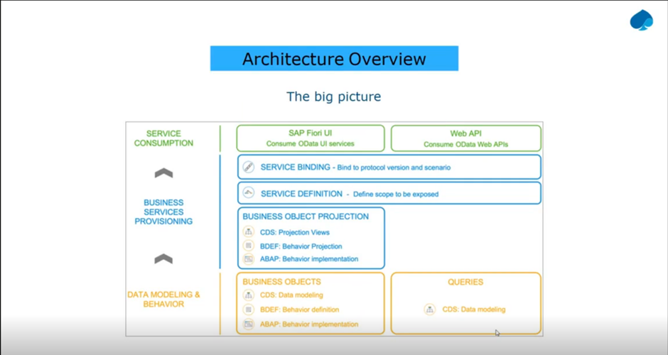
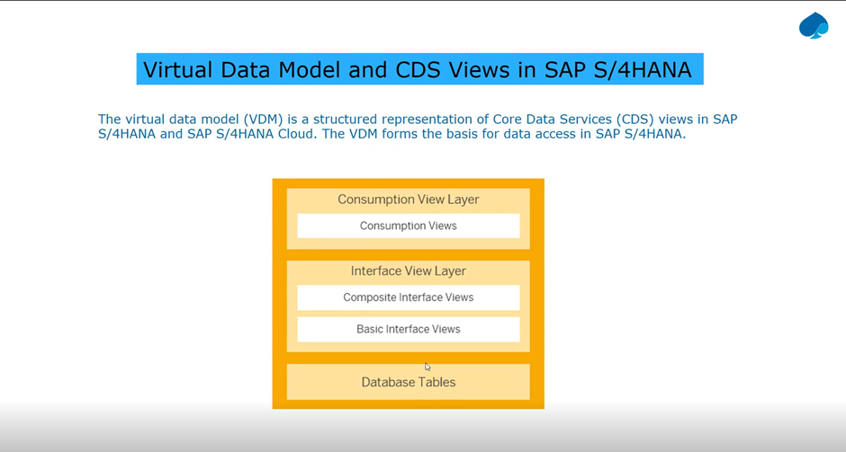
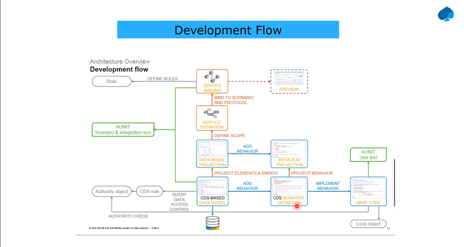
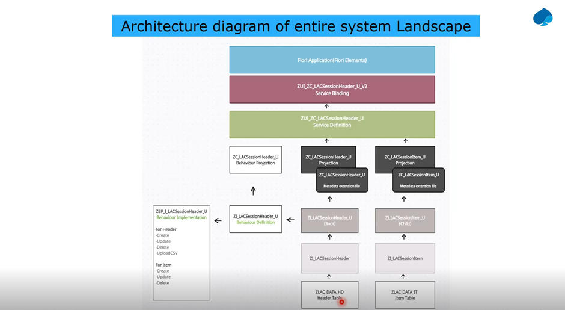

Make composite view more reusable, and consumption layer all the app specific calculation should be done here. It should not be reused anywhere else.



CDS BASED DATA MODEL - VDM

CDS behaviour definition – this will add behaviour, like CRUD operations

To implement these behavior we will implement theses in abap code

In the data model projection we can select what fields we are going to project

In behaviour projection, here also we can enable or disable the behavior projection

Service deficntion – we can say we want to expose the data model projection

Service binding – odata / web api 



```
@EndUserText.label : 'PO HEADER DATA'
@AbapCatalog.enhancement.category : #NOT_EXTENSIBLE
@AbapCatalog.tableCategory : #TRANSPARENT
@AbapCatalog.deliveryClass : #A
@AbapCatalog.dataMaintenance : #RESTRICTED
define table zyny_po_doc {
    key client           : abap.clnt not null;
    key purchase_doc     : ebeln not null;
    @EndUserText.label : 'Description'
    po_desc              : abap.char(40);
    po_status            : abap.char(1);
    @EndUserText.label : 'Document Priority'
    po_priority          : abap.char(1);
    ccode                : abap.char(4);
    @EndUserText.label : 'Created By'
    create_by            : abap.char(15);
    created_date_time    : timestampl;
    changed_data_time    : timestampl;
    lcl_last_changedtime : timestampl;
}
```

```
@EndUserText.label : 'PO line item'
@AbapCatalog.enhancement.category : #NOT_EXTENSIBLE
@AbapCatalog.tableCategory : #TRANSPARENT
@AbapCatalog.deliveryClass : #A
@AbapCatalog.dataMaintenance : #RESTRICTED
define table zyny_po_item {
    key client             : abap.clnt not null;
    @AbapCatalog.foreignKey.keyType : #KEY
    @AbapCatalog.foreignKey.screenCheck : true
    key purchase_doc       : ebeln not null
    with foreign key [1..*,1] zyny_po_doc
        where client = zyny_po_doc.client
        and purchase_doc = zyny_po_item.purchase_doc;
    key purchase_item      : abap.char(4) not null;
    @EndUserText.label : 'Short Text'
    short_text             : abap.char(40);
    @Semantics.amount.currencyCode : 'zyny_po_item.currency'
    price                  : abap.curr(13,2);
    currency               : abap.cuky;
    @EndUserText.label : 'Quantity'
    @Semantics.quantity.unitOfMeasure : 'zyny_po_item.unit'
    quantity               : abap.quan(13,2);
    @EndUserText.label : 'Unit'
    unit                   : abap.unit(3);
    changed_date_time      : timestampl;
    local_change_date_time : timestampl;
}
```