# Sales order cycle
## What is a sales order cycle?

Every business will have a cycle.

For example, the finance business or the finance department is responsible for looking at what the customer needs to pay (A/R) or receiving payments. So they call it report to record.

Procurement department, which is responsible for interacting with the vendors, getting the goods on time and so on, is responsible for placing the purchase order with the vendor.

Example If Walmart's procurement department were to be taken as an example, they are responsible for dealing with the vendors that supply the goods.

Like if milk needs to be put in the freezer of Walmart. The procurement department will talk to all the different milk vendors. They'll raise purchase orders.

They'll get the goods into the stock, and they'll pay the invoices, meaning pay the money to their vendors. This cycle is called procure to pay.

Procure to pay or P2P. So similarly, there are different business cycles followed by the different departments.

The sales department also follows a cycle. It's called the sales order cycle.

## What is the sales order cycle comprising of? (B2B scenario)

The sales order cycle is best understood with an example. We'll take two companies.

One company say a computer manufacturing company, say HP or Dell or whatever. And this is the company which is selling. So, we are looking at things from a HP's perspective.

Who is buying? 

=> Anybody could be buying from you or could be buying from Dell or HP.

Let's take the scenario of HP selling computers to a customer, say Walmart. So, Walmart is our customer. And the companies selling computers to Walmart.

So, Walmart is looking for computers. So, Walmart is inquiring about the different rates of HP, Dell and all the different computer manufacturers.
Now, since we are looking at it from HP's perspective, Walmart is going to send what is called as an RFI or request for information or inquiry RFI.
 

### What is an RFI?
=> An RFI is, quite simply, a request for a whole bunch of products. And what are the prices and when we can deliver them by.

So now, from HP's perspective, as soon as they receive this request from Walmart, they're going to say, okay, who is the customer? - Customer is Walmart.

What is the date that we have received this? - Jan, first, 2014 and some other details and then we'll start with the products.
What is it that Walmart is looking for? - They'll specify that in the request. They'll say, I want a particular model of desktop model one.

And how many quantity? - Say 1000.

They want it for a bunch of stores and maybe some laptops, a particular model, maybe 2000 of them and so on.

So, this information is captured in a document from HP's perspective. And this document is just a fancy word. You don't need to use that or think in terms of a document. It's just a collection of some data. So, SAP typically calls it a document.

So, this document is called an inquiry, which is a document created in SAP by HP based on the customer's RFI.
So, customer has asked for desktops, laptops, a certain quantity, and their prices. And HP has created a record in the system and says, okay, you have asked for this, this and this, and the prices are going to be dollar 500 per piece or dollar 800 per piece or whatever HP decides the rate to be.

And as soon as this inquiry is saved in the system, you get an inquiry number in the system that generates its, let's say, 110120, just a number, a sequential number.

HP has created this unique reference called an inquiry document, and this will be sent over to Walmart as a response to their inquiry saying, you know what?

Thank you, Walmart for inquiring with us. We have created an inquiry. Your reference number is 110120. And here are the products that you have inquired for. And these are the prices. And we can provide these quantities by so and so dates.

Finance is responsible for
-	Customers need to pay – A/R
-	Receiving payments
These are called report to record.

Procurement department is responsible for (interacting with Vendors, get goods on time)
-	Placing PO for Vendors
-	Get the goods
-	Pay the invoices
This cycle is called procure to pay (P2P)

Sales department (Sales order cycle)
Example (B2B Scenario)
HP / Dell – Selling computers to Walmart
1)	Walmart – inquire for the computers (RFI – Request for Information or Inquiry)
2)	Seller – for Customer on Date, product, quantity, price
3)	A document will be created and sent to Walmart

## Quotation
Now Walmart will apply for quotation
Quotation is a formal documents, with terms and conditions, price, quantities, deliverables, adhered to legally.

Validity Dates – the period for which quotations can be applied. 

Difference between inquiry(informal) and quotation(formal)

Create inquiry in system
Tcode – VA11

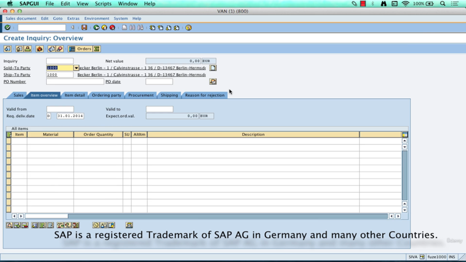

Save

## Quotation

 
From initial point of view, inquiry is the current doc, and quotation becomes the subsequent doc
From quotation point of view, inquiry becomes the previous doc, and quotation becomes the current doc.

We can create quotation by 2 ways
1)	Creation with reference from inquiry doc (rather than creating another copy of item details, we can use this data from quotation)
2)	Create standalone doc 

TCode – VA21 – To create the quotation

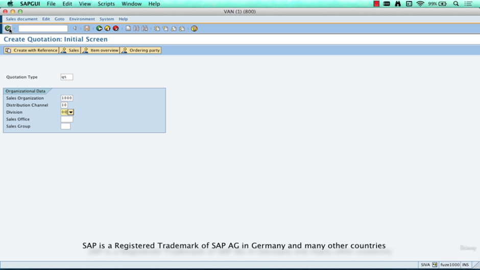
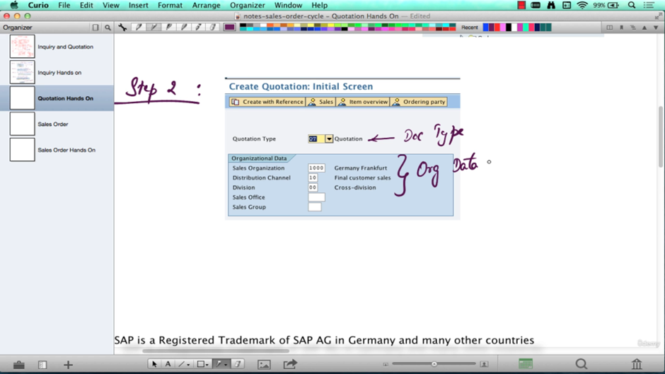

 
With the item selection – we can select the only item from inquiry to create quotation
 

 
Here we have not filled the valid from and valid to date, we can save and later enter that data also
 

Save

## Sales Order

 
Tcode – VA01 – To create Sales Order

 
Here delivery date is on 31 jan, but we are proposal delivery date is 13 feb
Click ok

 
Enter the po number(anything)

If we want to check how was the doc created
 

## Delivery

This document is created after SO, there can be multiple delivery documents for one SO.
For example feb delivery is created, then another could be created for march also.

The picking process involves taking goods from a storage location an staging the right quantity in a picking area where the goods will be prepared for shipping

 
Packing – if it is need for products to be packed
PGI – POST GOODS ISSUE – After the Goods have left the inventory, the account have to be maintained.

 
Open SO in change mode, then from menu select deliver button for delivery

Here delivery is trying to be create for feb month

 
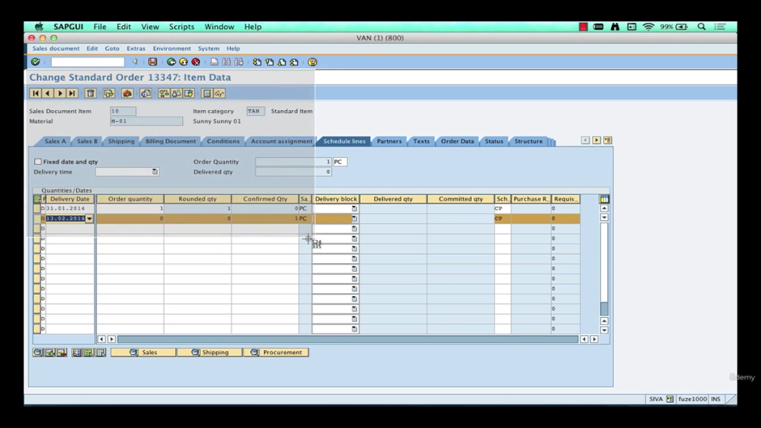

Here system is confirming the quantity to be delivered in 13 feb when it is actually available

 
Again go back and press deliver button in menu
 

 
Here we are future dating this, we are providing it future date to process the delivery

Here it is asking for picked quantity, if somehow there are not enough goods avl, we can give that picked quantity of the goods here

Save

 
To do PGI click on that button
 

Now delivery is completed

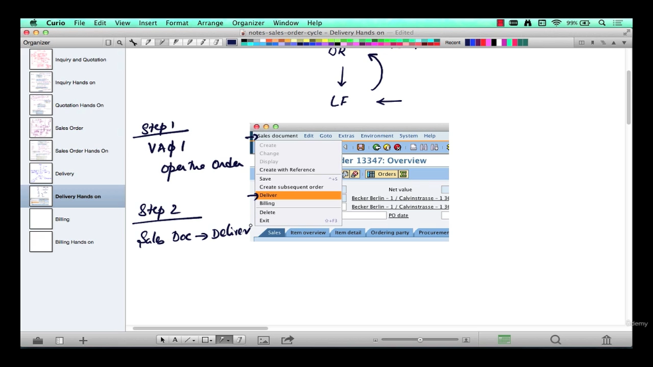
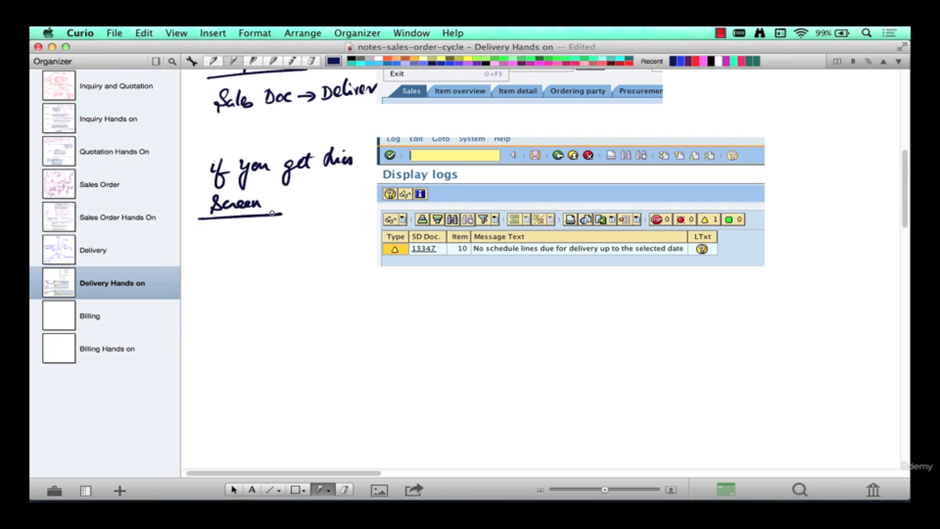

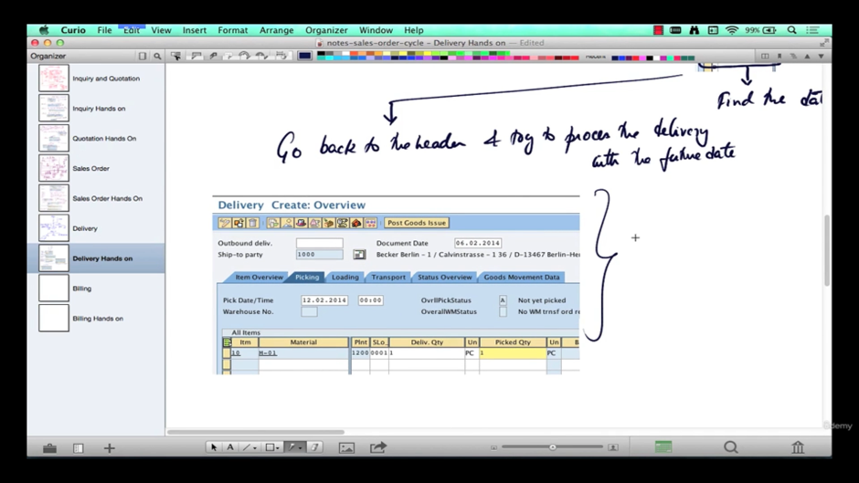

 
## Billing – Invoices

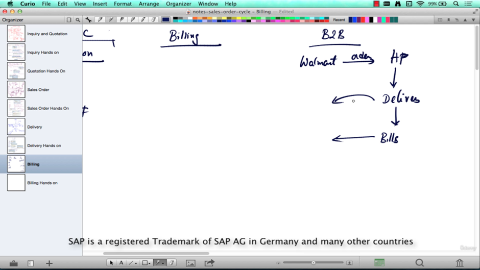

## Master Data
 

## Customer master
 

Tcode – VD01

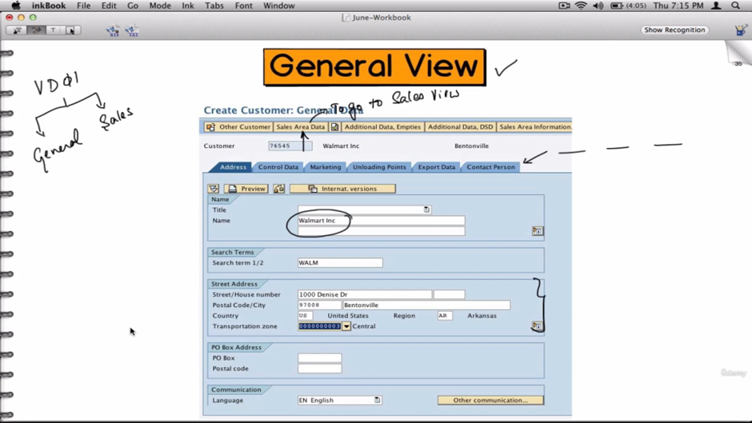

CLICK ON THE SALES AREA DATA
 

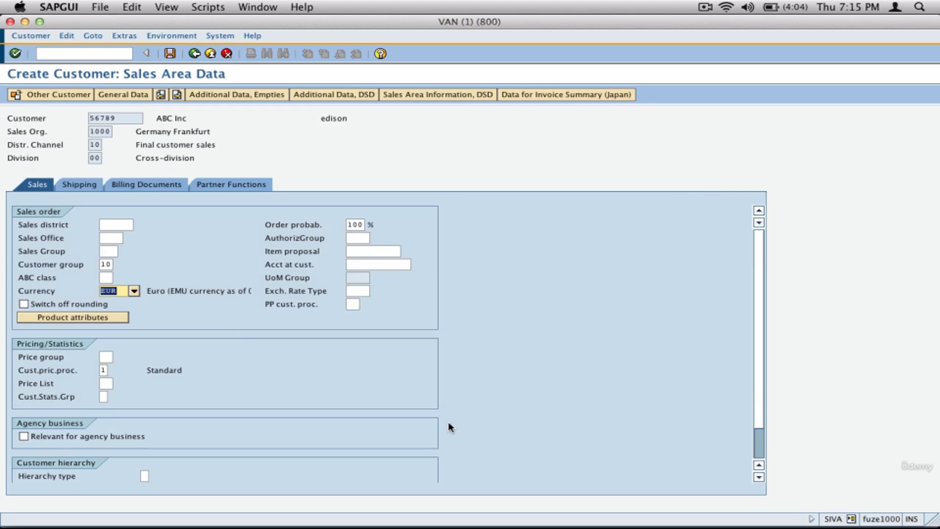

Delivery priority as name suggest

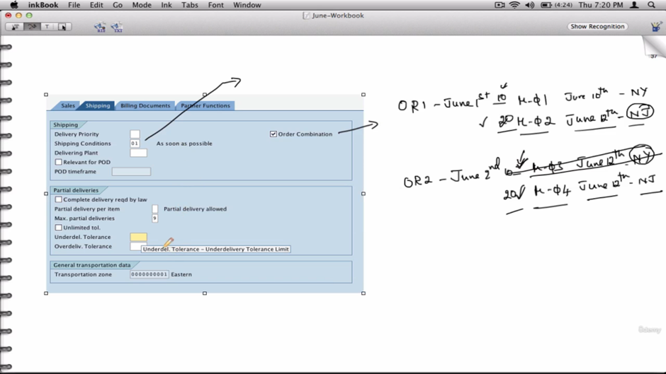
 
Order combination – If the date and place of delivery is same it can combine both line items of different order in single delivery
Complete delivery -  no partial delivery will be accepted
 

Tolerance – if customer is okay with delivery of little less or more quantity than the ordered quantity. The customer will be billed for delivery quantity. And if there is remaining quantity another order needs to be placed.
 

InvoicingDates – this will invoice the customer over a period link weekly, monthly, etc

InvoicingLIstDates – this will combine all the invoices of a period link weekly or monthly  into one document
 

Tax classification – how to tax the customer – need to ask FICO consultant for this info

Save the sales view

 
Tcode -FD01
 

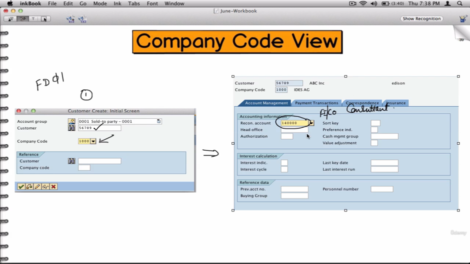

Now extending the view

VD02

 
Here customer data is extended for Germany company code – 1000
To extend it for USA – 3000

Here address is already present in master data so it does not need to fill it again
We just have to enter the shipping and billing data here according to USA

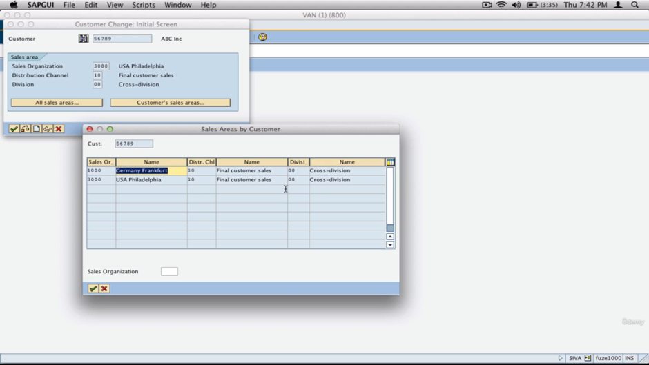
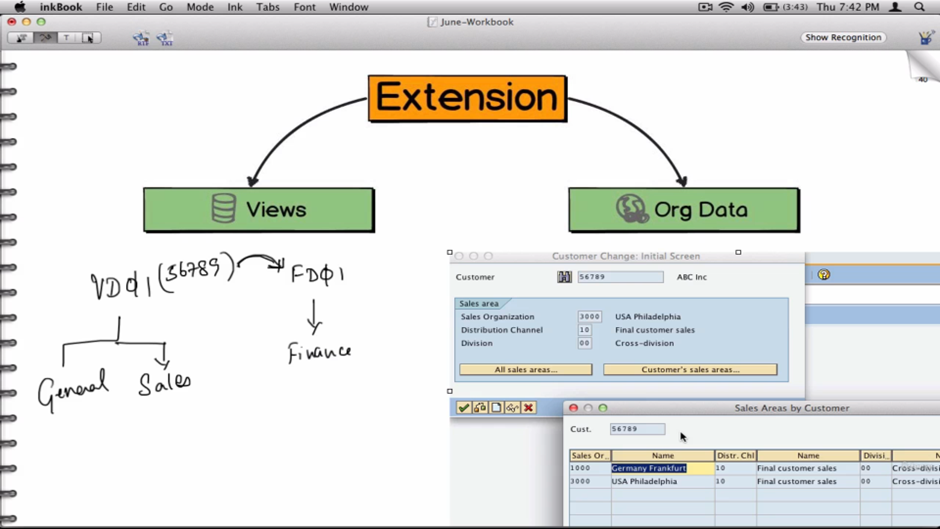
 
Now creating new customer with reference
 

Tcode -VD02

MADE CHANGES HERE
 

Double click on it

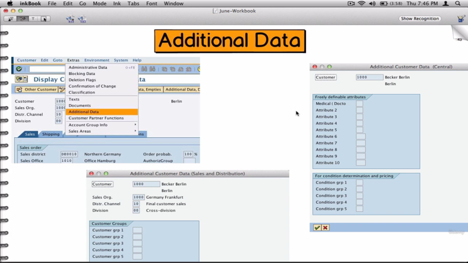
 
Go to general data for this.
We can customize this using CMOD 

## Material Master

MM01

 

Older material number – refers to the same material but from older system
 
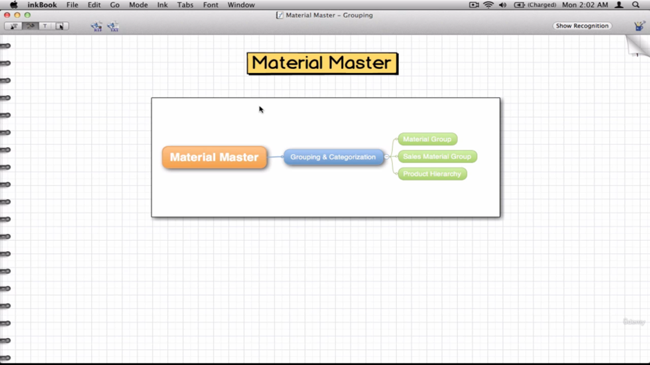

 
Here we can categories the same materials on different basis size, processor, type etc.
 

Hierarchy could be made like 5 – 5 – 8 structure, this is 3 level or it can be made by dividing differently 5- 3 - 3 - 3 – 4 it 5 levels
 

Sales Order Deep Dive
  
  
   
 
 
 
 
 
 
 
 
CO OP -BUYER – HELP TO GET THE BETTER DEAL
 
 
 
 
  
 
  
 
Tcode- vl02n
 
 
 
 
VF01
    
 
 
 
 
 
    
 
               
Enterprise Structure
   
Company code + Sales Org
Sales Area = ( S Org + D chnl + Div)
Sales Area <- Sales Office <- Sales Group <- People

Company can have multiple plant, but plants can not have multiple company code.
Plant can have multiple storage location for purposes like returns, defects, etc.
Storage location can have multiple ware house.
Plant <- Storage Location <- Warehouse
Plant needs to be mapped with Company code.
Plant  + ( Sales Org + D chnl )
Configuration
 
 
Create sales organization
 
      
 
       
Save

Create distribution channel
 
    
Create division
 
 
   
Create sales office
 
  
Sales group
  
Create plant
   
 
 
Create storage location
  
 
 
 
Warehouse
 
 
  
 
Shipping point
 
  
 
Assign company code to sales org  
Assign dist chnl to sales org
 
  
Assign divisions to sales org
 
  
Sales area
 
  
 
Assign sales office to sales area  
 
 
Assign sales group to sales office
 
  
Assign sales org, dist chnl, plant
 
 
 
Assign warehouse to plant/storage location
 
 
 
Assign Shipping point to plant
  
 
 
Common Distribution Channels and Divisions
Issue here is we have to create the customer for every sales area combination – this will be redundant data or unnecessary to create multiple times.
 
Here we will create a single record and for other combinations we will say them to take data from 10 as reference.
 
 
As long as you have referenced the dist chnl to another dist chnl, you can not create the master data for it or the refereced divisions.

Same with condition records
   
Enterprise Structure
Why we need this?
	Reporting
o	Internal
o	External (Comp Code) 
	Operational
o	Sales Org
o	Purchase Org
o	Plant
 
Business Processes
 
           
   
Document Type
    
Business Processes types
	Sales
	Delivery
	Billing
They can be further categorized
	Sales
o	Inquiry
o	Quotation
o	Order
o	Consignment
o	Contract
	Delivery
o	Reg Deliveries
o	Expedited Delivery
o	Returns
	Billing
o	Std Invoice
o	Credit
o	Debit
o	Corrections
 

 
 
 
 
 
Copy to create your own doc type
 
   
Reference mandatory – will force user to input the quotation number
 
Check division – will check if the material is from same division as sales order.
 
Check po no – this will check of the duplicate PO exists
 
Quotation Messages – 
 
 
Shipping
 
Del relevant billing type – this will create billing if only the delivery doc is generated, and delivery is completed
Order relevant billing type - this will create billing if only the order doc is generated
 
Inter company billing type - this will allow us to deliver the order from different company code, not from the company code they ordered. This might be the case when user needs to get the delivery fast, so it happens to be faster from different company code. 
 
Billing block 
Rush Order – RO - where delivery doc created instantly after creating the order doc
Item Category
BOM
   
Tcode – CS01 – To create BOM
     
Item category controls
   
 
Billing relevance
At header level or part level
At header level – this PC costs 650, includes the following components
At part level – this pc cost $, monitor $, CPU $, etc
 
Here mouse pad (MP) can be free of charge, so no billing required for that
Pricing Relevance
Same at header level or component level
At header level- we will show the total price
At component level – show price individually
 
Here it is component level
Here mouse pad (MP) can be free of charge, so no pricing required for that
Delivery Relevance & Schedule Line Relevance
It is divided in Order and Quotation
 
PC - Del is relevant in Order, but not for quotation
PC – Sche line is relevant in Orde and also in quotation
 
Here Ext – extended warranty – is not a tangible product, it cannot be delivered, so schedule line cannot for order is not created

You cannot do a delivery unless, you have schedule lines.
If you have schedule line that does not mean you have to do delivery.
Item Category control
 
 
Schedule Line Category
 
Drop Shipment – here the stock does not come to inventory, it directly gets delivered to customer location. 
There is no delivery doc created for this. After Order doc directly Invoice doc is ceated.
TAS – item category
This will trigger the schedule line category CS, which has not movement type, so it’s has no PGI.
 
Availability and transfer of Requirements
 
No Avl check on service products.
Avl check can be turned on or turned off in schedule line category level.
 
MRP- Material Requirement Planning
 
BOM gets flatten out in this delivery doc.
Delivery group – groups the BOM in a group so that all the components in BOM go together
 

 
 
 
 
Billing 
 
Profarma Invoice- When goods cross a border this invoice is needed, without tax, not posted to accounts, the price of free goods needs to be mentioned
 
Regular invoice – also tax invoice, commercial invoice, posted to accounts, here the cost of free goods need not to be mentioned
 
Credit – over charge a customer
Debit – under charge a customer
Return 
 
 
To reverse it logically, cancel the invoice, or give debit, credit invoice
 
 
A customer can have multiple invoices, to simplify these.

