02.

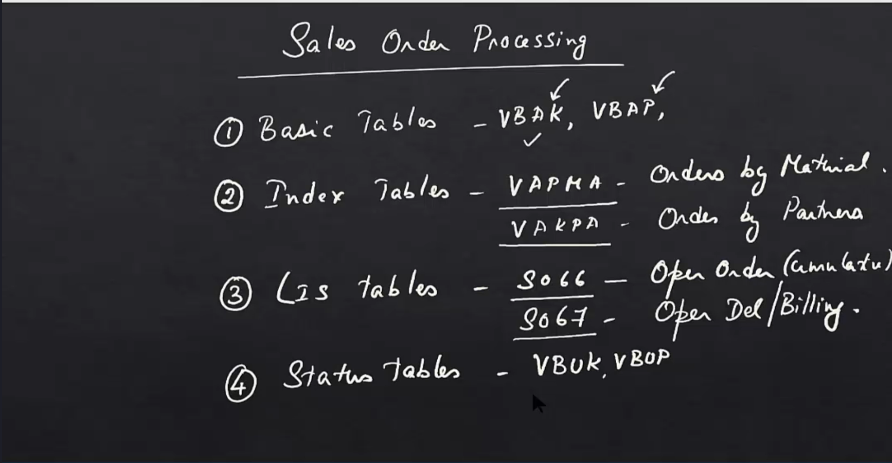

OLTP – Online Transaction Processing
OLAP – Online Analytical Processing
ETL – Extract Transform Load
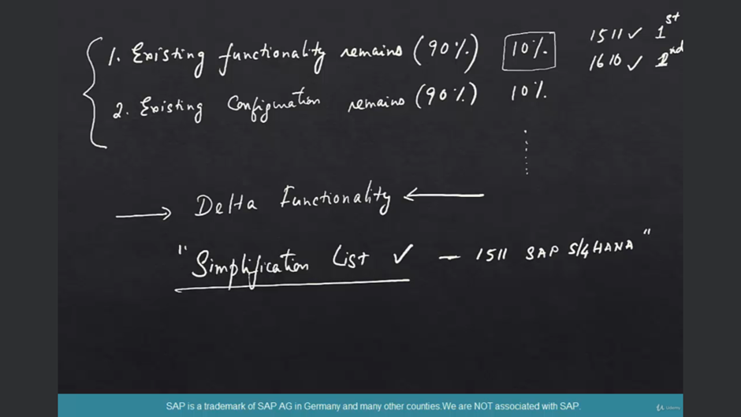
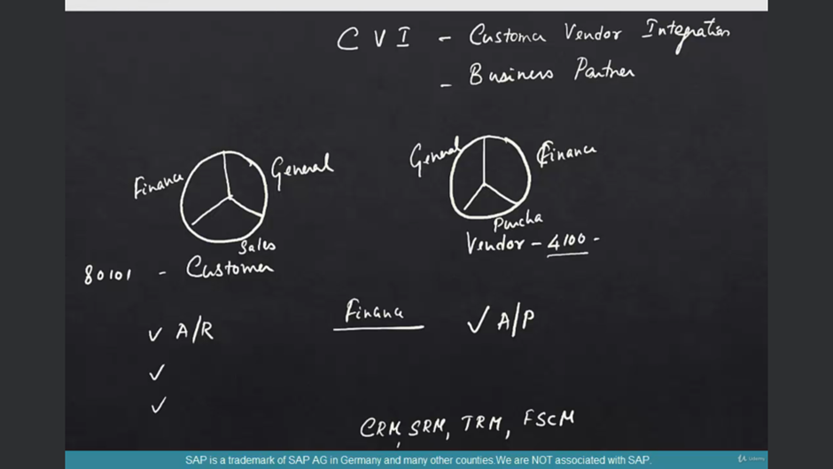
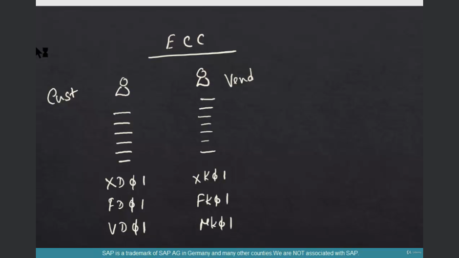
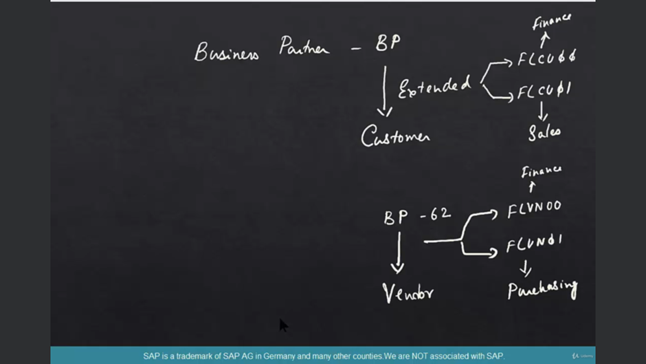
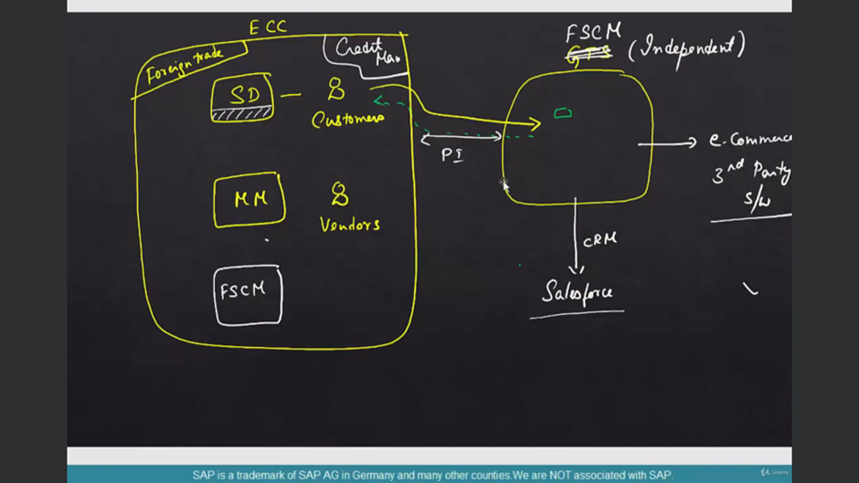

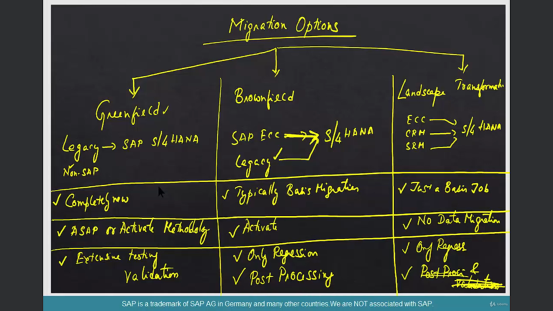

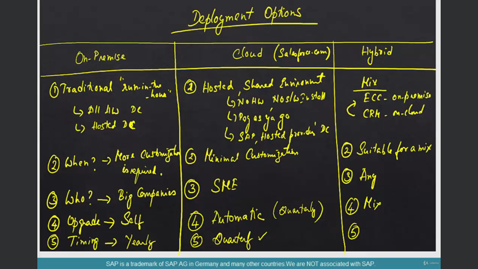

What is S4HANA Enterprise Management

SAP S4HANA Enterprise Management

For folks coming from the early days of S4HANA starting with products like Simple Finance, simple logistics, this is a new term.

The Evolution

The first product on S4HANA that leveraged the full power of the HANA database was Simple Finance. Then came Simple Logistics which covered the rest of the logistics areas like order to cash, procure to pay etc.

Enterprise Management

Now that every new S4HANA instances covers both Simple Finance and Simple logistics, the "simple" names are done away with and now the core S4HANA ERP suite is called Enterprise Management

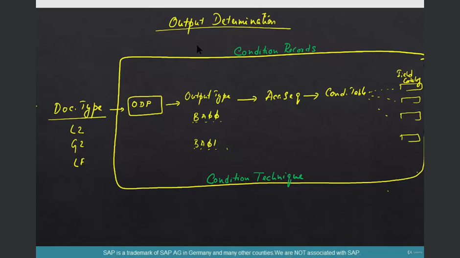
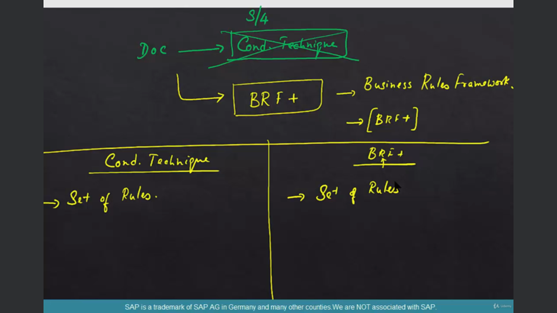
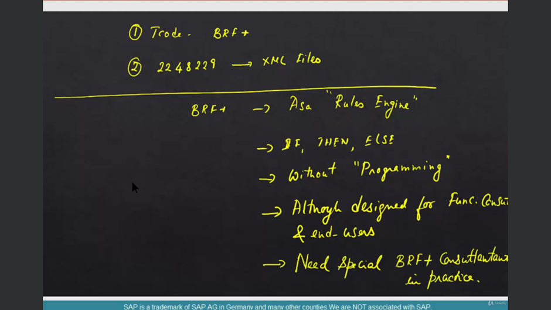
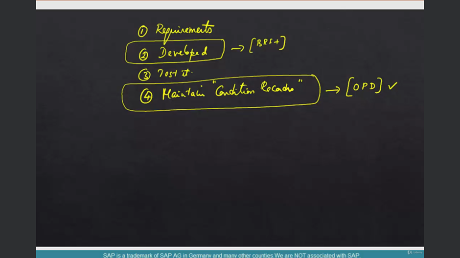
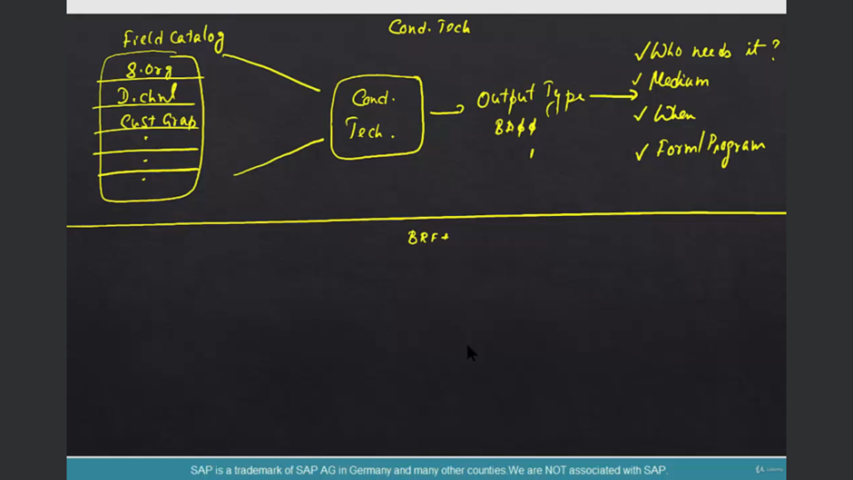

VOK2

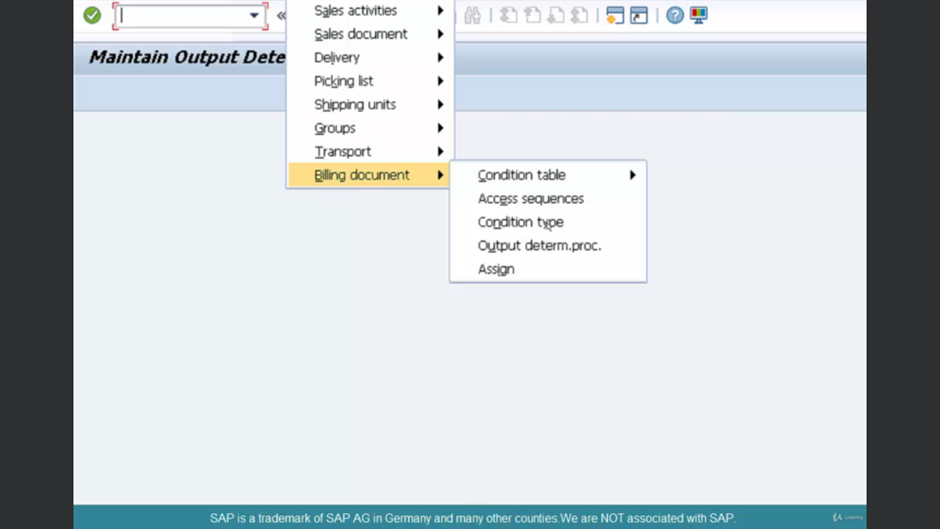
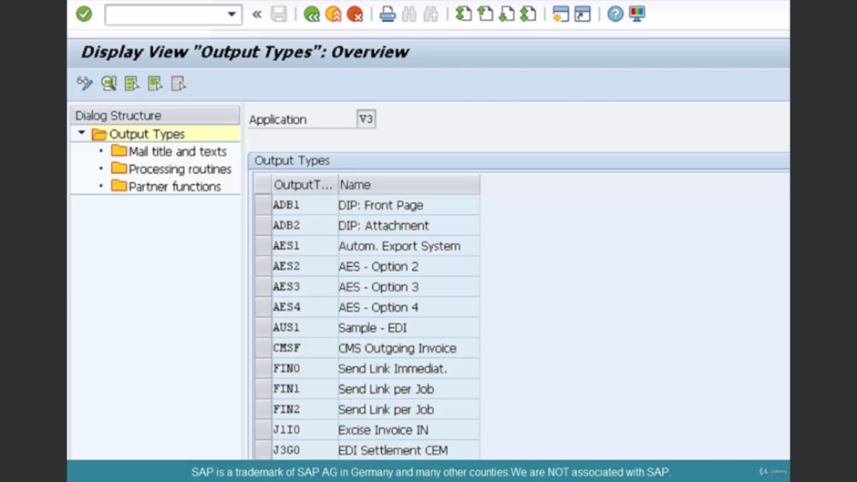
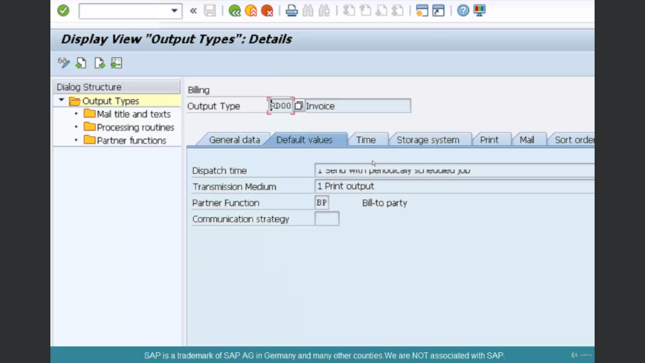
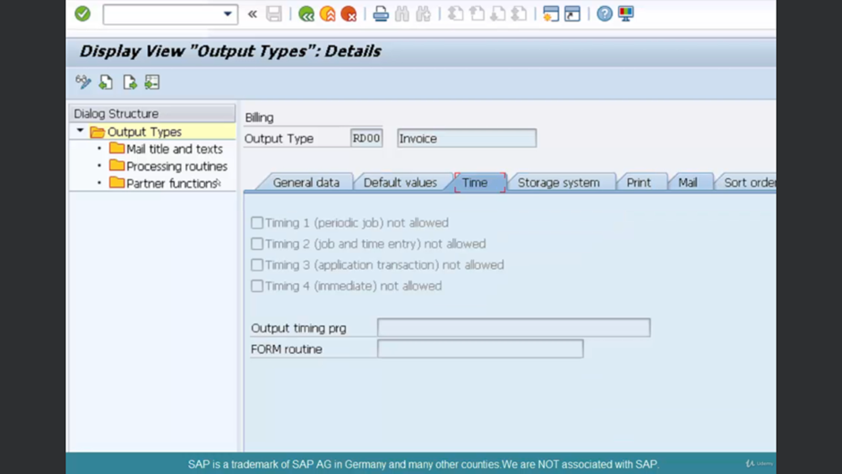
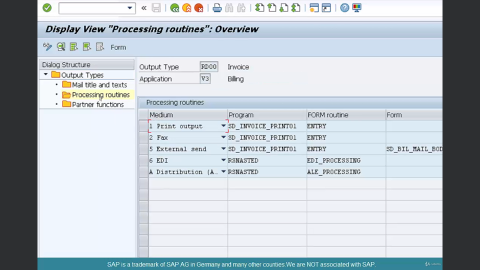
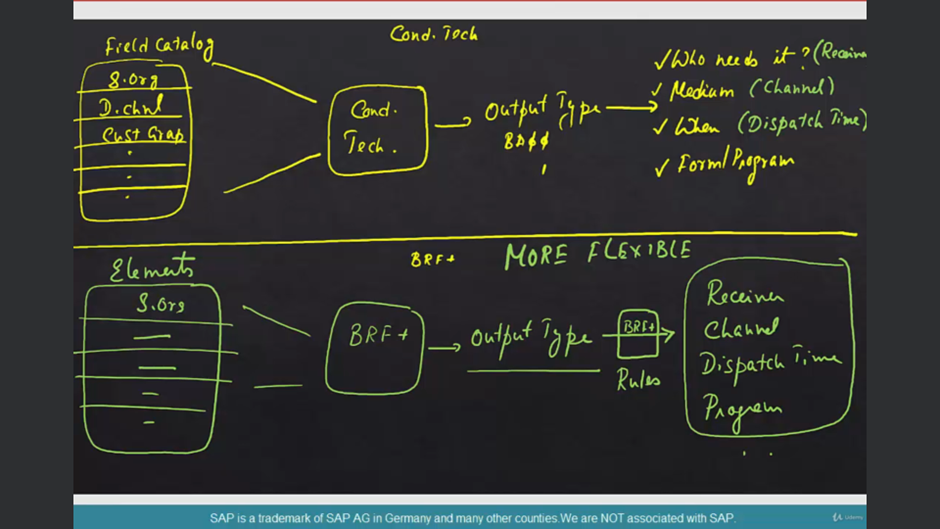
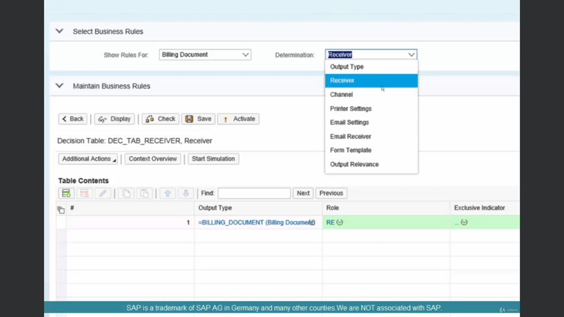
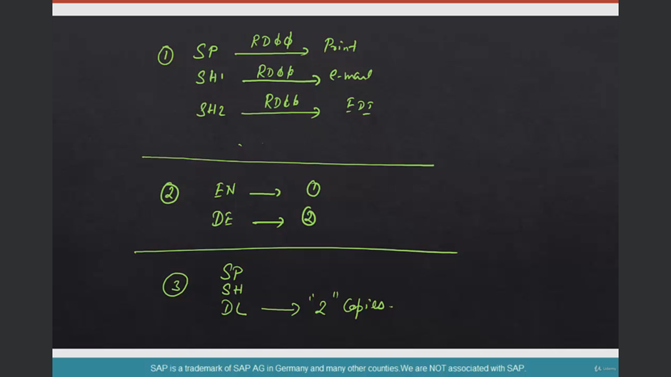