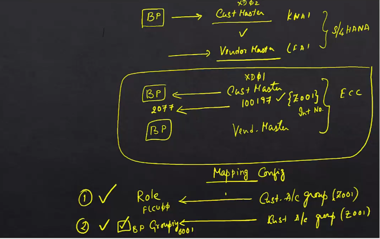

# Customer - BP Synchronization in SAP S/4HANA

## Introduction
This section covers the synchronization between Business Partner (BP) grouping and account groups in SAP S/4HANA.

## Overview
### Business Partner (BP)
- **Definition**: A new dimensional, new generation entity that integrates customer and vendor data.
- **Advantages**: Provides a unified approach to managing business entities.

### Traditional Customer/Vendor Master
- **Customer Master**: Traditionally created using transaction codes like VD01.
- **Vendor Master**: Traditionally created using transaction codes like XK01.

## Synchronization Concept
### Why Synchronize?
- **Compatibility**: Ensures existing code and data structures continue to function.
- **Interchangeability**: BPs and traditional customer/vendor masters represent the same entity but are stored differently for compatibility.

### Example Scenario
1. **Create Customer Master in ECC**: Demonstrates automatic creation of a corresponding BP.
2. **Configuration**: Shows how to configure synchronization settings.

## Practical Example
### Creating a Customer Master in ECC
1. **System Identification**: Green system indicates ECC, blue system indicates S/4HANA.
2. **Steps**:
   - **Transaction Code**: VD01
   - **Customer Account Group**: Z001
   - **Sales Area**: 1010, 10, 00
   - **Customer Name**: Mercedes-Benz
   - **Address**: Hyderabad, India
   - **Save**: Customer number 100197 is generated.

### Verifying BP Creation in S/4HANA
1. **Transaction Code**: BP
2. **Search Criteria**: Use search term or name.
3. **Verification**: Confirm that BP number 2077 is created corresponding to customer number 100197.

## Configuration Steps
### Navigation Path
1. **SAP Implementation Guide (IMG)**
2. **Cross-Application Components**
3. **Master Data Synchronization**
4. **Customer/Vendor Integration**
5. **Business Partner Settings for Customer Integration**

### Configuration Details
1. **Direction**: Customer to BP
2. **Mapping**:
   - **Customer Account Group**: Z001
   - **BP Role**: FLCU00
3. **Number Range Assignment**:
   - **Customer Account Group**: Z001
   - **BP Grouping**: 0001
   - **Same Number Option**: Enabled

## Summary
### Key Points
- **Synchronization**: Ensures that creating a customer or vendor automatically creates a corresponding BP.
- **Configuration**: Involves mapping customer account groups to BP roles and synchronizing number ranges.
- **Compatibility**: Maintains existing systems and code while transitioning to the BP model.

### Future Direction
- **BP as Master Data**: Eventually, BP will replace traditional customer and vendor masters.
- **Flexibility**: BPs can be extended with various roles, providing a versatile approach to managing business entities.

## Conclusion
### Summary
- **BP and Traditional Masters**: BPs provide a unified approach while maintaining compatibility with traditional customer and vendor masters.
- **Configuration**: Proper configuration ensures seamless synchronization between BPs and traditional masters.

### Next Steps
- **Detailed Configuration**: Future chapters will cover more detailed configuration of business partners.
- **Data Migration**: Discussion on data migration from ECC to S/4HANA.

## Additional Information
### Business Data Toolset
- **Definition**: A toolset used to define and configure the fields and dependencies for BPs.
- **Configuration**: Managed by an ABAP consultant based on functional requirements.

### Summary of BP vs. Traditional Masters
- **Traditional Customer Master**: Limited to general, sales, and finance views.
- **BP Model**: A flexible shell that can be extended with various roles and views, providing a more comprehensive approach to managing business entities.

So far we have covered what is business partner?

And the basic configuration behind business partner.

There is just one more thing in business partner in terms of configuration.

But we have to cover.

And that is the mapping between BP grouping and account group.

Let me give you an example.

When you create a beep.

I said entries are made in one.

Right.

That means when you create a BP a customer master.

In the traditional sense, like zero one.

It also created.

The only thing now with s four Hana.

Is that you can't view that customer master in zero 2 or 0 three.

The only view is BP.

So why even go create a customer master with a traditional data like A1K and a two?

The BP is there.

It's a new dimensional, new generation business partner.

It has some advantages.

Okay.

All good.

But why create a customer master every time a VP is created if you are giving it a role of customer?

If you are giving it a role of vendor, a vendor master is created.

In a traditional sense, like a one here and one here.

Those are the tables that makes entries in.

Now if you are not in s four Hana.

You can very well create the customer or business partner in BP and view the same in zero 2 or 0 three.

Now, we have already seen this.

In S four, Hana.

Now, what I'm going to show you is that when you create a customer master in EC.

When you create a customer master on the same logic applies for vendor master as well.

If you configure things right.

A beep will automatically be created.

This is.

This is not.

As for Hana, because you can't create a customer master using zero 1 or 0 one in.

As for Hana, you can only do that in EC.

What is the point I'm trying to make?

Point I'm trying to make is.

Number one.

BP existed way before s four Hana because of a variety of reasons.

Number two customer master in the traditional sense.

And business partner are interchangeable.

They basically represent each other.

When you talk about business partner as a customer.

It's just that data is stored in two different areas for compatibility reasons.

Now let's look at this example.

What I'm going to do now.

Is go to eke.

And then create a customer master.

I'll show you that it will create a.

Now I've changed the color of this system to green.

This is an SEC system.

This is not an s four Hana system.

The S4.

Hana is the regular blue and whenever you see the green system, it's a regular SEC system.

So I'm going to switch back and forth between the two.

And I want you to understand that green is SEC and the regular blue is for Hana.

All right.

So how do you create a customer master, say, sales view zero one.

And I'm choosing 001 here for a reason, which I'm going to explain a bit later.

You can choose any customer account group you want.

I've created one for myself.

And I'll tell you why.

And I've chosen 1010 zero zero as the sales area and the number range for Z001 is internal.

So you create the customer, a number will be generated automatically.

Click.

Okay.

And let's give it a unique name.

Say.

The Mercedes-Benz.

And right.

So maybe I just.

A unique name.

Then I'm going to give that address in Hyderabad.

India and some transportation zone.

Go to sales area data, fill in the things that are just required.

I'm not going to bother you with the details of how to create a customer master because you would already

know these things.

All right.

So save this customer.

And the customer number is what?

100197.

So make a note of that.

100.

197.

All right.

Now what I'm going to do is go to BP transaction BP and show you.

That that customer has really been created.

Decided.

It automatically pulled it up.

If you want, you can, let's say, start all the way from the beginning.

Says to say you want to search for me, right?

That was the search term.

You can search by name.

You can search by a variety of criteria.

So double click that and then you'll get that number.

Right now.

Do you see that?

10197.

That was the customer we have created.

An equivalent was created with the number 2077.

And that was created on the fly.

I did not create it.

That was created on the fly.

So what is the configuration for this?

If you go to SPRO.

IMG.

Cross application components.

And then right below business partner, there is something called as master data synchronization.

The reason we are going here is because we are trying to synchronize the creation of customer from VP

and vice versa.

In this case, we have created a customer in SEC.

And we have seen that the corresponding BP has been created.

Right.

The account group I have chosen is Z001, and I have given it an internal number range.

Let's see the configuration here.

It's really simple.

Not that complicated.

Now customer vendor integration.

That's where we need to go and click on business partner settings for customer integration.

And over here you see which direction are we going BP to customer or customer to in this case.

In this case, we have gone from customer to BP.

Right.

We have created the customer first and then a BP was automatically created.

So.

Direction customer to.

Select that.

And you see, this is the configuration I've made.

Z001 is the customer account group that controls the customer.

And the corresponding role I want to give is F00.

Right.

So this is the role I want to give when I create a customer of type 001.

Now, why do we have to do this setting?

Let's come here, for example.

You could create any kind of customer.

For example, you could create a lawyer as a customer in SEC, give it a special customer account group,

say Z Law.

For that account group.

What role should be created when a BP is created correspondingly?

That's what we are trying to decide here.

There cannot be a blind mapping between one customer account group and role.

There has to be some level of control, right?

Not all customers are the same.

Not all groups are same.

So depending on the customer type, is it a sold to?

Is it a payer?

Is it a one time customer?

You can give a corresponding role in BP, and that's what this does.

Q00 is the role that's given to the BP that's being created automatically when you create a customer

of type 001.

Right.

Once you do that, the next thing you have to do is number range, assignment from direction customer

to BP.

We have created a customer A is automatically created, right?

So the entry that I have made is.

If you create a customer of account group 001.

A customer with BP grouping 001 should be created.

You can also choose same number if you want.

That would be chosen.

Ideally, and what SAP recommends you to do whatever you create, create the same customer, whatever

customer you create, create the same number.

Anyway.

So there are two pieces of configuration that we have done here.

One is it's basically mapping, right?

You map the customer account group.

On the customer end or vendor end.

If it is vendor vendor account group, you map this.

To what role?

So this is the first setting that we have to do In this case.

What we have done is this was 001 and we have mapped this to Q00.

Company called View.

And the second thing is this.

This was number one, right?

This is the mapping configuration.

The second thing is the customer account group.

In this case, 001 has also got to be mapped to role.

Two BP grouping.

This case.

0001 internal.

And over here we have an option to select same number.

So this is the second piece of configuration.

If you do both these things in either direction, you can do it in either direction, right?

In this case, we have done it in the direction customer to VP.

You can do it in the direction of VP to customer.

So what are we achieving with this?

Why are we doing this again?

We are doing this because whenever a customer is created we can.

Force the system to automatically create a beep.

Whenever a beep is created, you can force the system to automatically create a customer.

And in order for the system to do that, there has to be some settings.

What are the settings?

Which account group in customer master in the traditional sense corresponds to which role in the business

partner.

And how to synchronize the number ranges when you create a customer.

21 What should be the number range created in BP?

And recommends that we synchronize the numbers.

That way.

BP.

100.

Number 100 corresponds to customer number 100.

Customer number one, two, three corresponds to number one, two, three.

Easy to reconcile.

That's it.

If you do these two things, any time you create a customer, you can create a BP.

Any time you create a vendor, you can create a BP.

And any time you create a BP with the role of vendor, you can create a vendor.

Simple, isn't it?

Once again.

Why are we doing this?

We are doing this because people are used to the concept of customers vendors.

And there is millions of lines of code written based on the traditional customer and material master

data.

So you can't just throw it away and introduce a new concept called BP and say don't use customer or

vendor, just use BP.

All the code will fail.

So for compatibility reasons.

All of this has to be done.

But you see the direction in which it's going, right?

Eventually the traditional customer and material master is going to be replaced, and BP is going to

be the master data for business partner, irrespective of its customer vendor account holder borrower.

We have seen so many examples, right?

Every type of customer.

Be a borrower or a regular B2B customer will be represented using one or more than one rules.

It could be a composite role rule grouping or a single rule.

You can give any number of roles to a business partner.

A business partner.

Is like a shell.

With 00000 roll.

And you can give it any role you want.

You want to give it a customer sales role?

Sure.

You want to give it a finance role?

Sure.

You want to make the same customer as a borrower.

Okay.

You want the same customer as something else?

Sure, you can do it.

Just map the same thing to a vendor as well.

Nothing different.

Essentially at the end of the day.

If you want me to summarize business partner in two minutes, this is how I would do it.

In a traditional sense.

This is how a customer master was represented, right?

A customer master had three views.

General View.

Sales View.

Finance View.

That's it.

You can't create more views.

You can add some fields here and there, no problem.

But you can't create new views.

This is the traditional customer master.

Same thing with the vendor.

Vendor has general finance purchasing in the BP world.

This is BP, just a shell with basic address.

This, basically.

Is.

All of this comes into it here.

Address and control data.

Right.

And now this.

BP can be extended any way you want.

You want to give it a sales view, just map it with a role.

And these roles are configurable and each role is associated with a view.

And The View is responsible for giving it all the fields that you see when you extend the business partner

to a role.

You want to give it?

Finance view.

Sure.

Give it a finance role.

You want to give it?

Borrower.

Roll, give it a borrower roll and you have a different view.

I would say business partner has come from a pie chart.

To a flower that has so many petals.

Right?

Each petal represents a role, and each role has a view that has so many tabs.

And that's definable.

Where do you define it?

You define it in a business data toolset.

Who configures business data toolset.

Your Abap consultant defines a business data toolset.

You just give him the requirements.

I want these, these these fields.

And this should be the dependency between the fields.

I want them organized in these tabs.

He'll do it for you.

That's based on what?

It's based on dialogue programming.

All right.

So this is the difference between customer master or vendor master in the traditional sense and business

partner.

