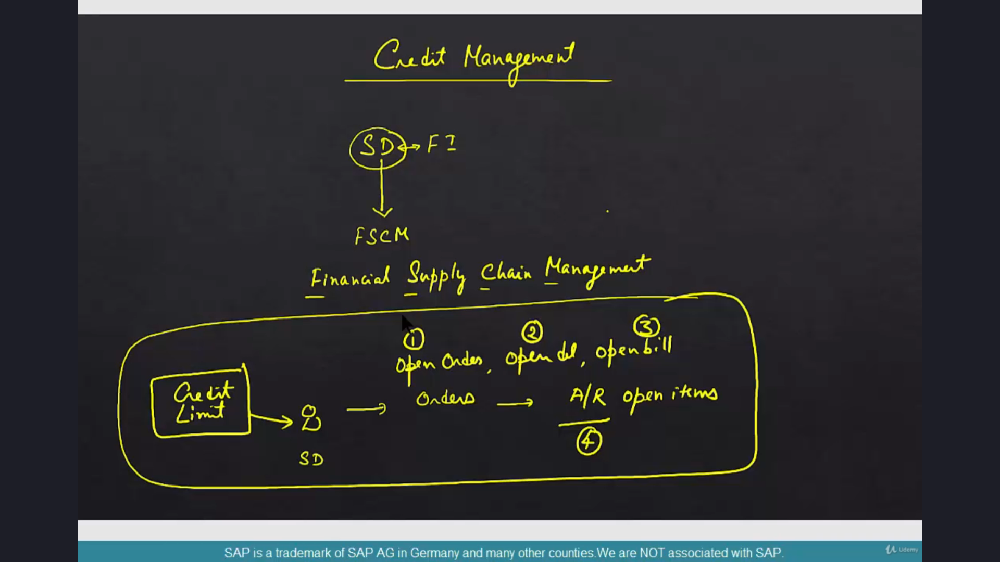
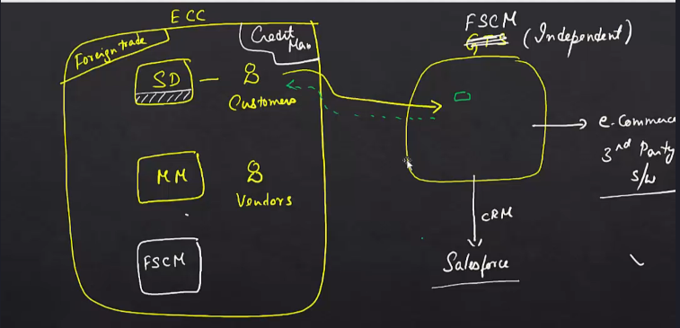

# The New Landscape

## Introduction
In this section, we will talk about credit management. If you are an SD consultant or an FI consultant, you know that credit management is a cross-functional area. The bulk of the configuration is done in SD, with some involvement from FI.

## Key Changes in Credit Management

### Transition to FSCM
- **Previous Setup**: Credit management was part of the SD module.
- **Current Setup**: Entire credit management has been moved out of SD into a different module called FSCM (Financial Supply Chain Management).

### What is FSCM?
- **Full Form**: Financial Supply Chain Management.
- **Development**: Developed by SAP well before S/4HANA.
- **Usage**: Used as a standalone module, similar to GTS (Global Trade Services).

### Why a Different Module?
- **Traditional Flow**:
  - Customer places orders in SD.
  - Orders become deliveries and billing, leading to accounts receivables (open items).
  - Credit management handles master data like credit limits, comparing open orders, deliveries, billing, and items against these limits.
- **Core Process**: The core process of credit management has not changed.
- **New Instance**: The functionality has been pulled out of the core SD module and is now handled in a new instance called FSCM.

### Example: Global Trade Services (GTS)
- **Previous Setup**: Foreign trade was part of the core SAP system.
- **Current Setup**: GTS is an independent system that evaluates customers and vendors against global trade regulations.
- **Advantage**: GTS can interact with multiple systems (SAP and non-SAP) to provide results, making it easier for third-party systems to get the right answers.

### Similarity with Credit Management
- **Independent Entity**: Credit management can now function as an independent entity, providing results for any system (SAP or non-SAP).
- **Flexibility**: This modular approach allows for greater flexibility and integration with external systems.

## Summary
- **Credit Management in S/4HANA**: Credit management is no longer part of the SD module. It is now handled by FSCM.
- **FSCM**: FSCM is typically kept as a separate instance but can be part of the same instance as well.
- **Communication**: FSCM typically communicates via PI with the core SAP system.

In this section, we will talk about credit management.

Now if you are an SD consultant or an FYI consultant.

You know that credit management is a cross functional area.

The bulk of the configuration is done in SD.

And a little bit in if this is how credit management is done in SEC.

With Hannah.

Entire credit management is moved out of SD into a different module called f.

S, c m.

It's a new module altogether.

It takes care of not just credit management, but so many other things.

But since we are talking only about credit management.

In the new World.

FCM takes care of credit management.

So FCM stands for Financial.

Supply chain management.

F.

S.

C m.

FSM is a module that was developed by SAP well before S four Hana.

It's used as a stand alone module.

Very much like us.

The next question that you might have is.

Now.

Why a different module?

Traditionally.

You have a customer.

This is an SD and then the customer places orders.

And orders.

Become deliveries and billing and become our accounts receivables.

Open items.

No.

If you are not aware of open items, you need to go back to SD.

This is the typical flow in EQ.

And then.

Credit management.

Takes care of some of the master data called credit limit.

That is associated with the pair.

Open orders.

Open deliveries.

Open billing.

And so open order.

Open delivery.

Open billing and open items.

Are compared against the credit limit.

This is how the business process runs irrespective of its Hana.

Or FSM or anything that you can think of.

This is credit management.

Nobody can defy that.

And is not defying that either.

So at the credit management level, this equation has not changed.

Open orders.

Open deliveries.

Open billing.

Are open items.

Blah, blah, blah.

This has not changed.

What has changed is that this functionality has been pulled out.

Of.

Your core is box the box and it is done in a new instance called FSM.

Now, again, the question is why?

Since the core process of credit management has not changed.

Why move this to a different module, different box?

Now, to understand this, let's take the example of.

There is.

And there is.

Two different modules.

One is sales, one is procurement.

SD deals with customers.

Deals with vendors.

And this is all inside SEC.

Now, SAP has created a new technology called Gte's Global Trade Services.

This was something that already existed in SEC.

With the name foreign trade.

Well before evening was created.

But with the introduction of Gt's.

The flow of data has changed.

But the business process has not changed.

The customers need to be evaluated, the vendors need to be evaluated, the orders need to be evaluated

from a perspective.

From a global trade perspective, the process has not changed.

There is still sanctioned party list, there is still license regulation.

There is all that stuff still remains.

The business process has not changed.

What has changed now is that the customer at the time of creation is the in customer master.

Immediately goes to.

And a check gets done here.

And comes back with the result, saying if he's a terrorist or not.

Right.

Or if he is belonging to a country, say, Iraq or Syria, which belongs to a sanctioned parties list.

And same thing with all business processes.

What is the advantage of this as opposed to having all that functionality inside?

SEC.

The main advantage is that Gtz is now an independent system that can deal with not just EAC but any

external system.

For example, it's not necessary that EAC is the only system for SD.

Only system for materials management, only system for all your business needs.

Sales could be done in SEC.

Material management could be done in some other system.

Serum could be done in a system, say Salesforce.

Let me just put them in there.

So this is CRM.

For example, this is not done in SAP, but done in Salesforce.

SDI is done in CRM is done in Salesforce and e-commerce.

Is not done in Hybris, but say some third party software.

It could be a Java based, net based whatnot.

In cases like this.

Gt's can act as a one stop stop for all your global trade needs.

It's an independent entity that can give you a result.

Saying that the order can be passed or not.

Or the customer can be true or not.

Or the vendor can be dealt with or not.

Stuff like this in an easy manner.

If it were all an sec, it would be very difficult for third party systems like Salesforce or other

e-commerce systems to get the right answers.

Imagine the same architecture, but instead of.

Let's put in.

Now think of your credit management.

Credit management.

Basically does some calculation and gives you a result.

Right.

And why should it be in SEC?

It need not be.

It can be, but it need not be.

It can be an independent entity that can give you the right results for any system, be it SAP or non

sap.

That's exactly what has happened with Hana.

With Hana.

Credit management is no longer part of SEC.

Well, it could be done in a sec, but I'll explain that a little bit later.

It's part of a new system called.

Now FCM could also be built into.

Like this.

Like SDM and FCM.

But it's no longer let me put it this way.

It's no longer part of SD.

Like it used to be in traditional EC.

Now, FCM is typically kept as a separate instance, much like how GS is done, but it need not be.

It could be part of the same instance as well.

FCM typically communicates via.

PY with sec.
