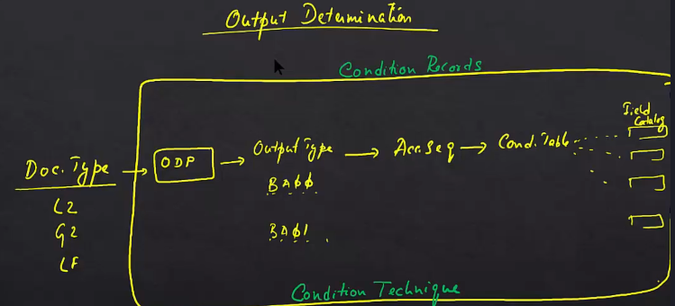

# Output Determination in ECC

## Introduction
In this section, we'll talk about output determination in SAP ECC.

## Understanding Outputs
When you create a sales document and save it, relevant outputs are issued. These outputs can include:
- Print output
- EDI (Electronic Data Interchange)
- Fax
- Email

## Traditional Output Processing Using Condition Technique

### Document Types
- **Examples**: L2, G2, LF (Invoice document types)

### Output Determination Procedure
- Each invoice document type is assigned an output determination procedure.

### Output Types
- Multiple output types can be assigned to an output determination procedure.
  - **Examples**: BA00, BA01

### Access Sequence
- Each output type is linked to an access sequence.

### Condition Table
- An access sequence is assigned to a condition table.
- Condition tables are created from a set of fields known as the field catalog.

### Condition Technique
- The entire setup of output determination procedures, output types, access sequences, condition tables, and field catalogs is known as the condition technique.

## How It Works
1. **Invoice Creation**: When an invoice is created, SAP uses the condition technique to determine the appropriate output types.
2. **Condition Technique Query**: The system queries the condition technique, which returns one or more output types based on the configuration.
3. **Output Assignment**: These output types are then assigned to the document.

### Example Scenario
- **Invoice for Walmart**:
  - A print invoice is sent to the Walmart payer.
  - An email invoice is sent to the respective store.
  - A fax is sent to a central purchaser.

## Summary
- The condition technique is a complex system involving output determination procedures, output types, access sequences, condition tables, and field catalogs.
- This system is used to return the appropriate output types for a given document in SAP ECC.

## Next Steps
- How is this different in SAP S/4HANA?

In this section, we'll talk about output determination.

We all know what outputs are right.

You create a sales document as soon as it is saved.

If outputs are relevant, an output is issued.

Outputs like print output.

EDI.

Fax.

Email.

Any of that stuff.

So let's quickly recap how the traditional output processing using condition technique works.

So you got a doctype or a document type.

If you're talking about invoices, the document type is L two or G two or Lf.

These are examples of invoice document types.

Right.

So against each invoice document type, an output determination procedure is assigned.

Right.

And.

Against each output determination procedure, there could be multiple output types.

One or more than one.

Typically.

Always more than one.

Example BA00.

Or BA01.

And internally against an output type.

There will be an access sequence.

An access sequence is assigned to a condition table.

Condition table is essentially created from a set of fields.

These set of fields is called the field catalog.

This entire set of technique.

You should know by now.

It's called condition technique.

So once again, what happens as soon as an invoice is created?

SAP asks.

This elaborate system, this condition technique based, elaborate system.

And the condition technique returns an output type.

That's all it does.

All of this in the box called output determination procedure.

Output types.

Access sequence Condition tables.

Field catalogs.

All it does is return one or more than one condition types.

And these output types are condition types are assigned to the document.

So, for example, if you create an invoice for Walmart, a print invoice needs to go to Walmart payer.

An email invoice needs to go to the respective store.

A fax needs to go out to a central purchaser.

These are all things that can be configured in condition Technique.

All SAP does at this point is call this elaborate condition, technique and condition technique returns

based on the configuration, a set of output types.

So this is the current world.

This is SEC.

This is how things work in SEC using condition technique for output determination.

How is this different in s four Hana?