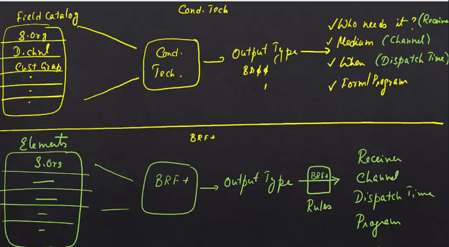

# OPD - Output Determination Master Data

## Introduction
The provided text explains the process of maintaining master data for output determination in SAP S/4HANA using the transaction code `OPD` (Output Parameter Determination). This transaction is used to manage output determination for various business documents such as billing documents, deliveries, purchase orders, and sales documents. When you enter the transaction code `OPD`, it opens a browser interface where you can see a set of rules for each specific document type.

## Using OPD for Output Determination

### Accessing OPD
1. **Transaction Code**: `OPD`
   - Opens a browser interface.

### Document Types
- **Examples**: Billing documents, deliveries, purchase orders, sales documents.

### Configuration in OPD
1. **Navigate to Document Type**: For example, billing documents.
2. **Settings Available**:
   - Output type determination
   - Receiver channel
   - Printer settings
   - Other parameters

## Comparison: Traditional Condition Technique vs. BRF+

### Traditional Condition Technique
1. **Field Catalog**:
   - Contains fields such as sales organization, distribution channel, customer group.
   - Influences how outputs are issued.
2. **Output Type Determination**:
   - Determines one or more output types (e.g., BA00, BA01).
3. **Output Type Controls**:
   - Receiver (e.g., sold-to party, bill-to party, payer)
   - Medium (e.g., print, fax, email, EDI)
   - Dispatch timing
   - Form or program triggered for the output

### BRF+ Based Output Determination
1. **Terminology Changes**:
   - Receiver is referred to as "receiver."
   - Medium is referred to as "channel."
   - Dispatch timing is referred to as "dispatch timing."
2. **Elements**:
   - Basic elements such as sales organization and distribution channel remain.
3. **Flexible Configuration**:
   - After determining the output type, additional rules can be applied to determine the receiver, channel, dispatch timing, and other parameters.

### Key Differences
- **Flexibility**:
  - BRF+ offers greater flexibility compared to the traditional condition technique.
  - Each parameter associated with the output can be controlled using rules in BRF+.
- **Control**:
  - In the condition technique, once the output type is determined, it controls the rest of the parameters in combination with condition records.
  - In BRF+, rules can be applied to each parameter, providing more granular control.

## Summary
- **OPD**: Used for maintaining master data for output determination in SAP S/4HANA.
- **BRF+**: Provides a flexible framework for managing business rules.
- **Comparison**: BRF+ offers more flexibility compared to the traditional condition technique.

## Conclusion
BRF+ and OPD streamline the output determination process in SAP S/4HANA, making it more flexible and manageable. The next chapter will include a quick demo to illustrate the process further.

The provided text explains the process of maintaining master data for output determination in SAP S/4HANA using the transaction code OPD (Output Parameter Determination). This transaction is used to manage output determination for various business documents such as billing documents, deliveries, purchase orders, and sales documents. When you enter the transaction code OPD, it opens a browser interface where you can see a set of rules for each specific document type.

For example, if you have already uploaded the configuration file for billing documents using BRF+ (Business Rules Framework Plus), you can navigate to the billing document section in OPD. Here, you will find settings for output type determination, receiver channel, printer settings, and more. The text then compares the traditional output determination method using the condition technique with the new BRF+ based output determination.

In the traditional condition technique, a field catalog contains fields such as sales organization, distribution channel, and customer group, which influence how outputs are issued. Based on these fields, the condition technique determines one or more output types (e.g., BA00, BA01). Each output type controls various parameters, including the receiver (e.g., sold-to party, bill-to party, payer), the medium (e.g., print, fax, email, EDI), the dispatch timing, and the form or program triggered for the output.

In contrast, BRF+ introduces some changes in terminology and functionality. The receiver is referred to as the "receiver," the medium as the "channel," and the dispatch timing as "dispatch timing." While the basic elements (formerly called field catalog) such as sales organization and distribution channel remain, BRF+ allows for more flexible configuration. After determining the output type, additional rules can be applied to determine the receiver, channel, dispatch timing, and other parameters.

The key difference between the traditional condition technique and BRF+ is the flexibility offered by BRF+. In the condition technique, once the output type is determined, it controls the rest of the parameters in combination with condition records. However, in BRF+, each parameter associated with the output can be controlled using rules, providing greater flexibility in configuration. The text concludes by suggesting a quick demo in the next chapter to illustrate the process further.

All right.

So the first transaction that we have seen is.

Biography, plus the next transaction that we are going to see where you maintain master data for output

determination is called OPD.

So the transaction code is o.

P d.

Think of it more like output determination.

And it opens a browser.

What do you have in the browser?

What you have is a set of rules.

Right.

And for what?

For each particular document.

For billing.

Document for delivery, for purchase order, for sales documents, so on and so forth.

Right.

Go to billing document because we have already uploaded the config file using bcf plus for billing document.

And then underneath that you have.

Determination for output type receiver channel, printer settings, so on and so forth.

Now, I want to briefly go back to the traditional output determination, using conditional technique

and try and compare to see how similar these are.

If you go to the traditional output determination.

Right.

I just want to draw a separator here.

So this is output based on condition technique.

And this is B plus based.

Output determination.

So how does things work in the condition technique?

You have a field catalog, isn't it?

The field catalog contains fields.

Feels like sales org distribution channel, customer group, anything that could be used to affect the

way output is issued.

And based on these fields.

Using the magic box of condition technique.

Which you are already aware of.

One or more than one output type.

Is determined, right?

Now, once this output type is determined, example B is zero, zero, B is zero one.

Once this output type is determined, the output type itself controls a bunch of things like.

Who needs to get it.

Is this for the soul, too?

Is this for Bill too?

Is this for the pair?

So this.

Is the receiver who needs this output.

And it also controls what is the medium.

It also controls when this needs to be issued, the dispatch timing.

It also controls what kind of a form or program.

Is triggered for this output.

So you can go to K2.

If I'm a sales consultant, all my output is there in Q2, right?

Or I can go to SPR or IMG sales and distribution, blah blah blah.

Output control.

And if we go to any output, say the billing output for sales.

Billing.

Condition type and then say zero zero, which is the invoice standard output be as zero zero or sales

zero zero is invoice, but it doesn't matter.

Any output type essentially has the same set of things.

You see, it has the default timings.

When does the dispatch needs to be done?

What kind of transmission?

Medium it is.

Print output.

Fax.

Email.

EDI.

Who is the partner function?

Is it billed to Sole.

To payer.

Who does this go to?

What's the timing?

And if you go to the processing routines.

For each medium, you can say this is the program and this is the form.

This is something we are all aware of.

Now in plus.

There is a slight change in the terminology.

Who needs to get it is called a receiver.

The medium is called channel.

And when the output needs to be issued.

It's called dispatch timing.

Now in VR, of course, you still need the basic elements.

Right now these fields are not called field catalog, but they are called elements.

Right.

There still are these elements because those are the basic building blocks based on which you configure

your rules.

So you got your sales org distribution channel, customer group, so on and so forth.

And then using brave plus.

Instead of condition technique, SAP determines the output type.

Again, one or more than one.

So one of the major differences here between condition technique and be of plus is.

Even after the output type has been determined, you can further do rules.

Using of plus.

To determine who the receiver is.

What is the channel?

What is the dispatch time?

What is the program?

So on and so forth.

In condition technique.

Once you determine the output type, that's it.

The output type controls the rest of the things in combination with condition records, of course.

But in of+, things are more flexible.

There is a determination for output type using rules and then you can determine the receiver using rules.

You can determine the channel using rules, you can determine the dispatch time using rules.

Every parameter associated with output can be controlled using rules.

So what is the difference between output using traditional conditional technique and A plus B plus,

apart from other things, is more flexible.

It doesn't make things simpler.

It makes configuration more flexible.

When compared to the traditional condition, technique based output determination.

Let's do a quick demo in the next chapter.