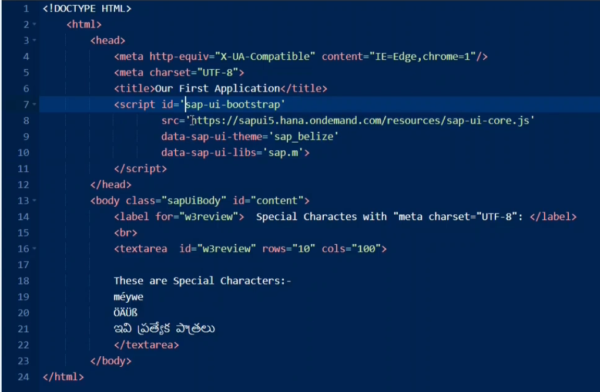
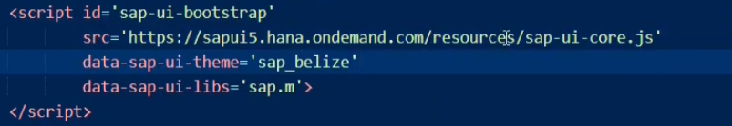

[UI5 Demo Kit](https://sapui5.hana.ondemand.com/)


```
<script id='sap-ui-bootstrap'
        src='https://sapui5.hana.ondemand.com/resources/sap-ui-core.js'
        data-sap-ui-theme='sap_belize'
        data-sap-ui-libs='sap.m'>
</script>
```
library is a combination of classes, classes are nothing but controls from this framework have to be loaded in our application.

first we have to link our application to sap ui5 framework only then we will be able to load the necessary controls otherwise this will be a normal web application without sap ui5 framework.



so this bootstrapping have to be done with the id sap ui bootstrap so this is mandatory parameter with the same id we cannot give any other id here 

this is the source tag which is pointing to the framework class.