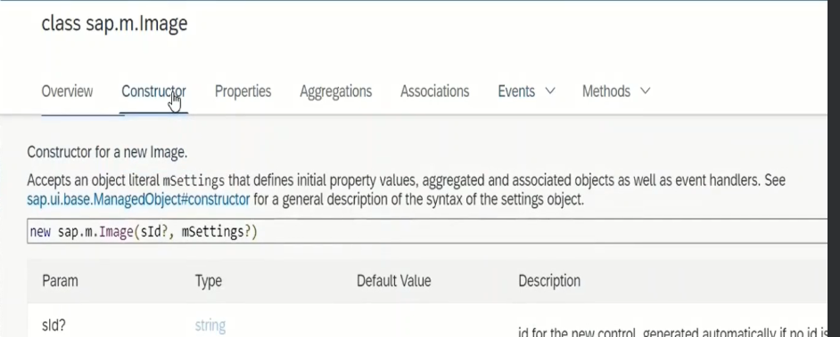

<style>
b {
    color : red;
}
</style>

# 1


```
 var oImage = new sap.m.Image();
```

for every variable declaration we need here sap.m is the library and image is the control of the library. If we go to SAPUI5 SDK we are going to find the libraries and the controls associated with each library. 


```
<script>
    var oImage = new sap.m.Image();
    oImage.setSrc("images/image1.jpg");
    oImage.placeAt("content");
</script>
```

there is a rule or there is a convention in SAPUI5 SDK that for each and every property of a control there will be set and get methods.

we have instantiated the image and we have set the path for that image and we have to place this image somewhere in the body of the document-oImage.placeAt(). again this placeAt() is one more method which is available for each and every control.

placeAt() accepts the id where this image control have to be placed.

there is something called sap.ui.core which is a core library in SAPUI5 framework this core library have to be instantiated and only then we will have to call any API's( Application programming Interfaces) like oImage to be displayed in the body of the application.

# 2.

This sap.ui.getCore() gets the instance of library sap.ui.core. once we get the instance we have to call a method called attachInit( ). <b>this attachInit method will be accepting event handler method, which will be called whenever the init event of the core library is fired.</b>

core library  will be loaded and once it is loaded init event is fired, our event handler method will be called. So here we will write the code.

```
sap.ui.getCore().attachInit(function () {

    var oImage = new sap.m.Image();
    oImage.setSrc("images/image1.jpg");
    oImage.placeAt("content");
});
```
# 3.
So now instead of setting the properties with the methods, we will be using the constructor itself of sap.m.Image( ) to set the properties. 

```
Before
    var oImage = new sap.m.Image();
    oImage.setSrc("images/image1.jpg");
    oImage.placeAt("content");

After
    var oImage = new sap.m.Image({
                    src: "images/image1.jpg"
                });
    oImage.placeAt("content");
```

# 4.


this sap.m.image control has the event press. so this event accepts a function. 

```
sap.ui.getCore().attachInit(function () {
			var oImage = new sap.m.Image({
				src: "images/image1.jpg",
				press: function () {
					alert("image is pressed");
				}
			});
			oImage.placeAt("content");
		});
```

It means whenever we are pressing the image an action should trigger. so that action is defined in the function and in the function we are simply writing an alert statement "image is pressed"

# 5.

```
sap.ui.getCore().attachInit(function () {
			var onImagePressed = function () {
				alert("image is pressed");
			};

			var oImage = new sap.m.Image({
				src: "images/image1.jpg",
				press: onImagePressed
			});
			oImage.placeAt("content");
		});
```

We can also replace this anonymous function with a variable. So inside this attachinit method we are going to define a function named function and name the function as onImagePressed and we are associating a function with that variable and for this press event I am passing the function.

# 6. 
```
sap.ui.getCore().attachInit(function () {
			var onImagePressed = function () {
				alert("image is pressed");
			};

			var oImage = new sap.m.Image({
				src: "images/image1.jpg",
				press: onImagePressed
			});
			var oImage1 = new sap.m.Image({
				src: "images/image1.jpg",
				press: onImagePressed
			});

			oImage.placeAt("content");
			oImage1.placeAt("content");

		});
```
We can also define one more control- same image control we can name it as oImage1.

# 7. 
```
sap.ui.getCore().attachInit(function () {
    var onImagePressed = function (oEvent1) {
        var sImgId = oEvent1.getSource().getId();
        if (sImgId === "image1") { 
            alert("image1 is pressed") }
        else {
            alert("image2 is pressed")
        }
    };

    var oImage = new sap.m.Image("image1", {
        src: "images/image1.jpg",
        press: onImagePressed
    });

    var oImage1 = new sap.m.Image("image2", {
        src: "images/image1.jpg",
        press: onImagePressed
    });

    oImage.placeAt("content");
    oImage1.placeAt("content");
});
```
now what we are going to do is, we are going to add the sid, which we have seen earlier that is the id for the control we name it as image1 for the first image and for the second image we are going to name it as image 2.

and now we are going to use this event handler method image pressed to identify which control has triggered the event. 

oEvent1 which is an argument for the event handler method and this argument will have a lot of information. 


go to the console and oEvent1 is the argument, is our argument which we have placed for the event handler method and here we can see oEvent1 has some information has a lot of information in fact so here we can see there is a parameter for that oEvent1 this is a object basically oEvent1 is an object.

let us observe what that mParameters is. get parameters why did i write get parameters. see for this event handler object this is an object basically we can say this is an object this is an object right.

parameters contains the id of the control which we clicked on so based on this id we can write further code.

getSource() - gives us the control
from the control we are going to get the id