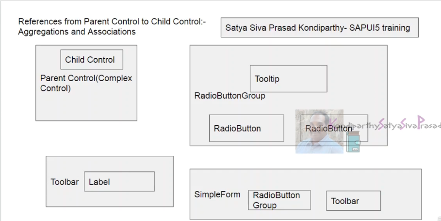
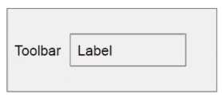
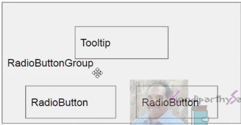
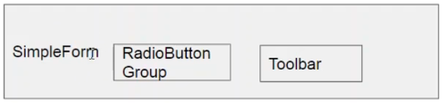
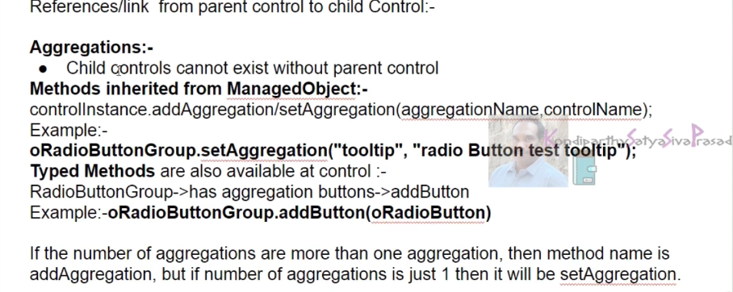
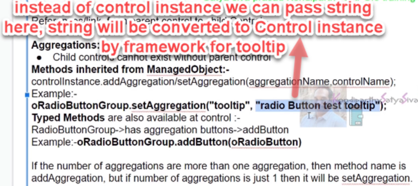
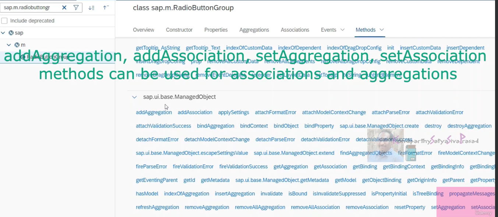
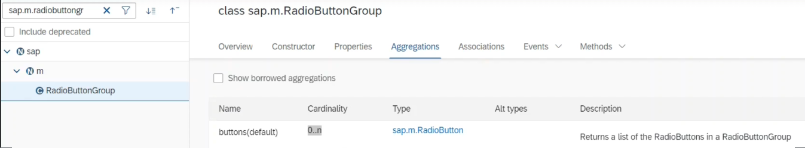
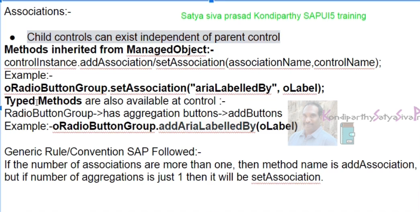
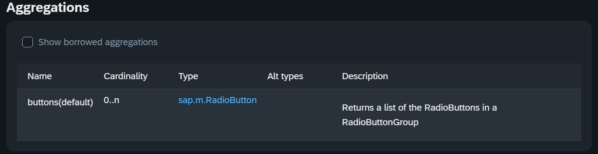

aggregations and associations are references from parent control to the child control. 

if a control can be placed inside another control then the placed control is called the child control and the control in which the child control is placed is called the parent control . otherwise it is also called as complex control because child controls can be placed inside parent control



the first example toolbar having a label the relationship between these two parent and child controls is association becausea label can be placed inside a toolbar or anywhere else. label can exist without a toolbar as well. so that's the reason label and toolbar are associated with each other. 



without radio button group, radio buttons cannot exist. so the relationship between these two is nothing but aggregations means child controls cannot exist without parent. if a parent dies child also dies.



in our example application i have also used simple form. inside simple form radio button group and toolbar controls are placed .simple form is nothing but a layout. layout arranges all the controls in a particular sequence. if the look and feel of the application have to be good we generally have to use layouts to arrange all the controls in a particular sequence




aggregations means child controls cannot exist without parent control

here if we have to implement aggregations means, if we have to add a child control to the parent control or if we have to add parent control to a child control then there are two ways possible. 

In the first method we will be using methods from the managed object and in the second method we will be using typed methods

## what are typed methods? 

typed methods are the methods which are implemented at the control level. these methods are not inherited from any parent class 

if we go to sapui5 sdk and go to radio button group just search for radio button group and go to the methods section. here there are three parent classes for this particular control



sap.ui.core.control and sap.ui.core.element and sap.ui.base.ManagedObject. so this managed object has add aggregation, add association , set aggregation and set association methods. 

so we can use this to add aggregations and associations to the parent control. 

if we go to the aggregations available for the radio button group ,we can see buttons is the aggregation. means radio button group is the parent and radio buttons of the child. here we can use two methods addAggregation or addButtons



the cardinality of buttons is 0 to n ,so that's the reason we will have to use addAggregation method. we cannot use setAggregation here. 

because the rule which sap followed for the aggregations or associations to be added for every control is that if the cardinality is 0 is to n then we have to use add method add aggregation if the cardinality is 0 to 1 then we have to use set aggregation method 

if we go to the methods available these are all the typed methods. means the methods which are implemented at the control



```
<script>
		sap.ui.getCore().attachInit(function () {
			var onImagePressed = function (oEvent1) {
				var oImgID = oEvent1.getSource().getId();
				if (oImgID === "image1") {
					alert("image1 is pressed");
				} else {
					alert("image2 is pressed");
				}
			}
			var oImage = new sap.m.Image("image1", {
				src: "images/image1.jpg",
				press: onImagePressed,
				width: "100px",
				height: "100px"
			});
			var oImage1 = new sap.m.Image("image2", {
				src: "images/image1.jpg",
				press: onImagePressed,
				width: "100px",
				height: "100px"
			});
			oImage.addStyleClass("sapUiSmallMargin");
			oImage1.addStyleClass("sapUiSmallMargin");

			var oRadioButton1 = new sap.m.RadioButton({
				text: "first Radio Button"
			});

			var oRadioButton2 = new sap.m.RadioButton({
				text: "Second Radio Button"
			});

			var oRadioButtonGroup = new sap.m.RadioButtonGroup({
				columns: 2
			});

			oRadioButtonGroup.setAggregation("tooltip", "radio Button test tooltip");
			oRadioButtonGroup.addButton(oRadioButton1);
			oRadioButtonGroup.addButton(oRadioButton2);

			var oToolBar = new sap.m.Toolbar();
			oToolBar.addContent(new sap.m.Label({ text: "Radio Buttons Below" }));

			/*	oToolBar.setAggregation("tooltip", "test tooltip" );*/

			/*	var oForm = new sap.ui.layout.form.SimpleForm({layout:"ResponsiveGridLayout"});
				oForm.addContent( oToolBar );
				oForm.addContent( oRadioButtonGroup );*/

			oImage.placeAt("content");
			oImage1.placeAt("content");

			oToolBar.placeAt("content");
			oRadioButtonGroup.placeAt("content");

			/*oForm.placeAt("content");*/

			/*	oToolBar.placeAt("content");
			oRadioButtonGroup.placeAt("content");	*/
		});
	</script>
```


toolTip- 0.1 cardinality

