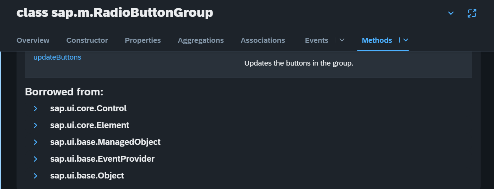
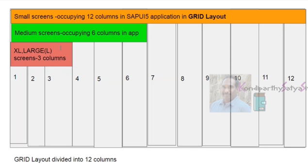
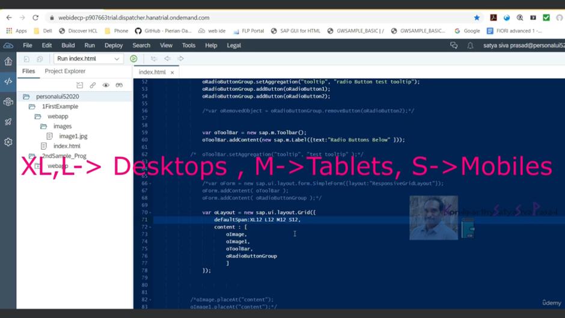

<style>
b {
    color : red;
}
</style>
there are two types of methods available for each and every control

first methods are the methods which are inherited from the parent class and the second methods are the methods written in the control itself

Example



sap.m.radioButton from the managed objects as well as sap.ui.core.Control
sap.ui.core.Element
sap.ui.base.ManagedObject
sap.ui.base.EventProvider
sap.ui.base.Object

some methods will be inherited to the class sap.m.radioButton

so do we need to use these inherited methods or the typed methods

```
typed methods are the methods which are implemented at the control itself

Typed methods are prefered to be used more than inherited methods
```





<b> content == control </b>

<b> Here we are using the grid layout, to place the contents on screen </b>

```
<script>
    sap.ui.getCore().attachInit(function () {
        var onImagePressed = function (oEvent1) {
            var oImgID = oEvent1.getSource().getId();
            if (oImgID === "image1") {
                alert("image1 is pressed");
            } else {
                alert("image2 is pressed");
            }
        }
        var oImage = new sap.m.Image("image1", {
            src: "images/image1.jpg",
            press: onImagePressed,
            width: "100px",
            height: "100px"
        });
        var oImage1 = new sap.m.Image("image2", {
            src: "images/image1.jpg",
            press: onImagePressed,
            width: "100px",
            height: "100px"
        });
        oImage.addStyleClass("sapUiSmallMargin");
        oImage1.addStyleClass("sapUiSmallMargin");

        var oRadioButton1 = new sap.m.RadioButton({
            text: "first Radio Button"
        });

        var oRadioButton2 = new sap.m.RadioButton({
            text: "Second Radio Button"
        });

        var oRadioButtonGroup = new sap.m.RadioButtonGroup({

        });

        oRadioButtonGroup.setAggregation("tooltip", "radio Button test tooltip");
        oRadioButtonGroup.addButton(oRadioButton1);
        oRadioButtonGroup.addButton(oRadioButton2);

        var oToolBar = new sap.m.Toolbar();
        oToolBar.addContent(new sap.m.Label({ text: "Radio Buttons Below" }));

        var oForm = new sap.ui.layout.form.SimpleForm({ layout: "ResponsiveGridLayout" });
        oForm.addContent(oToolBar);
        oForm.addContent(oRadioButtonGroup);

        <!-- <b> Here we are using the grid layout, to place the contents on screen </b>-->
        var oLayout = new sap.ui.layout.Grid({
            content: [
                oImage,
                oImage1,
                oForm
            ]
        });
        oLayout.placeAt("content");
    });
</script>

<body class="sapUiBody sapUiResponsiveMargin" id="content">
</body>
```

<b> To place form without layout </b>
```
/*	var oLayout = new sap.ui.layout.Grid({
        content: [
            oImage,
            oImage1,
            oForm
            ]
    });*/

oImage.placeAt("content");
oImage1.placeAt("content");
oForm.placeAt("content");
/*	oLayout.placeAt("content");*/
```

<b> Now placing content with form </b>
```
/*	var oForm = new sap.ui.layout.form.SimpleForm({layout:"ResponsiveGridLayout"});
    oForm.addContent( oToolBar );
    oForm.addContent( oRadioButtonGroup );
    */
/*	var oLayout = new sap.ui.layout.Grid({
        content: [
            oImage,
            oImage1,
            oForm
            ]
    });*/
oImage.placeAt("content");
oImage1.placeAt("content");
oToolBar.placeAt("content");
oRadioButtonGroup.placeAt("content");
```

<b> Placing all the content using layout grid </b>  
```
var oLayout = new sap.ui.layout.Grid({
				content: [
					oImage,
					oImage1,
					oToolBar,
					oRadioButtonGroup
				]
			});
			oLayout.placeAt("content");
```

<b> Here we are changing the defaultSpan value to control the grid layout</b>
```
var oLayout = new sap.ui.layout.Grid({
				defaultSpan: "XL12 L12 M12 S12",
				content: [
					oImage,
					oImage1,
					oToolBar,
					oRadioButtonGroup
				]
			});
```

skiped 6, 7 almost same

<b>We can also set the individual control layout span to be used in grid layout </b>
```
var oRadioButtonGroup = new sap.m.RadioButtonGroup({
				layoutData: new sap.ui.layout.GridData({ span: "XL12 L12 M12 S12" }),
				columns: 2
			});

oRadioButtonGroup.setAggregation("tooltip", "radio Button test tooltip");
oRadioButtonGroup.addButton(oRadioButton1);
oRadioButtonGroup.addButton(oRadioButton2);

var oToolBar = new sap.m.Toolbar();
oToolBar.addContent(new sap.m.Label({ text: "Radio Buttons Below" }));

/*	var oForm = new sap.ui.layout.form.SimpleForm({layout:"ResponsiveGridLayout"});
    oForm.addContent( oToolBar );
    oForm.addContent( oRadioButtonGroup );
    */

var oLayout = new sap.ui.layout.Grid({
    content: [
        oImage,
        oImage1,
        oToolBar,
        oRadioButtonGroup
    ]
});
oLayout.placeAt("content");
```

skiped 9 almost same