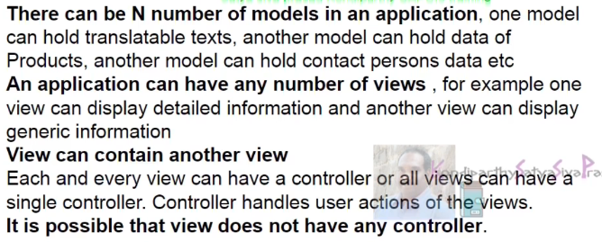

```
new sap.m.ObjectIdentifier({ text: "{ID}" })
```
here again we can see the data binding syntax is there here we cannot see a forward slash so what is the reason we are not able to see a forward slash is id and name are the two properties which we want to display 

```
oTable.bindItems({ path: "/SweetsSupplier", template: oTemplate });
```
here we have bound sweet suppliers absolute path to the entire table 

```
var oData = {
			"CountSweets": "2",
			"SweetsSupplier": [
				{
					"ID": 0,
					"Name": "Sweet Magic",
					"Address": {
						"Street": "Sivarao Street",
						"City": "Vijayawada",
						"State": "Andhra Pradesh",
						"ZipCode": "521456",
						"Country": "INDIA"
					}
				},
				{
					"ID": "1",
					"Name": "Aanjaneya Sweets",
					"Address": {
						"Street": "Bhavanipuram",
						"City": "Vijayawada",
						"State": "Andhra Pradesh",
						"ZipCode": "521456",
						"Country": "INDIA"
					}
				}
			]
		};
```
inside sweet suppliers there are fields id and name these are nothing but the properties so we want to display for each and every row of the table the id and the name of the sweet supplier

as we can see we have bound the entire table using absolute path binding so entire table is bounded to sweet supplier now each and every row inside the table have to be bound with this data so id and name are relative to this data hence we can directly have the field properties bound to the rows so that's the reason we have given id and name directly here

```
if it is root, slash have to be prefixed but if it is not root then this direct field name can be provided 
```

```
relative binding means the data inside the table is bound based on the table the sweet supplier data is already present in the table so inside the table we have id and name so relative to sweet suppliers, id and name are there so this is called a relative binding 
```

```
absolute binding means direct binding so directly the table is bound to the sweet supplier
```