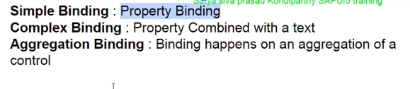

```
new sap.m.ObjectIdentifier({ text: "{ID}" })
```
Simple binding - the object identifier is bound to the property id in the json format this is the property of the control the property of the control is bound to the property of the json format so this is simple property binding 


```
oTable.bindItems({ path: "/SweetsSupplier", template: oTemplate });
```

Aggregation binding - aggregation binding is where we bind the aggregation of a control to properties of the model in particular array properties of the model and inside array we have records so the records of this model are bound to the table

```
var oTemplate = new sap.m.ColumnListItem({
			type: "Navigation",
			cells: [
				new sap.m.ObjectIdentifier({ text: "{ID}" }),
				new sap.m.ObjectIdentifier({ text: "{Name}" })
			]
		});
```


