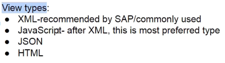
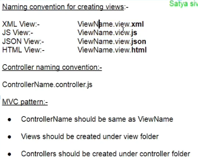
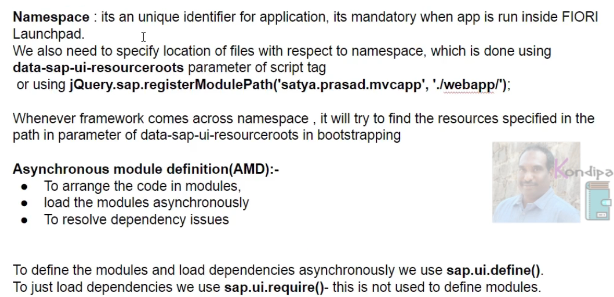
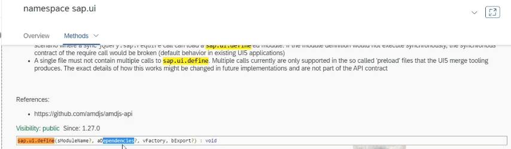
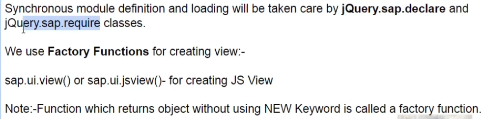
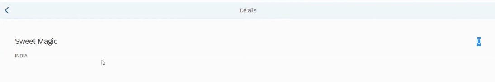

declarative syntax - XML, JSON, HTML



factory function is a function which returns an object without using new keyword




2 ways to define the namespace
this is important when deploying this in fiori launch pad
```
<script id="sap-ui-bootstrap" src="https://sapui5.hana.ondemand.com/resources/sap-ui-core.js"
		data-sap-ui-libs="sap.m" data-sap-ui-theme="sap_belize" data-sap-ui-compatVersion="edge"
		data-sap-ui-resourceroots='{ "satya.prasad.mvcapp" : "./webapp/"}'>
</script>

jQuery.sap.registerModulePath('satya.prasad.mvcapp', './webapp/');
```

this namespace is pointing to webapp/ means resources inside a webapp folder all those resources this namespace is pointing to

system encounters this namespace in application go to this webapp folder to find the resources

```
sap.ui.jsview("satya.prasad.mvcapp.view.First",
```

this particular line is telling the framework that this is the namespace we have defined the namespace

ui5 framework should go to the web app folder and inside web folder look into view for view folder so this is view folder inside view folder search for first so this is first


all related controls will be defined as modules and only those modules will be loaded for that particular view giving you the concept of modules for improvement of the performance of sap ui5.



```
sap.ui.define(["sap/ui/core/mvc/Controller"], function (Controller) {
	"use strict";
	return Controller.extend("satya.prasad.mvcapp.controller.First", {
		onListItemPress: function (oEvent) {
			var sPageId = "detailPageId";
			var oPage = oApp.getPage(sPageId);

			var oContext = oEvent.getSource().getBindingContext();
			oPage.setBindingContext(oContext);
			oApp.to(sPageId);
		}
	});
});
```

we will use asynchronous module definition syntax so this syntax has four parameters this is module name if we are going to give a particular name for this module and then dependencies we have to define so these dependencies can be modules or controls so all these dependencies first will be loaded instantiated and these dependencies will be given as input to the function this is a factory function once these are instantiated these will be given as a input to the factory function 



## creating second view for detailPage 



```
sap.ui.jsview("satya.prasad.mvcapp.view.second", {
	getControllerName: function () {
		return "satya.prasad.mvcapp.controller.second";
	},
	createContent: function (oController) {
		var oObjectHeader = new sap.m.ObjectHeader({
			title: "{Name}",
			number: "{ID}",
			attributes: [
				new sap.m.ObjectAttribute({
					text: "{Address/Country}"
				})
			]
		});

		var oDetailPage = new sap.m.Page(
			{
				title: "Details",
				showNavButton: true,
				navButtonPress: [oController.onNavPress, oController],
				content: [oObjectHeader]
			});
		return oDetailPage;
	}
});
```

	navButtonPress: [oController.onNavPress, oController]

Here we are passing the function and context, here we are defining an array and giving two parameters this is the event handler name 'ocontroller' inside ocontroller there is a event handler called onnavpress, so system is going to go into second controller and it is going to check for this event handler function so on nav press is the event handler function.

```
sap.ui.define(["sap/ui/core/mvc/Controller"], function (Controller) {
	"use strict";
	return Controller.extend("satya.prasad.mvcapp.controller.second", {
		onNavPress: function () {
			oApp.back();
			// this.back(); // this will not work, because this is pointing to control not the controller
		}
	});
});
```

again we also have to pass the controller reference as well so automatically this controller reference when we give it as a parameter for the create content function.

here the controller reference in second controller is not availale if we don't pass it from the view.

	oApp.back();
	// this.back();

inside the event handler if we use this keyword in our logic this will point to the controller reference if we pass like this

	navButtonPress: [oController.onNavPress, oController]

if we don't pass this controller reference from first controller, then it will point to the control reference (which is this second page) 

```
here only for javascript views we have to pass the controller references like this, for declarative view types we don't have to pass the controller reference 
```

so on press of navigation button we need to navigate back to the first page, if we need to navigate back there is something called oapp