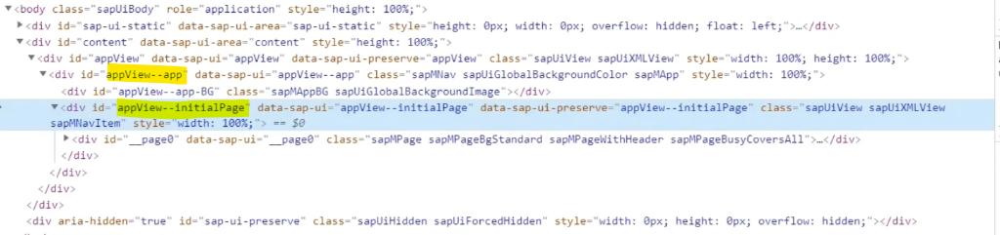
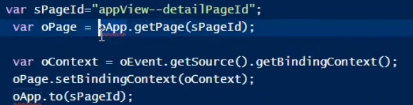

```
var oView = sap.ui.view("appView", {
			viewName: "satya.prasad.mvcapp.view.App",
			type: sap.ui.core.mvc.ViewType.XML
		});

<mvc:View xmlns:mvc="sap.ui.core.mvc" xmlns="sap.m">
	<App id="app">
		<pages>
			<mvc:XMLView id="initialPage" viewName="satya.prasad.mvcapp.view.First"/>
			<mvc:XMLView id="detailPageId" viewName="satya.prasad.mvcapp.view.second"/>
		</pages>
	</App>
</mvc:View>
```

Here while using XML, ids generated are different 




```
index.html

var oApp = oView.byId("app");
oView.placeAt("content");
```
we are able to access app reference by using the id given by us in app.view.xml but not the id generated by the framework the reason being we are trying to access the control by using the view reference 

by using any other means apart from view reference then we have to give the id generated by the framework so here we are trying to access the control inside a view by using app reference 


```
var sPageId="appView--detailPageId";
    var oPage = oApp.getPage(sPageId);
```

this is not the view reference, app reference is the reference of the control inside a view so in that case we need to give the id generated by the framework

The stucture look like this, PageView is child of AppView in run time. So fetch the generated ID from PageView by using our provided ID, then pass it to the AppView

```
-------------------
| AppView         |
| --------------- |
| |  PageView   | |
| --------------- |
-------------------
```

in JS, we were mentioning which view is the initial view
```
var oApp = new sap.m.App("myApp", {
			initialPage: "initialPage"
		});
```

But in the case of xml, which ever view is added first is the initial view
```
<App id="app">
    <pages>
        <mvc:XMLView id="initialPage" viewName="satya.prasad.mvcapp.view.First"/>
        <mvc:XMLView id="detailPageId" viewName="satya.prasad.mvcapp.view.second"/>
    </pages>
</App>
```