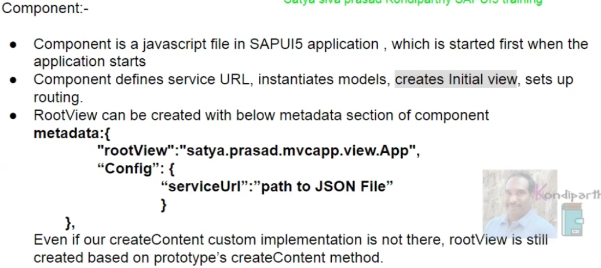

if componenet.js model is available at the component level it will be available at the entire application level 

    sap.ui.getCore().setModel(oModel);

now this is not required the problem with this setting the model to the core is when we run the application in sap fiori launchpad then if we set model to the core then all applications of the fiori launchpad will have the same core instance in that case no application will work with proper data