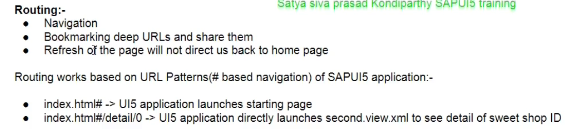

```
"routing": {
    "config": {
        "routerClass": "sap.m.routing.Router",  //standard router class provided by sap
        "viewType": "XML",                      //all our views in routing are XML Views
        "viewPath": "satya.prasad.mvcapp.view", //folder in which views are present
        "controlId": "app",                     //control in which views should be placed
        "controlAggregation": "pages",          //aggregation in which views should be placed
        "transition": "slide"                   //we can try flip/show transitions as well
    },
}
```

viewType - we are specifying as xml view the reason we have specified the view type here is we are going to create the views also automatically if we see here inside in the view app.view.xml

```
<mvc:View xmlns:mvc="sap.ui.core.mvc" xmlns="sap.m">
	<App id="app">
	<!--<pages>
			<mvc:XMLView id="initialPage" viewName="satya.prasad.mvcapp.view.First"/>
			<mvc:XMLView id="detailPageId" viewName="satya.prasad.mvcapp.view.second"/>
		</pages>-->
	</App>
</mvc:View>
```

we don't need to declare the views in this app.view.xml we will be able to create these views automatically just remember that pages is the aggregation and inside aggregation we are placing these two views

```
"routing": {
    "config": {
        "routerClass": "sap.m.routing.Router",  //standard router class provided by sap
        "viewType": "XML",                      //all our views in routing are XML Views
        "viewPath": "satya.prasad.mvcapp.view", //folder in which views are present
        "controlId": "app",                     //control in which views should be placed
        "controlAggregation": "pages",          //aggregation in which views should be placed
        "transition": "slide"                   //we can try flip/show transitions as well
    },
}
```

the view path we are specifying it as namespace.view inside this view folder all the views are there that is what we are specifying

the control id is app means inside this app control id we will have to place the views and that is what we are specifying to the system

transition at the moment or we can use flip or show anything

we are telling the system in this root view go to the app control go to the pages aggregation and create the views specified in the routes so routes has patterns so as i said earlier when we have executed the sap ui5 application we have seen that there is just one pattern so this is empty pattern but still even for empty pattern we will have to declare it in routing configuration file in component.js

```
"routes": [{
                "pattern": "", //no text after # in URL
                "name": "master",
                "target": "master1"
            }]
```

so this is called pattern so this is null pattern but still this pattern has a name called master and it has a target, target means what should be loaded when this pattern is matched by the framework master page should be loaded the master page means the home page

pattern has a target so there is one more section called targets here

```
"targets": {    // targets define which view should be displayed
                "master1": {
                    "viewName": "First", //view path is defined in global configuration of the router- no need to define full path
                    "viewLevel": 1 //slides to left
                    /* "controlAggregation":"pages"*/
                },
                "detail": {
                    "viewName": "second",
                    "viewLevel": 2 //slides to right
                }
            }
```

this targets will have the target name which we have specified in the routes section master one is there so this master one is again pointing to a viewname and view level

```
{
    "pattern": "detail/{ID}", // => URL Pattern looks like this - #/detail/0 or 1 -> ID is mandatory parameter
    "name": "detail",
    "target": "detail"
}
```
the second pattern is also defined this is a mandatory parameter if it is specified in the curly braces then it is a mandatory parameter so this have to be filled in mandatorily when we are navigating from one page to another using routing concept at the code level we have to fill this id parameter 

```
init: function () {
			UIComponent.prototype.init.apply(this, arguments);
			this.getRouter().initialize();
		}
```

this init function is a standard function and this this.getRouter() will give us the router instance we are using initialize method to initialize the router this call is mandatory and this is super class call

```
sap.ui.define(["sap/ui/core/mvc/Controller"], function (Controller) {
	"use strict";
	return Controller.extend("satya.prasad.mvcapp.controller.First", {
		onListItemPress: function (oEvent) {
			var oSelectedItem = oEvent.getSource();
			var oCtxt = oSelectedItem.getBindingContext();
			var oRouter = sap.ui.core.UIComponent.getRouterFor(this);
			oRouter.navTo("detail", {
				ID: oCtxt.getProperty("ID")
			});
		}
	});
});
```

here we are getting the selected item based on the selected item i am getting the binding context by using that binding context i am getting the property id

we are getting the selected item, this is actually table line item we will see what this context is

    var oCtxt = oSelectedItem.getBindingContext();  // this is the like sweets/1/ID

this is the context basically, data is bound to this line item that we are getting here in the context 

    var oRouter = sap.ui.core.UIComponent.getRouterFor(this);

we are getting the router instance here get router for sap.ui.core.UI component will give us the component.js instance and by getting the component.js instance we are getting the router instance

based on this router instance we are navigating to the detail pattern if we see here if we go to component.js here the pattern is a detail pattern so in order to navigate to the detail pattern we will have to write this piece of code
```
oRouter.navTo("detail", {
				ID: oCtxt.getProperty("ID")
			});
```

we will have to fill the id mandatory parameter, what is this id go to this model defaultmodel.json what is the path here for the context it is sweet suppliers of zero