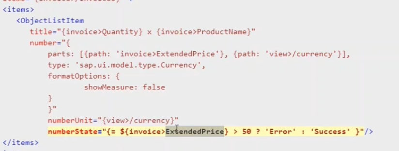

expression binding is used to evaluate small/simple conditions but if we have to evaluate complex conditions then we will have to use formatter.

Formatter:-

- Instead of displaying the data(model property value) as it is from backend we can modify data to be user friendly/understandable format(custom value different from backend).
- Instead of binding the data as is from backend , we can bind different value from backend to a control.
- Expression binding is used to evaluate simple true/false conditions , but formatter can be used to evaluate more complex conditions and pass back the value to be bound to a property.

Syntax used:-
Binding with multiple parts in View

```
ControlProperty="{
    parts: [
        { path:’modelProperty’ },
        { path:’modelProperty’ }
    ],
    formatter: ‘.controllerProperty.formatterFunction’
}"
```

in the formatter as well we are going to evaluate conditions based on the model properties and we are going to bind a particular value to control property based upon our requirement.

the syntax for using the formatter is this one and we are going to use binding with multiple parts syntax in this formatter coding to the control property we will pass two properties from the model two or three or however the number of properties we want to evaluate we will pass all those properties to this formatter function. so the syntax for passing is binding with multiple parts.

    state="{ parts:[ {path:'ODATA>WeightMeasure'}, {path:'ODATA>WeightUnit'} ], formatter:'.variable.formatterFunction' }"

so if there are multiple properties to be bounded to a particular property we will have to use this particular syntax of parts. parts, this is array syntax and inside the array the objects have to be passed. inside the objects the path to the model properties have to be specified and all these properties will be input parameters or arguments to this formatter function. 

formatter: ‘.controllerProperty.formatterFunction’ - we are going to define a controller variable and that variable will be referring to an object and inside that object we are going to define a formatter function. 

```
List.controller.js
sap.ui.define(["sap/ui/core/mvc/Controller", "sap/ui/core/routing/History", "sap/m/MessageToast", "satya/prasad/mvcapp/utilities/utilities"],
	function (Controller, History,
		MessageToast, utilities) {
		"use strict";
		return Controller.extend("satya.prasad.mvcapp.controller.List", {
			variable: utilities
		});

List.view.xml
<ObjectNumber number="{ODATA>WeightMeasure}" unit="{ODATA>WeightUnit}" 
							state="{ parts:[ {path:'ODATA>WeightMeasure'}, {path:'ODATA>WeightUnit'} ],
								     formatter:'.variable.formatterFunction' }">
</ObjectNumber>

utilities.js
sap.ui.define([], function () {
	"use strict";
	return {
		formatterFunction: function (WeightMeasure, WeightUnit) {
			if (WeightMeasure > 5) {
				return "Success";
			} else {
				return "Error";
			}
		}
	};
});
```

    .variable.formatterFunction

here this variable is referring to .js file which is returning an object and inside this object, formatter function is there so in order to point to the property of an object we have to use the dot notation 

```
{
    formatterFunction: function (WeightMeasure, WeightUnit) {
        if (WeightMeasure > 5) {
            return "Success";
        } else {
            return "Error";
        }
    }
}
```
here now these two weight measure and weight unit are being passed to the formatter function and those are evaluated inside the formatter function and formatter function is either returning success or error 

    state="{ parts:[ {path:'ODATA>WeightMeasure'}, {path:'ODATA>WeightUnit'} ],
								     formatter:'.variable.formatterFunction' }"

so the success or error is bound to the state property of objectnumber control this is how we will be using the formatter function