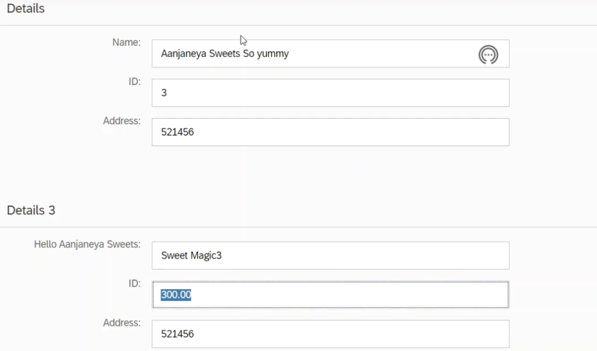

here we can see that the data is formatted, the data will be bound back to the model data will always be connected to the model but in case of formatter and the two way data binding does work so if we change to 2 here we can see that inside the model there is a 2 and if we change it to 3 it is changed to 3

also the decimals this is only for the user look and feel right the format options are used only for the users look and feel but the data which is residing in the model will be different see the data is 3 but what is appearing is 3.00 because we have specified the minimum fraction digits as a 2 here, also right now there is no validations

to set a breakpoint - sap.ui.getCore().attachValidationError( function(oEvent) {debugger;} );

this will execute when an error has occured

   sap.ui.getCore().getMessageManager().registerObject(this.getView(), true);

this register object will accept the object for which the message manager have to display the messages

on error, changed data is not committed to model