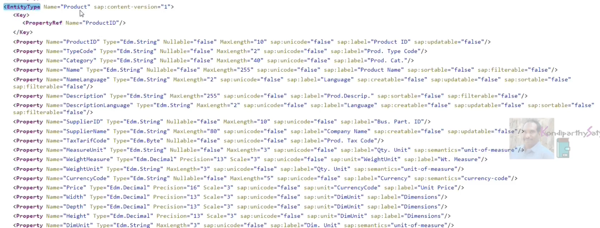
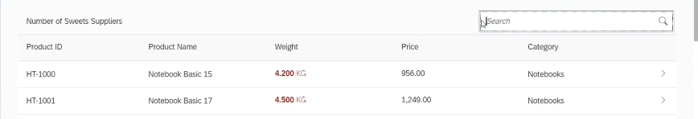

sap filterable is false for few of the fields it means that these fields cannot be used as a filter criteria for the product set entity set means we are telling the end user that do not use these fields in the filter criteria

```
    <Table id="idTable" items="{ODATA>/ProductSet}" class="sapUiResponsiveMargin" width="auto">
        <headerToolbar>
            <Toolbar>
                <Label text="Number of Sweets Suppliers "/>
                <ToolbarSpacer></ToolbarSpacer>
                <SearchField width="30%" search="onSearch"></SearchField>
            </Toolbar>
```

toolbar spacer - there should be a gap in between the search field and that label so inside the toolbar we are giving a space in between the label and the search field that's the reason toolbar spacer is required and such a field width is a 30 percent(user preference value)



how to apply the filter criteria on table?

we have to get the binding in the table view, table is bound to the aggregation items and what is bound to the items is the odata service product set entity set now if i get the items aggregation and if i apply a filter on the item aggregation then the filter will be applied on the table itself


When users enters the product id and category and press the search button this event handler will be triggered once the even handler is triggered we will get the table view instance and then the binding instance on top of the binding instance (binding instance means that this items aggregation instance we will be getting) and on top of this binding instance we will be applying a filter

we are applying the filter on the binding not on the fields or the data which is appearing on the table view so that's the reason even though the data is not there on the table view if we are applying the filter criteria on the odata service binding then the data is appearing as per the filter criteria which we are applying on the odata service 

the data is appearing on the table view based on the odata service and we are applying the filter on the odata service binding 

now i want to filter the category as well either the product id or the category whatever the match is there on the odata service that data have to be appearing on the table view

```
    aFilter.push(new Filter(
					[   new Filter("ProductID", FilterOperator.Contains, sQuery), 
                        new Filter("Category", FilterOperator.Contains, sQuery) ],
					false
				));
```

after the array just keep the condition as false which means in between these filter criteria what is the condition and the condition is true or our condition (false means or cond), (true means and cons)