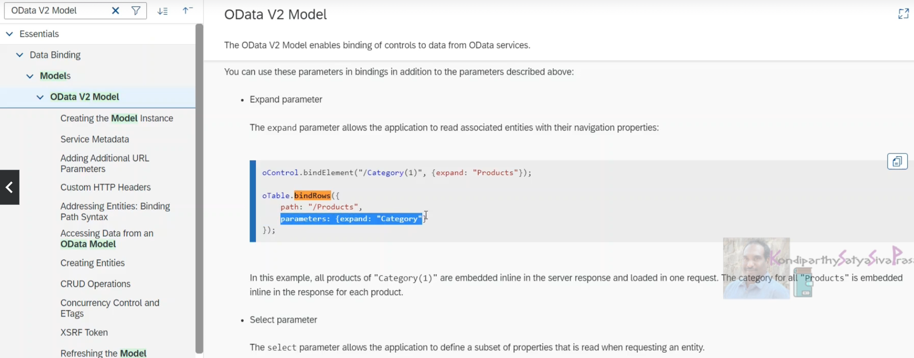
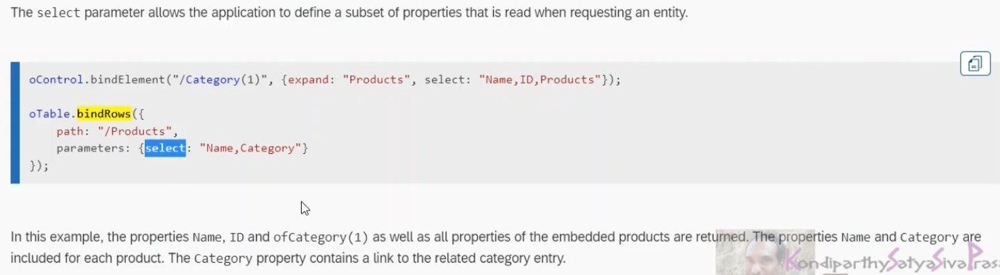

```
<Table id="idTable" items=" {	path:'ODATA>/ProductSet',
                                parameters:{ 
                                    expand:'ToSupplier',
                                    select:'ProductID,ToSupplier/BusinessPartnerID'
                                },
                                sorter: {
                                    path:'Category',
                                    group:true
                                } 
                            }" 
                    growing="true" 
                    class="sapUiResponsiveMargin" width="auto">
</Table>
```

We are interested in items and what are all parameters which can be passed to this item segragation.

BindItem is the method which will accept few objects or parameters, whichever object or parameters which binditems method accept those can also be to this item segregation as well

BindItems is a javascript implementation, but the items is XML implementation of the same code

this is V2 model



Parameters is an object
```
parameters:{ expand:'ToSupplier',select:'ProductID,ToSupplier/BusinessPartnerID'}
```


even select can be implemented, it is a performance intensive task