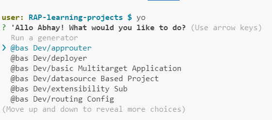
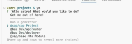

here the cap project option was not available

we have to install some packages for it

```
npm install -global @sap/cds-dk
```

https://cap.cloud.sap/docs/guides/


https://developers.sap.com/tutorials/btp-cap-beginner-bas-wizard..html

https://developers.sap.com/tutorials/build-cap-app..html