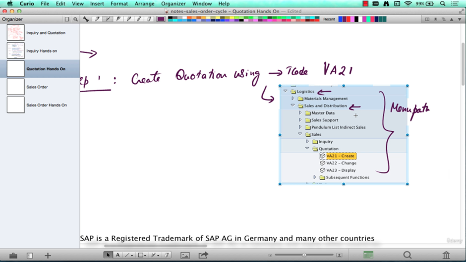
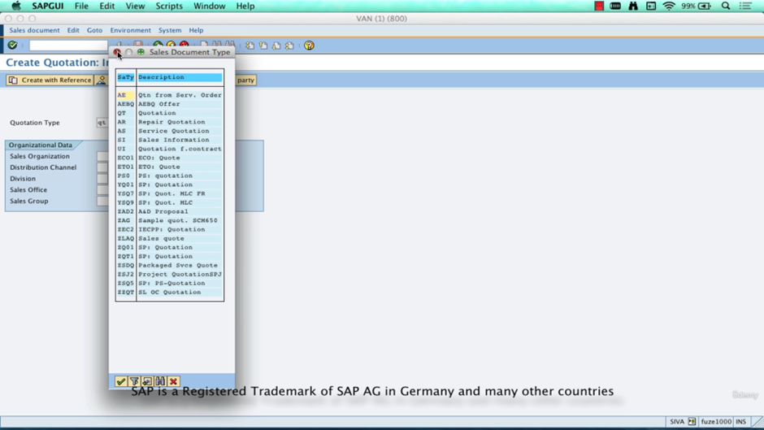
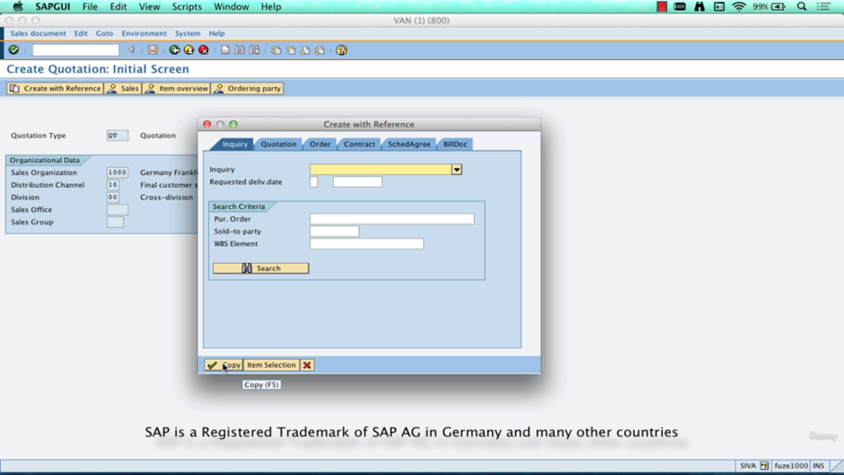
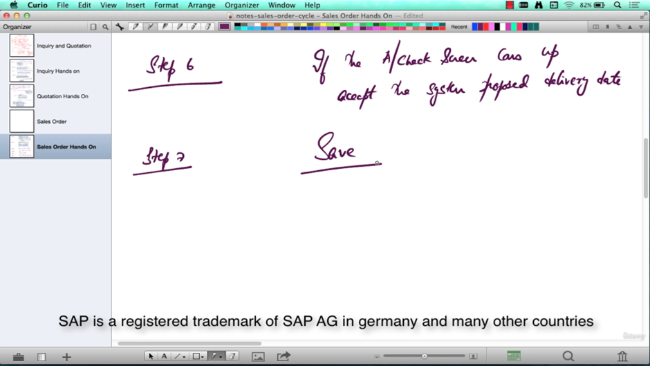
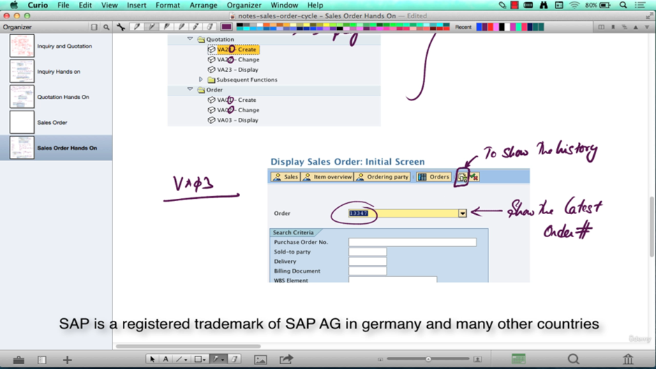
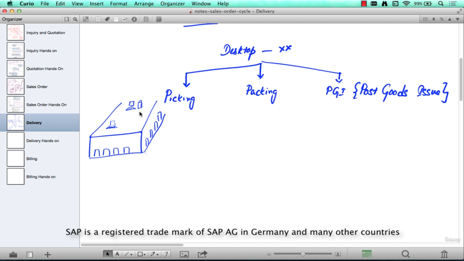

# Sales order cycle
## What is a sales order cycle?

Every business will have a cycle.

For example, the finance business or the finance department is responsible for looking at what the customer needs to pay (A/R) or receiving payments. So they call it report to record.

Procurement department, which is responsible for interacting with the vendors, getting the goods on time and so on, is responsible for placing the purchase order with the vendor.

Example If Walmart's procurement department were to be taken as an example, they are responsible for dealing with the vendors that supply the goods.

Like if milk needs to be put in the freezer of Walmart. The procurement department will talk to all the different milk vendors. They'll raise purchase orders.

They'll get the goods into the stock, and they'll pay the invoices, meaning pay the money to their vendors. This cycle is called procure to pay.

Procure to pay or P2P. So similarly, there are different business cycles followed by the different departments.

The sales department also follows a cycle. It's called the sales order cycle.

## What is the sales order cycle comprising of? (B2B scenario)

The sales order cycle is best understood with an example. We'll take two companies.

One company say a computer manufacturing company, say HP or Dell or whatever. And this is the company which is selling. So, we are looking at things from a HP's perspective.

Who is buying? 

=> Anybody could be buying from you or could be buying from Dell or HP.

Let's take the scenario of HP selling computers to a customer, say Walmart. So, Walmart is our customer. And the companies selling computers to Walmart.

So, Walmart is looking for computers. So, Walmart is inquiring about the different rates of HP, Dell and all the different computer manufacturers.
Now, since we are looking at it from HP's perspective, Walmart is going to send what is called as an RFI or request for information or inquiry RFI.
 

### What is an RFI?
=> An RFI is, quite simply, a request for a whole bunch of products. And what are the prices and when we can deliver them by.

So now, from HP's perspective, as soon as they receive this request from Walmart, they're going to say, okay, who is the customer? - Customer is Walmart.

What is the date that we have received this? - Jan, first, 2014 and some other details and then we'll start with the products.
What is it that Walmart is looking for? - They'll specify that in the request. They'll say, I want a particular model of desktop model one.

And how many quantity? - Say 1000.

They want it for a bunch of stores and maybe some laptops, a particular model, maybe 2000 of them and so on.

So, this information is captured in a document from HP's perspective. And this document is just a fancy word. You don't need to use that or think in terms of a document. It's just a collection of some data. So, SAP typically calls it a document.

So, this document is called an inquiry, which is a document created in SAP by HP based on the customer's RFI.
So, customer has asked for desktops, laptops, a certain quantity, and their prices. And HP has created a record in the system and says, okay, you have asked for this, this and this, and the prices are going to be dollar 500 per piece or dollar 800 per piece or whatever HP decides the rate to be.

And as soon as this inquiry is saved in the system, you get an inquiry number in the system that generates its, let's say, 110120, just a number, a sequential number.

HP has created this unique reference called an inquiry document, and this will be sent over to Walmart as a response to their inquiry saying, you know what?

Thank you, Walmart for inquiring with us. We have created an inquiry. Your reference number is 110120. And here are the products that you have inquired for. And these are the prices. And we can provide these quantities by so and so dates.

Finance is responsible for
-	Customers need to pay – A/R
-	Receiving payments
These are called report to record.

Procurement department is responsible for (interacting with Vendors, get goods on time)
-	Placing PO for Vendors
-	Get the goods
-	Pay the invoices
This cycle is called procure to pay (P2P)

Sales department (Sales order cycle)
Example (B2B Scenario)
HP / Dell – Selling computers to Walmart
1)	Walmart – inquire for the computers (RFI – Request for Information or Inquiry)
2)	Seller – for Customer on Date, product, quantity, price
3)	A document will be created and sent to Walmart

## Quotation
Now Walmart will apply for quotation
Quotation is a formal documents, with terms and conditions, price, quantities, deliverables, adhered to legally.

Validity Dates – the period for which quotations can be applied. 

Difference between inquiry(informal) and quotation(formal)

Create inquiry in system
Tcode – VA11

Save

## Quotation

 
From initial point of view, inquiry is the current doc, and quotation becomes the subsequent doc
From quotation point of view, inquiry becomes the previous doc, and quotation becomes the current doc.

We can create quotation by 2 ways
1)	Creation with reference from inquiry doc (rather than creating another copy of item details, we can use this data from quotation)
2)	Create standalone doc 

TCode – VA21 – To create the quotation

 
With the item selection – we can select the only item from inquiry to create quotation
 

 
Here we have not filled the valid from and valid to date, we can save and later enter that data also
 

Save

## Sales Order

 
Tcode – VA01 – To create Sales Order

 
Here delivery date is on 31 jan, but we are proposal delivery date is 13 feb
Click ok

 
Enter the po number(anything)

If we want to check how was the doc created
 

## Delivery

This document is created after SO, there can be multiple delivery documents for one SO.
For example feb delivery is created, then another could be created for march also.

The picking process involves taking goods from a storage location an staging the right quantity in a picking area where the goods will be prepared for shipping

 
Packing – if it is need for products to be packed
PGI – POST GOODS ISSUE – After the Goods have left the inventory, the account have to be maintained.

 
Open SO in change mode, then from menu select deliver button for delivery

Here delivery is trying to be create for feb month

 

Here system is confirming the quantity to be delivered in 13 feb when it is actually available

 
Again go back and press deliver button in menu
 

 
Here we are future dating this, we are providing it future date to process the delivery

Here it is asking for picked quantity, if somehow there are not enough goods avl, we can give that picked quantity of the goods here

Save

 
To do PGI click on that button
 

Now delivery is completed

 
## Billing – Invoices

