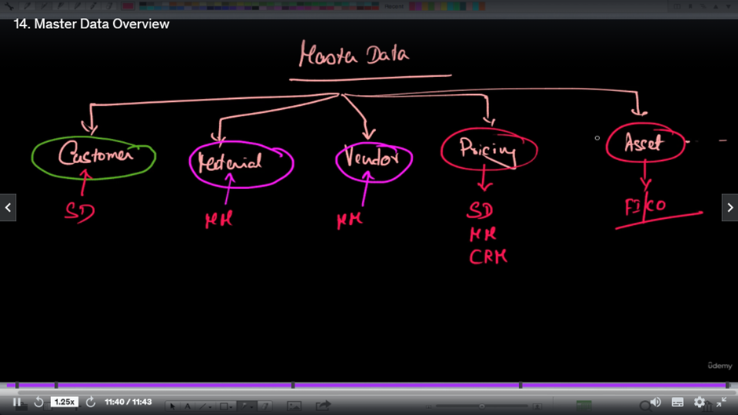
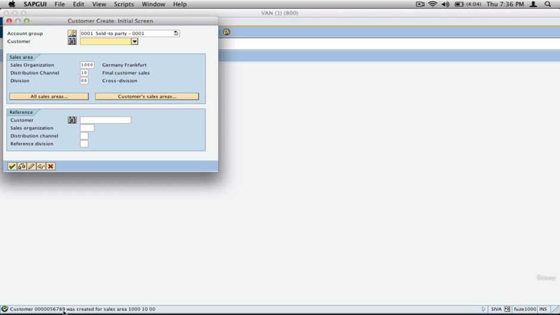
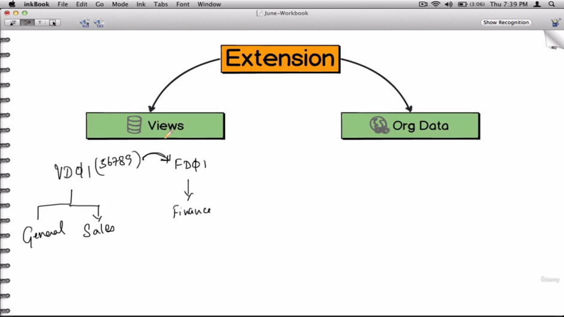
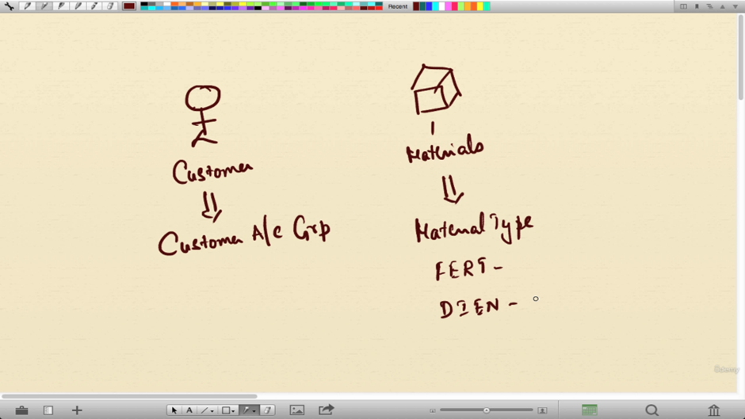
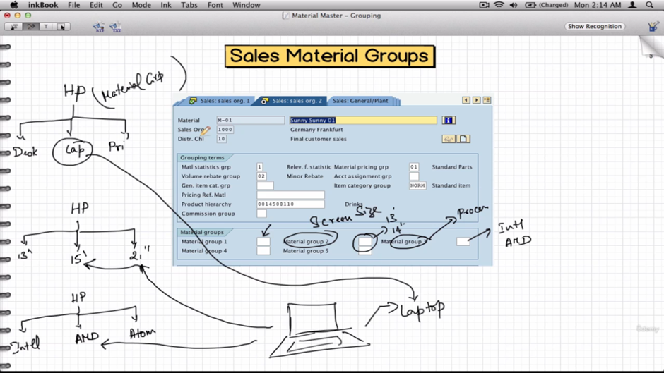
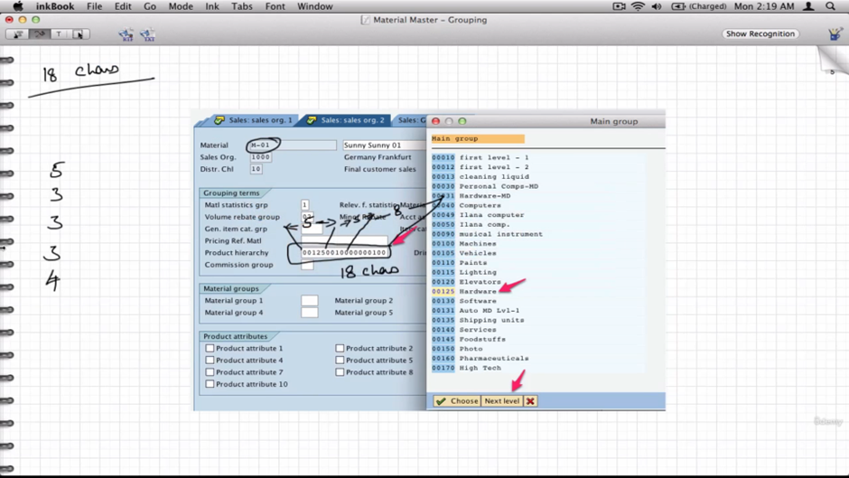

## Master Data
 

## Customer master
 

Tcode – VD01

CLICK ON THE SALES AREA DATA
 

Delivery priority as name suggest

 
Order combination – If the date and place of delivery is same it can combine both line items of different order in single delivery
Complete delivery -  no partial delivery will be accepted
 

Tolerance – if customer is okay with delivery of little less or more quantity than the ordered quantity. The customer will be billed for delivery quantity. And if there is remaining quantity another order needs to be placed.
 

InvoicingDates – this will invoice the customer over a period link weekly, monthly, etc

InvoicingLIstDates – this will combine all the invoices of a period link weekly or monthly  into one document
 

Tax classification – how to tax the customer – need to ask FICO consultant for this info

Save the sales view

 
Tcode -FD01
 

Now extending the view

VD02

 
Here customer data is extended for Germany company code – 1000
To extend it for USA – 3000

Here address is already present in master data so it does not need to fill it again
We just have to enter the shipping and billing data here according to USA

 
Now creating new customer with reference
 

Tcode -VD02

MADE CHANGES HERE
 

Double click on it

 
Go to general data for this.
We can customize this using CMOD 

## Material Master

MM01

 

Older material number – refers to the same material but from older system
 

 
Here we can categories the same materials on different basis size, processor, type etc.
 

Hierarchy could be made like 5 – 5 – 8 structure, this is 3 level or it can be made by dividing differently 5- 3 - 3 - 3 – 4 it 5 levels
 

Here we can add the choose to how much we want to fine tune the product. If more fine tuninig is needed then choose next level.

## Sales Order Deep Dive

 
CO OP -BUYER – HELP TO GET THE BETTER DEAL
 
 
 
 
  
 
  
 
Tcode- vl02n
 
 
 
 
VF01
    
 
 
 
 
 
    
 
               
Enterprise Structure
   
Company code + Sales Org
Sales Area = ( S Org + D chnl + Div)
Sales Area <- Sales Office <- Sales Group <- People

Company can have multiple plant, but plants can not have multiple company code.
Plant can have multiple storage location for purposes like returns, defects, etc.
Storage location can have multiple ware house.
Plant <- Storage Location <- Warehouse
Plant needs to be mapped with Company code.
Plant  + ( Sales Org + D chnl )
Configuration
 
 
Create sales organization
 
      
 
       
Save

Create distribution channel
 
    
Create division
 
 
   
Create sales office
 
  
Sales group
  
Create plant
   
 
 
Create storage location
  
 
 
 
Warehouse
 
 
  
 
Shipping point
 
  
 
Assign company code to sales org  
Assign dist chnl to sales org
 
  
Assign divisions to sales org
 
  
Sales area
 
  
 
Assign sales office to sales area  
 
 
Assign sales group to sales office
 
  
Assign sales org, dist chnl, plant
 
 
 
Assign warehouse to plant/storage location
 
 
 
Assign Shipping point to plant
  
 
 
Common Distribution Channels and Divisions
Issue here is we have to create the customer for every sales area combination – this will be redundant data or unnecessary to create multiple times.
 
Here we will create a single record and for other combinations we will say them to take data from 10 as reference.
 
 
As long as you have referenced the dist chnl to another dist chnl, you can not create the master data for it or the refereced divisions.

Same with condition records
   
Enterprise Structure
Why we need this?
	Reporting
o	Internal
o	External (Comp Code) 
	Operational
o	Sales Org
o	Purchase Org
o	Plant
 
Business Processes
 
           
   
Document Type
    
Business Processes types
	Sales
	Delivery
	Billing
They can be further categorized
	Sales
o	Inquiry
o	Quotation
o	Order
o	Consignment
o	Contract
	Delivery
o	Reg Deliveries
o	Expedited Delivery
o	Returns
	Billing
o	Std Invoice
o	Credit
o	Debit
o	Corrections
 

 
 
 
 
 
Copy to create your own doc type
 
   
Reference mandatory – will force user to input the quotation number
 
Check division – will check if the material is from same division as sales order.
 
Check po no – this will check of the duplicate PO exists
 
Quotation Messages – 
 
 
Shipping
 
Del relevant billing type – this will create billing if only the delivery doc is generated, and delivery is completed
Order relevant billing type - this will create billing if only the order doc is generated
 
Inter company billing type - this will allow us to deliver the order from different company code, not from the company code they ordered. This might be the case when user needs to get the delivery fast, so it happens to be faster from different company code. 
 
Billing block 
Rush Order – RO - where delivery doc created instantly after creating the order doc
Item Category
BOM
   
Tcode – CS01 – To create BOM
     
Item category controls
   
 
Billing relevance
At header level or part level
At header level – this PC costs 650, includes the following components
At part level – this pc cost $, monitor $, CPU $, etc
 
Here mouse pad (MP) can be free of charge, so no billing required for that
Pricing Relevance
Same at header level or component level
At header level- we will show the total price
At component level – show price individually
 
Here it is component level
Here mouse pad (MP) can be free of charge, so no pricing required for that
Delivery Relevance & Schedule Line Relevance
It is divided in Order and Quotation
 
PC - Del is relevant in Order, but not for quotation
PC – Sche line is relevant in Orde and also in quotation
 
Here Ext – extended warranty – is not a tangible product, it cannot be delivered, so schedule line cannot for order is not created

You cannot do a delivery unless, you have schedule lines.
If you have schedule line that does not mean you have to do delivery.
Item Category control
 
 
Schedule Line Category
 
Drop Shipment – here the stock does not come to inventory, it directly gets delivered to customer location. 
There is no delivery doc created for this. After Order doc directly Invoice doc is ceated.
TAS – item category
This will trigger the schedule line category CS, which has not movement type, so it’s has no PGI.
 
Availability and transfer of Requirements
 
No Avl check on service products.
Avl check can be turned on or turned off in schedule line category level.
 
MRP- Material Requirement Planning
 
BOM gets flatten out in this delivery doc.
Delivery group – groups the BOM in a group so that all the components in BOM go together
 

 
 
 
 
Billing 
 
Profarma Invoice- When goods cross a border this invoice is needed, without tax, not posted to accounts, the price of free goods needs to be mentioned
 
Regular invoice – also tax invoice, commercial invoice, posted to accounts, here the cost of free goods need not to be mentioned
 
Credit – over charge a customer
Debit – under charge a customer
Return 
 
 
To reverse it logically, cancel the invoice, or give debit, credit invoice
 
 
A customer can have multiple invoices, to simplify these.