Sales Ducument

- Quotation
- Inquiry
- Sales Order
- etc..

Here Sales order has a header part, then it can have multiple line item, then those line item can have multiple schedule lines.

header button

to navigate to line item data

schedule lines - delivery schedule for the line items

PO date - after SO is created , later we create PO for requisition for ordered items

PO date is later than the SO date, it can be changed. - ME22N
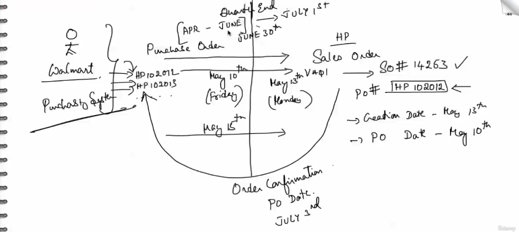

Partner funtions
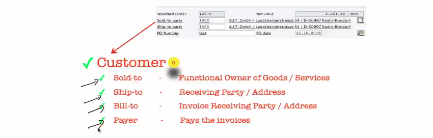

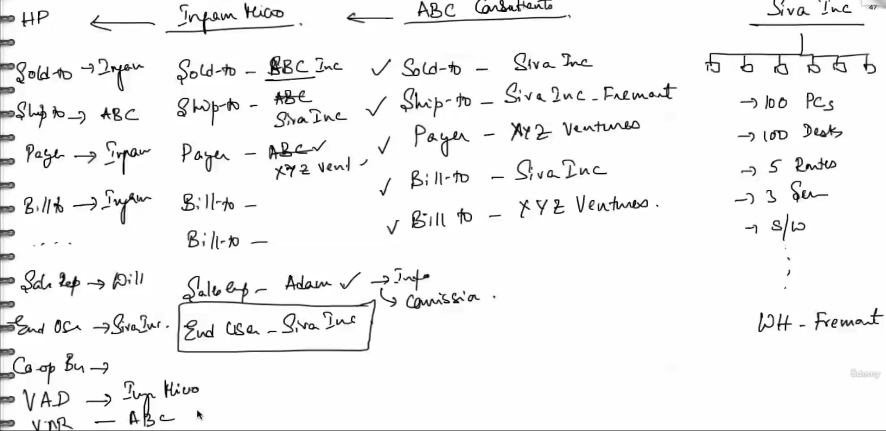

We have sold to party.

1400 ship to party.

1400.

Then a whole bunch of different partner functions that I'm going to show you now.

Now I'm using a word called partner functions.

What is this partner function?

So the examples that I'm showing you here are sold to ship, to bill, to payer.

But it's not just limited to that.

There could be any number of partner functions in the transaction.

You can just go to the header by clicking on this button again.

Click on partners and then you'll see a whole bunch of partners there and then more if you like.

Like for example, we see contact persons with the sales employees, so on and so forth.

So let me take an example here and then try and illustrate the concept of partner functions.

This is really important.

Okay, so, um, just try and focus on the subject.

What do we have here is a company, let's say Siva.

Is a small company with, you know what, let's say.

Allow 100 employees.

So Siva is in the process of setting up an office with 100 employees, which requires 100 PCs.

100?

You know, um, uh, desks.

Five routers, three servers, whole bunch of software, so on and so forth.

Now, with this kind of requirement, you can't just go to any one company, right?

You can just go to HP or Cisco and then buy all of that stuff.

You'd have to go to a provider or a consulting firm or an infrastructure firm that can do all of this

for you in a very integrated fashion.

Okay.

You could call them resellers, you could call them value added resellers, you can call them sometimes

distributors.

It's really up to the nature of the business transaction.

But let's start off with a reseller who is A, B, C, consultants.

Okay.

Let's say they are local to the place where Siva lives.

And then they said, Yeah, you can.

We can do all that for you.

Okay, So take your order.

100 PCs, 100 desktop, 100 desks, five routers, so on and so forth.

So A, B, C takes an order.

And when ABC takes this order, the sold to if they were implementing SAP, let's say, is Siva, Inc.

So whom are they selling the goods to?

Okay, this is a primary entity.

Then we have ship to maybe Ziva says, You know what?

Initially, I might not have all the space for 100 computers, but I do have a warehouse maybe in Fremont,

California, with this address and then ship it there.

Okay, so ship two is Ziva ENC, but to the Fremont address, not to maybe the San Francisco address.

Right.

That's the ship to payer.

Who's going to pay for this transaction?

Maybe Ziva and got a, um.

A loan from the bank.

Or maybe some angel invested in Ziva, Inc..

And he's going to pay for it.

Right.

So the payer is going to be, let's say A, B, X, Y, Z Ventures.

Who is paying on behalf of Ziva for this venture?

Right.

Who's the bill to?

Meaning?

Who is supposed to get the bill?

A payer pays for the bill.

A bill to receives the bill.

When I meant receives the bill.

It's as simple as getting a copy of the bill.

But you don't have to really pay for it.

That's a bill to a payer pays for the bill.

Okay, so the bill too could be Ceva Inc as well as there could be multiple bill twos.

Right.

Everybody wants to see the bill, so it could be X, y, z ventures as well.

Okay, so this is the partners associated with the transaction that Siva is giving to ABC consultants,

in this case an order.

Now ABC consultants will source these different products from different companies.

Now the routers will be sourced from Cisco.

The PCs will be sourced from HP.

Let's say desktops would be sourced from Office Depot, so on and so forth.

Now, they might not directly speak with HP, but they might have an.

Mediator.

Distributor say Ingram Micro.

Ingram Micro, which is a distributor to HP.

So they're going to place an order to Ingram Micro because Ingram Micro actually gives better prices

for smaller smaller resellers than HP does because of the volume of business that they do.

Right.

So if Ingram Micro were implementing SAP, how would it be so so to is, is ABC here?

So whom are they selling this to?

ABC It's not Ceva Inc. Ceva Inc. is just a ship to address for them or an end user for them, but they

are not the ones placing the order, right?

The order is placed by ABC consultants.

And what about the ship to the ship to could be ABC in case you know, ABC wants to receive the goods,

maybe unpack them, install some software and ship it after that to one corporated or depending on the

business process.

They might just say, hey, you know what, ship it directly to my client, Ceva, Inc. Either way,

it's fine.

Who is paying for this transaction?

Typically, it's ABC.

But if ABC doesn't really want to take any financial risk, they'll say, Hey, you know what?

I'm not going to pay it.

My customer is going to pay it directly, which is XYZ Ventures.

So it's either this or this.

Generally, you know, it's not both and then build to it could be one build two, it could be more

than one build two.

There are other partner functions, let's say when ABC consultants called up Ingram Micro, they were

speaking to a sales employee, say, Adam.

So he is the sales employee at Ingram associated with this transaction, which is an order on behalf

of Ceva Inc..

Okay.

And who is the end user?

Meaning okay, we are selling some goods.

Where is it going?

It's not going to it's going to ABC Consultants.

All right.

But is he consuming the goods?

Not really.

Right.

He's selling it back after adding some value to another company, Ceva Inc., his customer.

So the end user in this case is Ceva, Inc..

Now, why am I even capturing it here?

Maybe it's required for reporting.

Maybe it's required for audit reasons.

Maybe it's required for any other special function that Ingram Micro deems fit.

In this scenario, for example, Adam is captured because it could be informational or sometimes this

could be a for commissions or you made $10 million in sales, you get 1% out of it, so on and so forth.

Now when HP takes this order from Ingram Micro again, who is the sole two ship to pair bill to and

if necessary, more bill twos.

There could be a sales rep here.

There could be an end user here.

There could be a cooperative buyer here.

There could be a value added distributor here, so on and so forth.

So too is Ingram.

Ship two is, let's say A, B, C pair is, let's say Ingram.

In this case, generally it's the the distributor that pays for the goods.

Bill two is Ingram because he doesn't want to share the bill with a, B, C sales rep is the HP sales

rep in this case who is, let's say um Will.

End user is again civil and corporate.

Always right?

Who's a cooperative buyer?

Another partner function I really want to don't go into the details of it, but that depends on the

nature of the business scenario.

Cooperative buyer is generally when different companies form a cooperative and then buy goods because

they have more leverage.

Right?

Who is a value added distributor here?

Ingram Micro.

He is.

He is doing the distributor who is a reseller.

In case there is a reseller, you can say Var value added reseller is ABC.

So on and so forth.

So a partner function, these are all called partner functions.

A partner function is an entity or a stakeholder or an entity or a stakeholder responsible.

Or has a stake in the transaction.

Now, that stake could be financial, informational or whatever the case of one sales rep.

He could get some commissions in the case of another sales rep.

Maybe it's just information.

Hey, how many sales did you do for the day or how many sales did you do for the month?

How were you performing against the previous month?

Sometimes it's entities that don't have anything to do with the transaction.

For example, the cooperative buyer who is not really paying for the bill, nor is he looking at the

bill, nor is he receiving the goods.

But it is just there to ensure that you get a better deal.

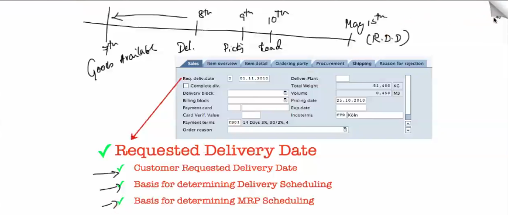

What is the requested delivery date?

It's the date when the customer requested the delivery to happen.

Sometimes the system just defaults it to a certain date.

I'll tell you the reason why, and I'll tell you why that date was picked and where is the configuration

for it?

But functionally, this is supposed to be the date on which the customer has entered or has asked the

goods to be delivered.

And this date will be kept as the basis for which you do all your subsequent transactions related to

that that particular order.

Like how do you plan for the delivery?

Okay.

If the customer wants goods to be received by the 13th of May or 15th of May, then how do you plan

for it?

Right.

For example, if you look at this as a timeline.

This is May 15th, which is the requested delivery date.

How do you plan for it?

By May 10th.

Maybe you need to transport the goods and load the goods.

Maybe by the ninth.

You need to make sure your picking is done.

Maybe by the eighth.

You need to make sure that you know your delivery is created maybe by.

Um, seventh.

You got to make sure that your goods are available.

Okay, so it plans and backtracks like this.

And in order to do this kind of a computation, which is called delivery scheduling and transportation

scheduling, which is a topic for another day.

The requested delivery date is generally the target date.

Okay.

And it's the basis for determining delivery, scheduling, scheduling, so on.

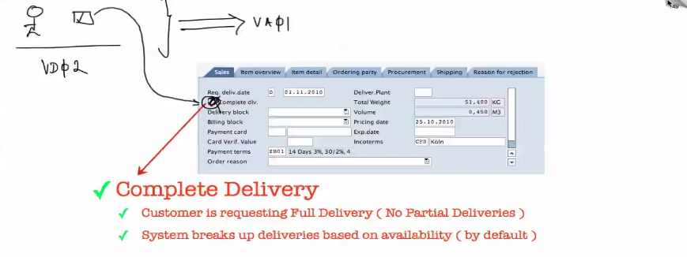

we have the complete delivery flag, which we have seen already as part of the customer master.

The complete delivery flag is going to identify.

Whether this customer requires the order to be delivered in full, meaning no partial breakups for this

transaction.

Okay.

So generally, if the customer master contains the complete delivery flag, check down in the master

data.

010203.

Now when you create a transaction using var zero one for this customer, automatically this flag will

come and sit in.

This flag.

So that means the customer preferences are carried over to the transaction level.

Okay.

Now you can always go and change it.

Meaning?

Yeah, this is generally the customer's preference, complete delivery, but this time he's okay.

He's okay to relent.

So if it is checked on, you can just go and remove it.

Okay.

So at the transaction level you can change the customer's preferences to whatever you like.

Maybe yes or make it no.

And you know what happens if you say yes And you know what happens if you say no?

Complete delivery.

Make sure that the system doesn't break it up into partial deliveries.

And if you don't set it to complete delivery, where possible, the system will try to deliver whatever

is available first and then ship the rest of the goods later.

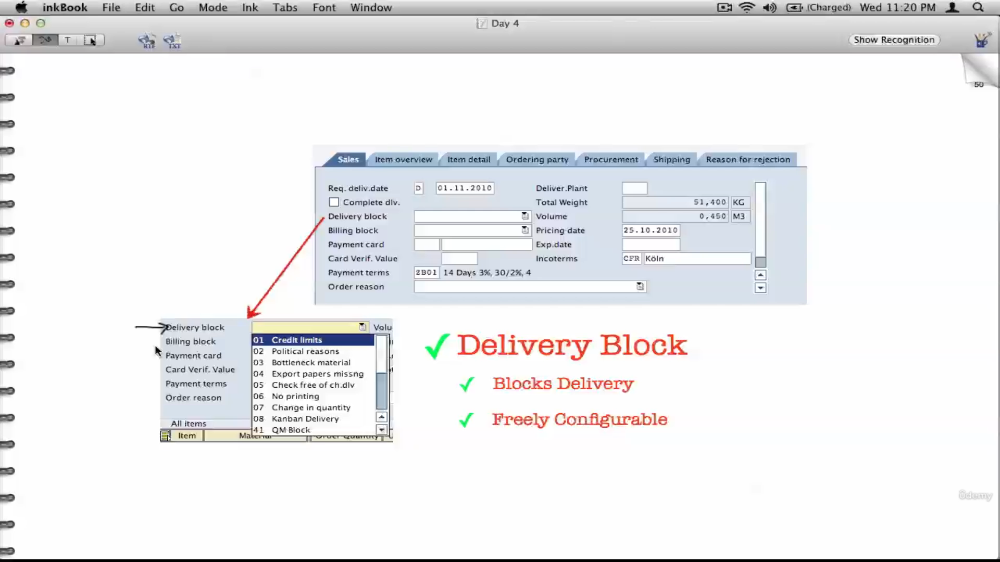

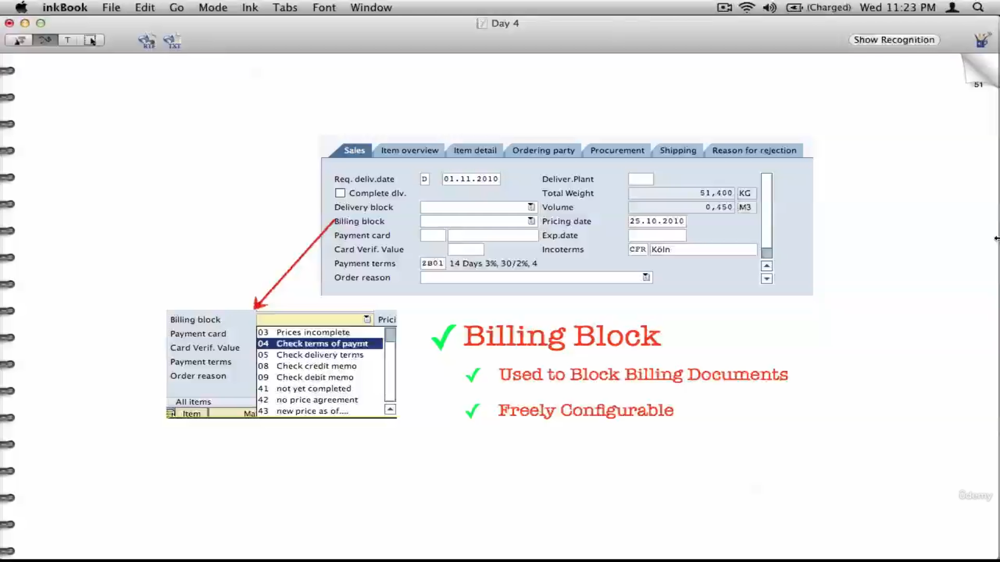

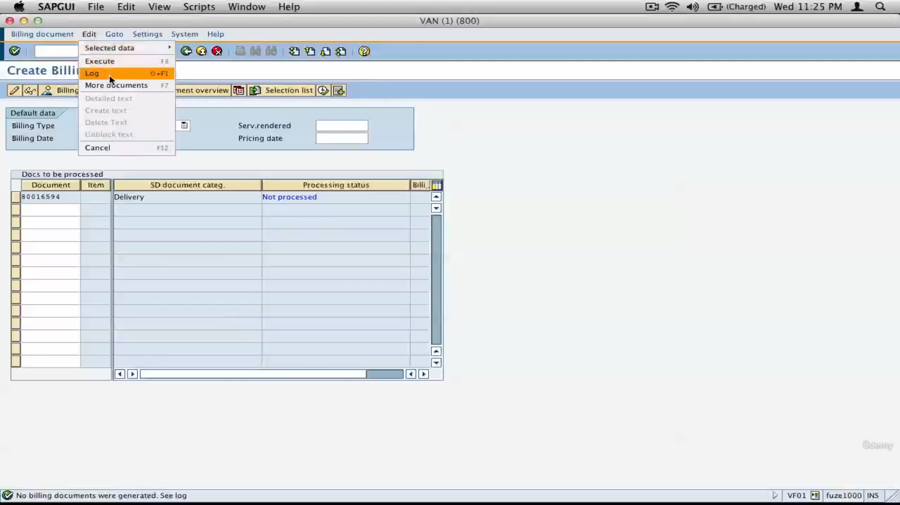

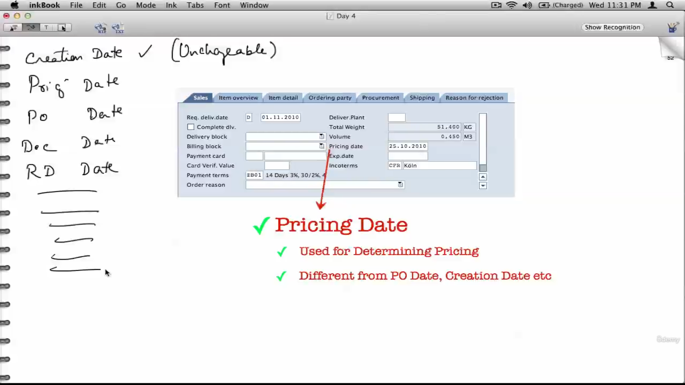

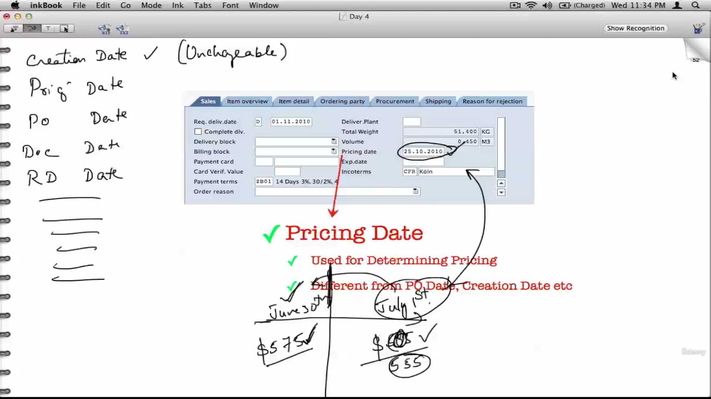

pricing date now, we have seen creation date.

Where is the creation date?

Let's go to zero three and I'll show you where the creation date is.

Go to header.

Okay, Go to header.

And this is the creation date.

Okay.

Here is a little caveat that you might want to know.

If I go to the display mode and go to the header, you'll see that the creation date is actually grayed

out.

Right?

I cannot change this nine five, 2012 to anything else that's grayed out, but the pricing date is changeable,

meaning I can change it from 95 to 10 five.

All right.

Same with the date.

I can change it from 95 to 16 five or I can change it from nine five 2 to 5.

Right.

So we have creation date, which is unchangeable.

It's set in stone.

Then we have pricing date, P.O. date, document date requested delivery date, so many different dates.

Most of these dates are changeable except for the creation date.

Now we know why and how a date is used.

Now let's talk about the pricing date.

What is the pricing date?

This is also used very similarly to how we have used the date, but with a slight difference.

The pricing date determines what is the date on which the pricing has to be taken.

Again, let's split up our dates into two quarters.

Let's say the Walmart has placed an order to us on, um, June 30th.

Let's say the price on June 30th for a product of 1020 is dollar 575.

Okay.

But if you create the order on July 1st and let's say the price for that material is jacked up to 595,

the customer is going to see this price, whereas he was expecting a price of 575 because we said that,

you know what, until July 30th, this is our price list.

Now, Walmart is not going to be happy with that price.

Right.

He's going to say, you know what, I placed an order on July 30th and I think I'm supposed to get 575

as the price.

Well, how do you change it?

You change the pricing date from July 1st to June 30th, as simple as that.

And the system will automatically pick up the price that was created or that that is applicable on June

30th.

All right.

That's pricing date.

The same thing happens with future dating.

Let's say five, the price is 575.

But as of July 1st, the price was dropped to 555.

Okay.

Now, Walmart might ask you for a concession.

Being a customer, they'll say, hey, you know what?

Can you give me this price and I'm going to give you this order right now.

And you might be or you or your sales employee from HP will be very much tempted to take that because

by this quarter end, this order on June 30th was a big one, will increase his or her sales target

for that quarter.

So he's going to take this order on this quarter and then probably give him July 1st prize by changing

or future date in this pricing to July 1st.

Okay.

That's the significance of pricing date.

Once again, pricing date.

Make sure that whatever be the date of pricing is the price is the date on which pricing that was maintained

for that product is picked up.

Example a product would have one page until the 30th of June and the price could change after the 30th

of June, let's say, starting July 1st.

So if you want to give a previous price, you can just backdate it to July 30th or any date before that.

Or if you want to give a price after July 1st, you can change the pricing date from the passed on to

July 1st or any date beyond that.

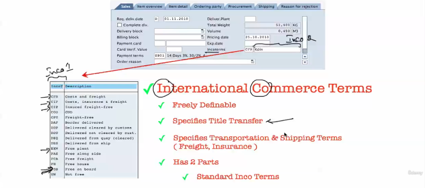

What are incoterms?

International commerce terms or incoterms, as it's called.

Right?

Inco Inco stands for international commerce terms.

So there is a, you know, general standards body which defines these terms.

And the terms are defined in two parts.

First part or it's called Inco.

One is a three character or a two character ID that's set in stone.

Maybe it's it's called CFR CIF, CIP carriage and insurance paid carriage insurance and freight for

free.

Right.

FOB Free off board.

Free on board Ex-works.

Meaning the customer will come and pick up from the plant.

So these are all the different types of, you know, logistics that are mutually agreed upon.

So if you if you as HP promises an order as FOB, that means that you're going to ship the goods free

of cost, and that's agreed upon.

Okay.

So there's no argument over what FOB is because there is a strict definition to what FOB is, and that's

defined by an international body, like I said.

Okay, now, FOB until what point is it going to be?

Let's say I'm shipping computers from San Francisco down to Brazil.

It's an international order or it could be a domestic order, say, until New York.

Okay, I said fob, but until what point is it going to be to your doorstep?

Is it going to be to your warehouse or is it going to be to our distribution center in in the East Coast?

And that is described by this part, which is in Co two or part two of the incoterms.

So incoterms define how the logistics happens, especially freight and shipping terms.

No, there is another part to it, which is called the title transfer, which says.

Where exactly the transfer of the title is happening.

You know, meaning where exactly is the change of ownership happening?

So if there is some goods that are shipping to Walmart, New York and let's say it says FOB until New

York, that means that HP or its logistics provider, let's say UPS or USPS, they are responsible if

any damage happens to these goods.

So the change of ownership is only happening at New York, where maybe it's a docking station or maybe

it's the port, or maybe it's their warehouse.

That's exactly where the change of ownership is happening.

So until that point, HP or the logistics provider owns the goods and they are responsible if something

goes bad.

Okay.

But after the goods have received, the goods have been received in the warehouse, it's the responsibility

of Walmart.

Okay, so Incoterms is defined by Incoterms defines the title transfer as well.

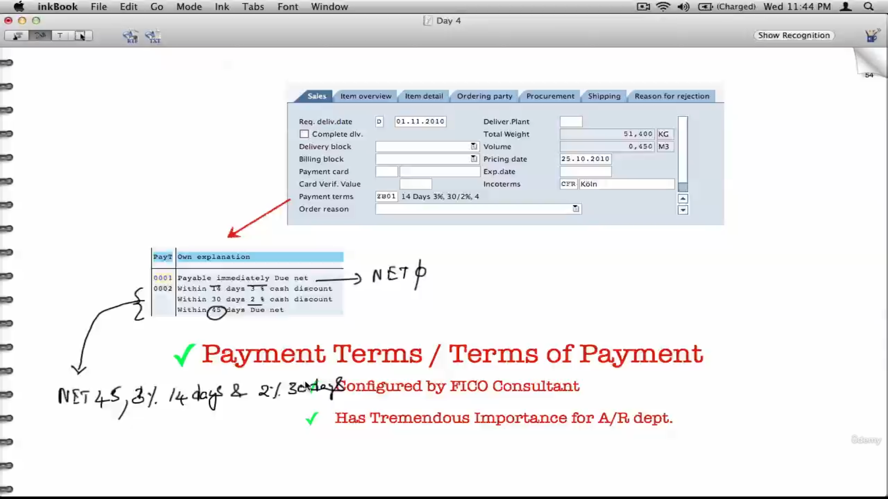

What is a payment term?

Like we discussed a payment term dictates how your customer pays you.

It's a schedule of payment.

A simple payment term could be net zero or this one, it's commercially called net zero, which means

pay within zero days, which is immediately.

Now, let's look at this example 002, which says pay within 45 days.

But if you pay within 30 days, you get a cash discount of 2%.

And if you pay within 14 days, you get a cash discount of 3%.

In general.

This is written like this.

The payment terms is called net 45 comma.

3%, 14 days and 2% 30 days.

So that percentage represents the cash discount that the company is going to give their customers in

gratification of the customers early payment.

So essentially, if you pay within 45 days, yeah, the company is happy, but if you pay within 14

days, the company is more than happy and they'll let you pay only 97% of what you're supposed to pay.

If you're supposed to pay $100, just pay $97 is what that 3% says.

The specific term for it is called cash discount.

All right.

As opposed to other instant discounts that are applied as part of your invoice.

But we'll see the different discount terms when we come to pricing.

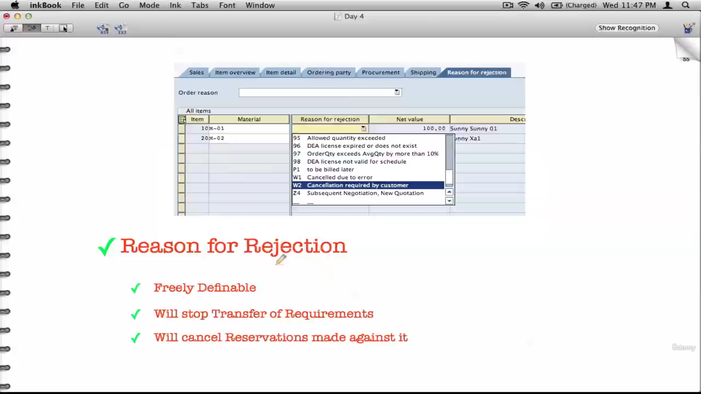

What is the difference between reason for rejection versus deleting the line item?

Why really are we doing this reason for rejection as opposed to deleting that line item?

Now, deletion of line item number one is not really capturing what is the reason why we are deleting

that line item.

Well, he might just talk over the phone and talk to our sales rep and say I don't want it because of

quality, but there should be some way for the sales rep to really capture that reason.

That could be captured via this reason for rejection based on the dropdown.

So that way your senior management will get a nice report that says, okay, out of all the orders that

have been placed this month, so many items have been rejected because of quality.

So many items have been rejected because of competition better than us or whatever.

Be their reasons for rejecting that line item.

So that's why SAP always suggests that we put a reason for rejection as opposed to deleting line items.

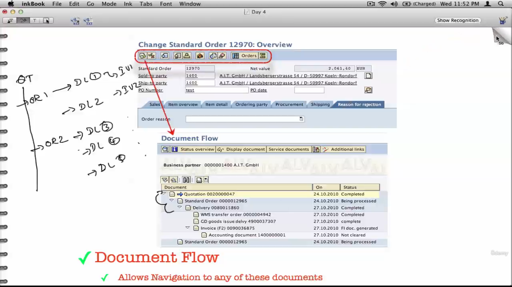

What is a document flow?

We have seen what a document flow is already.

How a quotation spawns a order.

How an order spawns one or more than one deliveries.

And how you can track back from the delivery back to the order and back to the quotation.

Sometimes this flow could be pretty intimidating.

So you could have one quotation and then order one and then order two.

Against this order you could have delivery one and then delivery two, delivery three, so on.

And then over this we have delivery three in our delivery, four delivery five.

And then this will have invoice one, invoice two and then so on.

You know, it could be pretty complicated, you know, especially with big orders.

So a document flow is very handy if you want to track back.

Um, you know what really has transpired, You know, when was this invoice created?

What was the corresponding delivery that triggered this invoice to be created?

Was this delivery created as a single delivery or as multiple deliveries as part of a single order?

Did this order refer to a quotation or.

It did not refer to a quotation, Right.

This is called as a document flow.

Now, document flow could be both at the header level as well as at the line item level.

At the header level as well as the line item level.

We'll have a separate video on what is document flow at the header level versus document flow.

The line item level, how to view the document flow at the line item level and what is the effect of

this document flow when or how to see the effect of delivery splits or invoice splits or order splits

as part of troubleshooting or as part of user auditing and other use cases where you might want to use

document flow.

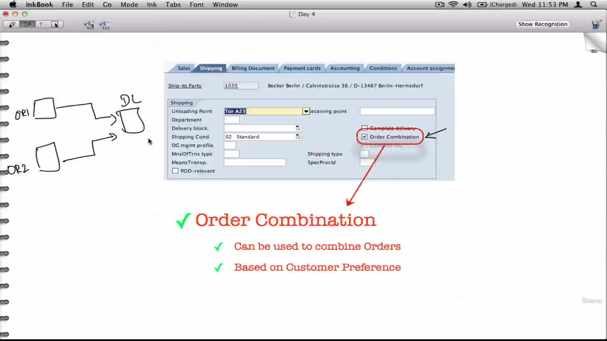

The order combination field is used when you want to combine multiple orders into a single delivery.

So order one, Order two can be combined into a single delivery if the goods are going to the same destination

and they're going on the same day.

ET cetera.

And some other conditions are fulfilled.

So again, this is a priority or this is a preference set by the customer and the customer master level,

and that just flows down into the transaction.

And you can always uncheck this at the transaction level and say, hey, you know what?

For this transaction order combination is not recommended by the customer, so uncheck it.

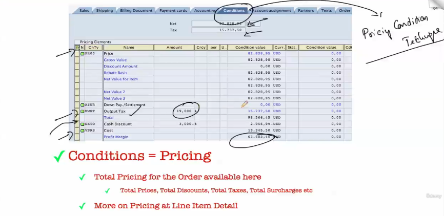

Well, we're just going to look at it because it's a very, very vast subject and it will take close

to 3 to 4 hours to really understand pricing and at least do a single hands on of the basic price list

and basic discount.

Of the key word here is conditions, because pricing uses what is called as a pricing condition technique.

This is.

A proprietary SAP method to perform pricing using a variety of parameters.

So like I said, pricing is a pretty complicated subject, so we're not going to get there until probably

very late in the course, maybe 25th day, and that's when we're going to discuss pricing.

So until that point, we're not going to get to pricing.

But we should understand.

But this is where you can see the prices like the waves.

What is the price, what is the tax, what is the cost associated with it and what is the discount associated

with it, so on and so forth.

And what is the profit margin?

What is the net before tax and what is the net after tax, so on and so forth.

So if I ask you a question and say, what is the total tax for this line item 20, you should be able

to go to the line items and then look at the MWC or whatever tax condition is out there and the percentage

and the corresponding amount that was calculated.

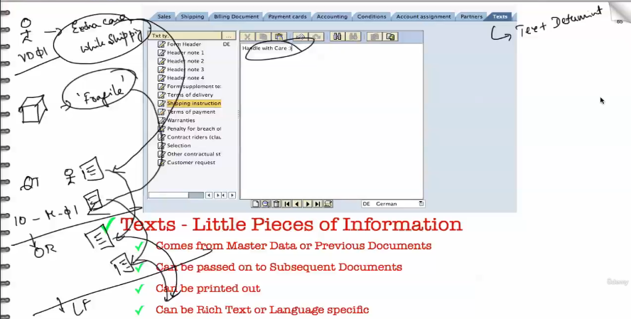

What are texts?

Texts are little pieces of information.

That are.

You know, essentially texts as they are, they're nothing more than texts.

It could flow down from a previous transaction or it could flow down from master data, or they could

be entered in the system by a user or by somebody in the warehouse.

So let's take an example.

So there is a customer.

Who's very finicky about his goods, and he always complains.

So we make a note against the customer in the customer master and say, um, you know, extra care while

shipping.

Okay, we don't want to get more trouble from this customer.

So we say extra care while shipping.

Now there is a material, some material.

Which is, let's say, you know, fragile.

So we say it's fragile or take extra care while shipping, so on.

And so whatever it is.

Now let's create a quotation for this customer, for this material.

Line item ten for this material.

When we create this quotation, this text will automatically come and sit in the quotations header and

this text will automatically come and sit in the line item.

Now, when you create an order with reference to this quotation, automatically these little pieces

of texts.

Now it could be as simple as handle with care or extra care while shipping or fragile.

So these texts will come and sit in your order.

And when you create a delivery from this order, these texts, again, if required, can be transferred

over to the delivery where the delivery clerk will be able to make some decision like, you know, put

some extra foam or extra padding to make sure that, you know, they don't get broken.

So on.

Once again, we're going to talk more about texts.

What is text determination?

How to set these texts, how to create new text types, how to make the texts flow from the previous

transaction to the current transaction and all that good stuff as part of what is called as text determination.

Okay, so until that point, you can just consider text as little pieces of information that can flow

from master data down into transactions and from one transaction to another transaction.

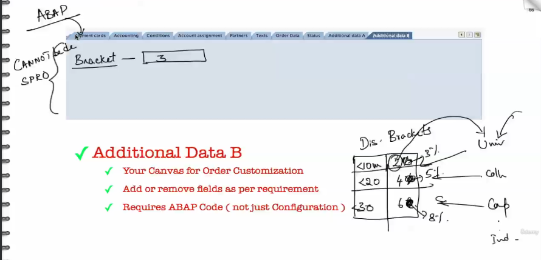

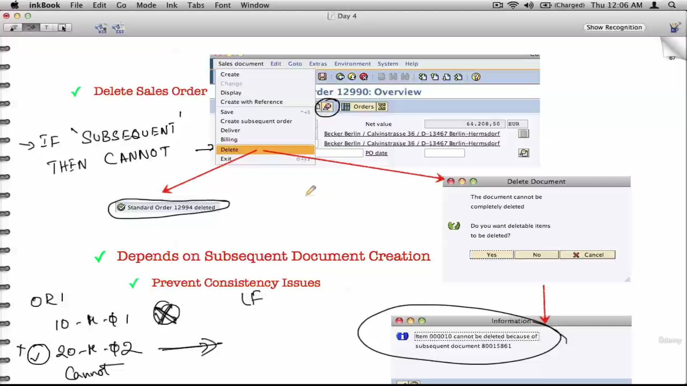

And next is can you delete sales orders?

Can you delete sales orders?

Well, we know at this point that we cannot delete customer masters or any master data.

But can you delete sales orders?

Yes, you can.

There is a specific.

Menu path for it.

You can delete sales orders like create an order, and then you can delete an order by clicking on that.

Now, sometimes deliveries or orders cannot be deleted.

And when you try to do that, you get this error.

Now, when can you delete things and when can you not delete things?

Here is a thumb rule.

If there is a subsequent transaction to it, be it at the header level or the line item level.

Okay.

If there is anything subsequent, then.

Cannot delete.

Okay.

Example order one line item ten M01 line item 20 M02.

Can you delete it?

Yes, you can delete now line item two is delivered.

After delivering.

Can you delete this guy?

No, you cannot delete.

It cannot because there is a subsequent transaction associated with that line item.

Okay.

If there is a subsequent transaction associated with a line item, you cannot delete that particular

line item.

Same with the order.

If there is any subsequent transaction associated with that um, order, let's say some delivery has

been created with respect to that order, then you cannot delete that.

Order.

Okay.

Either way, the preferred way is not to delete transactions.

It's always to put a reason for rejection.

Okay.

And you know the reasons why.

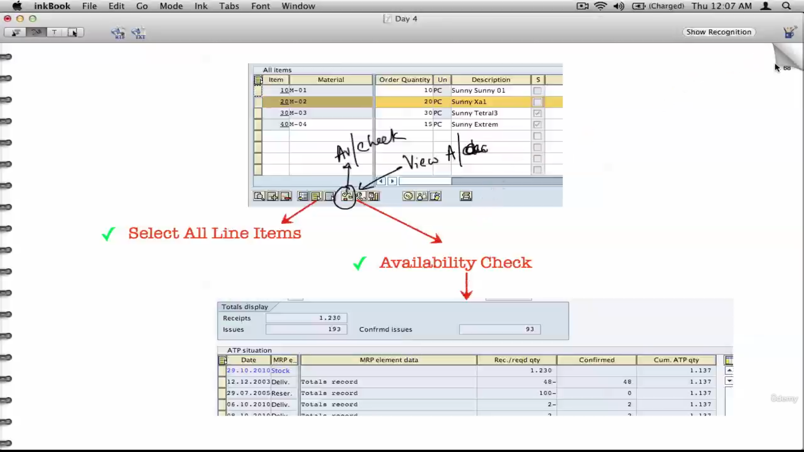

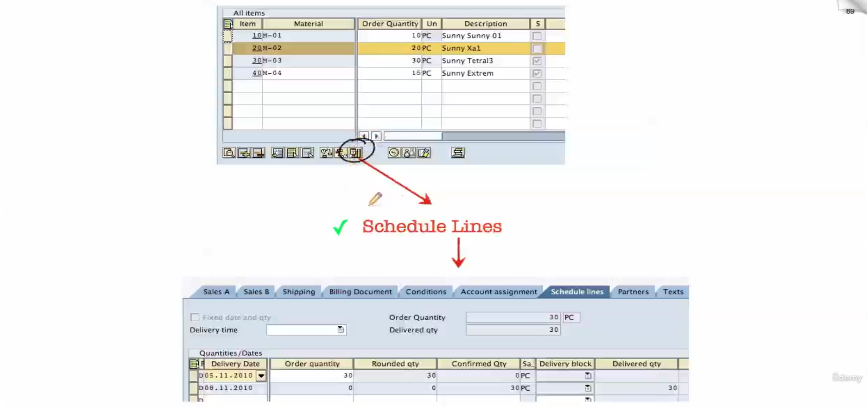

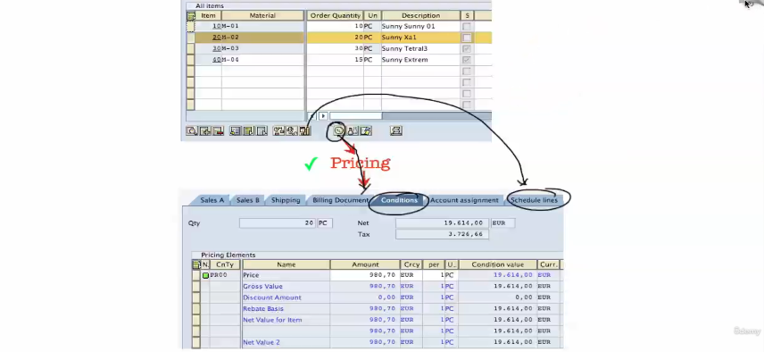

Now, between the header and the line item, there is a ton of data that's actually shared like the

header data contains the partners tab.

The line item data also contains the partners tab.

The header data contains shipping data.

The line item data line item also contains shipping data.

Same with texts billing additional data.

But why?

Why are we replicating data between the header and the line items?

Here is a simple reason why the same data partner data, for example, could differ between the header

and line items.

Again, let's take an example.

Here is the header where we are saying Ship the goods to San Francisco.

But line item ten should be set to, let's say, New York and 20 should be shipped to San Francisco.

So the header data is generally applicable to all the line items, but at the line item level, you

can always change the shipping data.

In this case the ship to same with Bill to the entire order at the header level is net 30 payment terms,

which is in the billing data.

But line item 20, the customer says, hey, you know what, I can do net 30 just for this line item.

Can you do net 40 or net 45?

If you're okay with it, you can do it.

Changing the payment terms at the line item level to be different than the header level.

So the thumb rule again is data from the header percolates down to the sales line items as example payment

terms, incoterms shipping point, ship tools, texts, so on.

If you want the data to be different for a particular set of line items, say like the examples that

we have taken, we want to ship some goods to New York as opposed to the header San Francisco.

You want to ship the goods with a payment terms of net 45 only for 20 line item, but for the rest of

the line items, you don't want to do that in all these cases.

Data at the lineitem level can be made to change.

All right.

And that's why data is generally replicated between the header and the line item level.

All right.