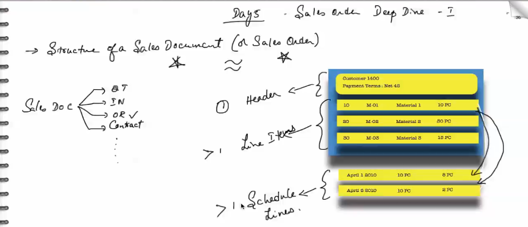
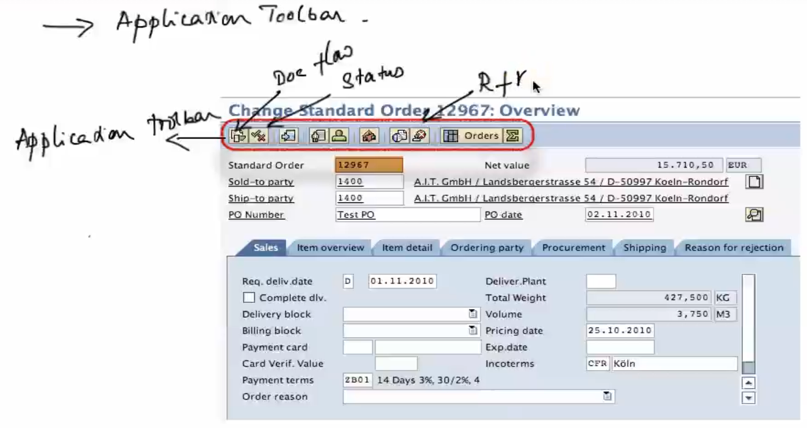
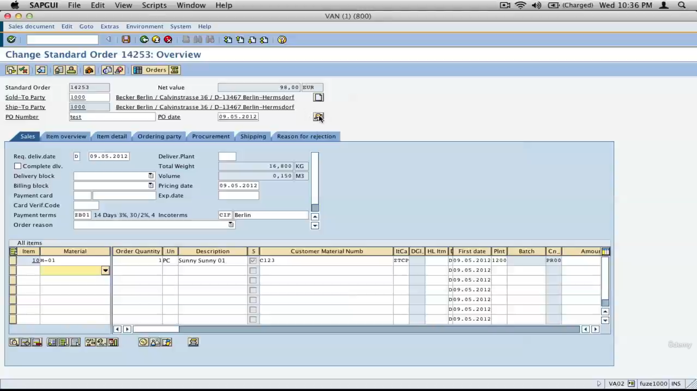
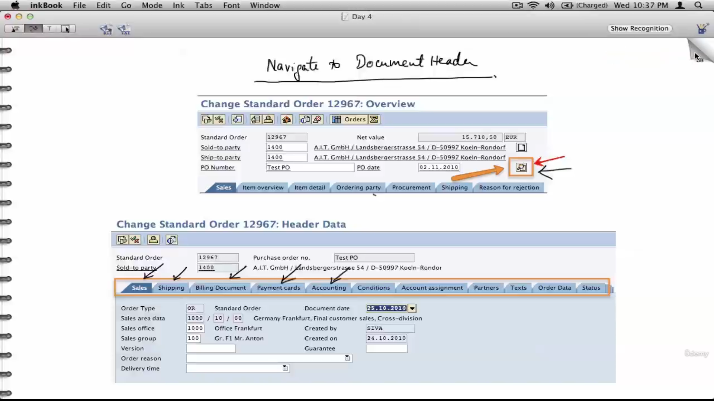
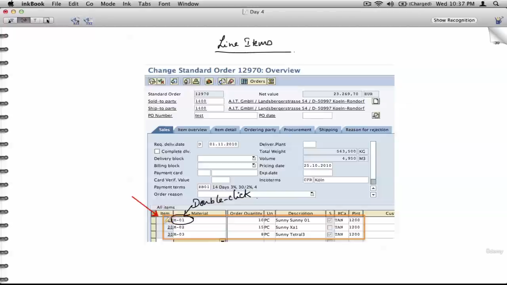
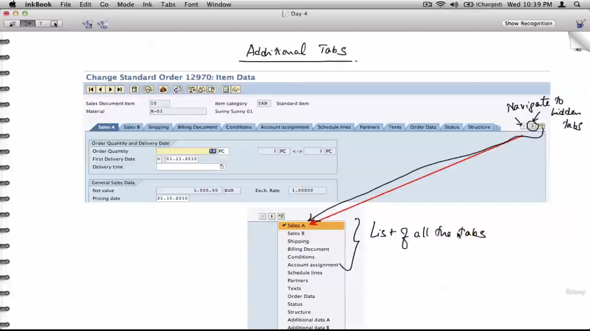
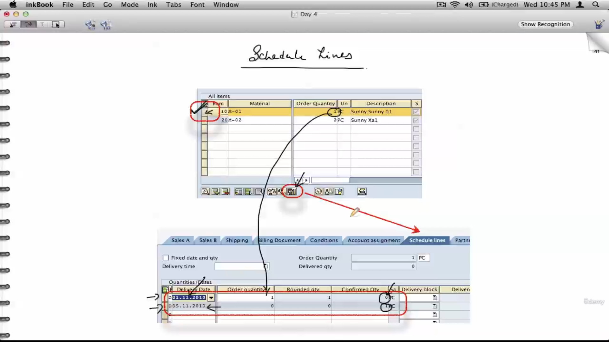
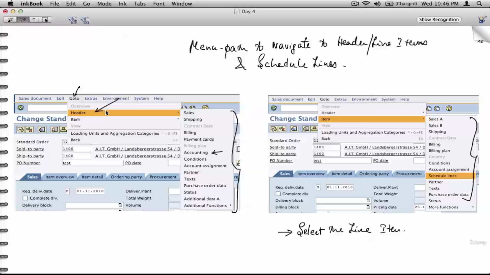
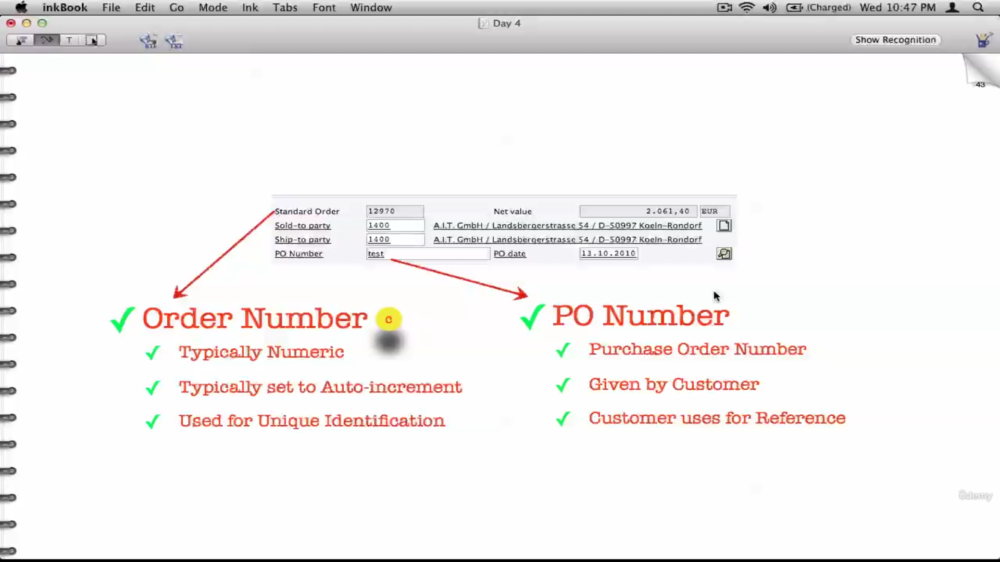
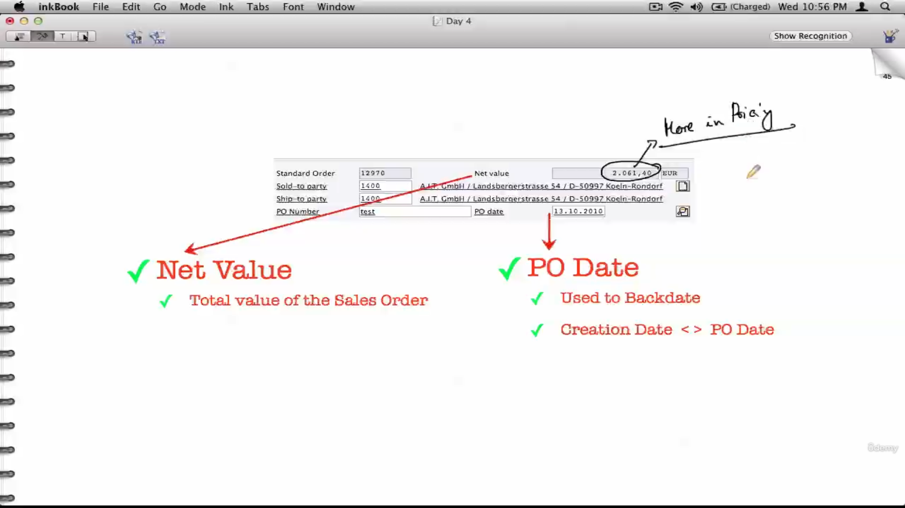

Sales Ducument

- Quotation
- Inquiry
- Sales Order
- etc..

Here Sales order has a header part, then it can have multiple line item, then those line item can have multiple schedule lines.

header button

to navigate to line item data

schedule lines - delivery schedule for the line items

