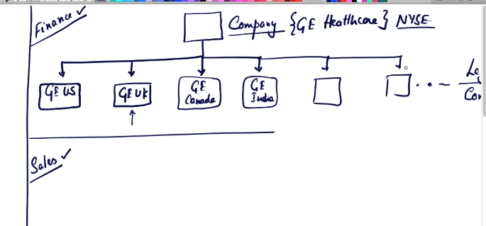
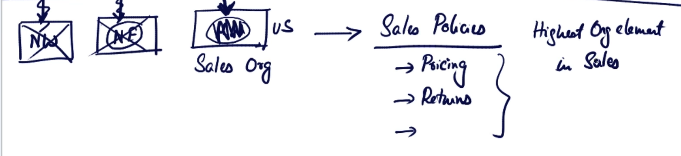
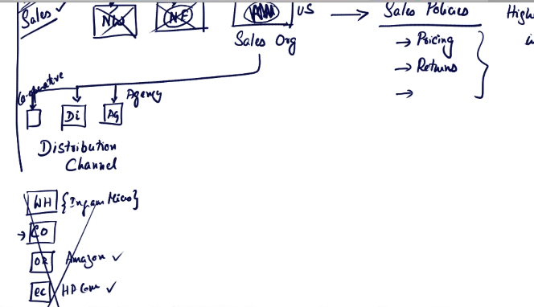
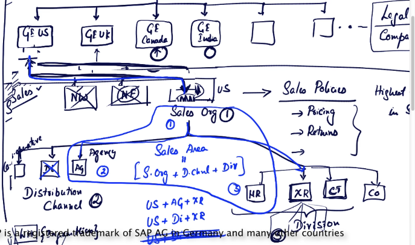
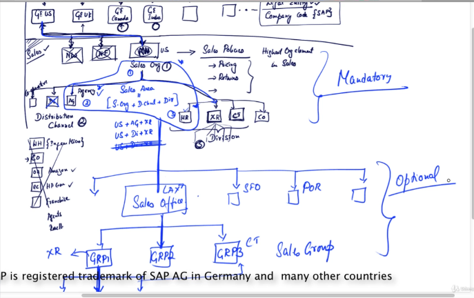

# 28

So in this chapter we're gonna start

learning about Enterprise Structure.

What is enterprise structure?

How do companies.

In the system.

Let me give you an example.

If you take the company GE, GE is a pretty big company, right?

So GE has GE healthcare,

GE lighting,

and say GE plastics.

There are many different companies inside GE, but let's just take one of these.

If you take GE Healthcare, GE Healthcare is again, a global company,

meaning it does business in the US, it does business in the UK,

Canada, India,

Singapore, and so on.

Now, if you take the US company.

The US company has sales offices on the west coast.

Because there are hospitals on the west coast.

There are hospitals in the midwest.

There are hospitals on the east coast.

In the south.

So on and on.

And each sales office contains a whole bunch of groups of people.

You know, some people doing a certain line of business.

[COUGH] Salesman, say in Rob's group,

does only capital equipment, meaning all the big stuff, right?

Like X-ray machines or MRI machines and so on.

Capital equipment.

Steven's group

does consumables.

Meaning an x-ray equipment requires some tissues, some tubes, or

something that's consumed just for that particular X-ray, for that patient.

That's a consumable.

A syringe is an example of a consumable; a tube is an example of a consumable.

You see, the entire company is structure in a certain way, you know, in terms

of where it's operated, how many different sales

orgs it has, or sales offices it has.

And in each sales office, how many different groups of sales reps are there.

And of course underneath it, there are so many different sales reps.

Right?

Selling the product.

This is one part of it.

Another part is, I'm just taking US, just for the sake of simplicity.

Another part is, maybe there's

a manufacturing plant somewhere in Wisconsin.

So in Wisconsin, so this is a manufacturing plant.

So in Wisconsin, there is a plant or a factory, it could be one or more than one.

You know, one of these factories is producing capital equipment, another

producing consumables, another producing spare parts, so on and so forth.

So, each factory will have or can have so many different warehouses.

You know, one warehouse in Milwaukee.

One warehouse in Waukesha, one warehouse in Brookfield.

There just different cities that might have in all

different warehouses that store the goods that these factory produces.

And when you're shipping say, for example, spare parts for

an x-ray machine, they could be shipped out of Brookfield.

And when you're shipping an x-ray machine, the entire

machine itself, it could be shipped out of Milwaukee.

And say if you're shipping some consumables,

it could be shipping out of Waukesha.

All right.

So, what I'm trying to say here, the

company runs its business using different org structures.

In this case each country represents a company.

Because if GE Healthcare wants to do business in Singapore, it has to go

set up a legal office there and do there business, so it's company.

Where the profit and loss, the balance

sheets, assets, liabilities, are maintained at this level.

And further downstream, company has plans.

One or more than one.

Company has warehouses.

Company has sales offices Since office, company has expenses around offices.

Company has manufacturing expenses.

Company is structured in a certain

way to represent the structure

of the company, entire GE or

G healthcare, in SAP is done

wire, enterprise structure.

So this is the definition of enterprise structure

# 29

An enterprise structure from the perspective of SD has three parts.

From the perspective, and as the consultant.

This is Finance.

Okay.

This rectangle is Finance,.

And this is sales and

this is logistics.

Finance, sales, logistics.

Now for a consultant working on a MM, he's more focused on logistics.

A finance consultant, he's worried about more elements in finance.

More operative and organizational elements in finance.

The reason why I'm saying we need to know a bit about finance, and sales, and

logistics is, when you perform a sale, the sale has to be accounted for in finance.

And the sale has to be done using the sales elements.

And the sales has to be delivered using logistics.

So all these three functional areas come together, when you represent

name price structure of the company that's relevant for, and as the consultant.

As [UNKNOWN] consultant, you should know a little bit of finance AG elements, a

little bit of sales AG elements, and a little bit of logistics AG elements.

In this chapter, we are gonna focus on

the financial element, or the financial AG elements.

Now I'm using the word AG element.

What's an AG element?

I'll give you a very, very rough example.

If a bank, say Bank of America,

is writing an application for online banking,

it will represent in its code within its system the major elements, right?

How is the bank structured?

[UNKNOWN] what are the branches.

Because a customer can make a transaction in a branch.

And we should represent that branch in the system.

Okay, this is the Boston downtown branch.

Or the Houston midtown branch.

Let's say you're a hiding [UNKNOWN].

And you have privileged banking with Bank of America.

Which privileged banking manager or group of people responsible

for dealing with privileged banking, has done your transactions.

So, who is the sales manager who has done the transaction for you.

And the list goes on and on, the point being.

We are trying to capture the major elements,

within which, we are trying to do the transaction.

We are trying to do a transaction in

a branch, with our sales manager, and the details

from that point on, could be very bank

specific, so we're not here to talk about that.

The reason why I gave you this example, is

so that you understand that when you do a transaction.

When a customer comes to us and does a

transaction, in case were are GE medical systems or healthcare.

And the customer comes to us, and we create a sales order for him.

We have to say.

Okay, we have created a sales order for this customer in this company.

We have to represent the company in the system, right.

Are we doing it in Singapore, or are we doing it in U.S.

or UK, and who has done it, and what channel will be used to sell.

The goods to the customer.

These are all, the different AG elements.

These are not real, physical entities, sometimes.

For example, a plant is a physical entity.

It exists, but a sales group, it's really virtual, right?

It doesn't exist.

It's a group of people, that we're calling as an AG element.

Most fo the time, it's, it's a

virtual grouping or virtual representation of certain things

that are required to run your business, and report on that part of a business.

Now, in a subsequent section, where I'm gonna talk about.

What really is the use of enterprise structure?

But up until then, let's really go through

the definitions of all the different AG elements, and

create them in the system, before we really go

and understand the philosophy behind why SAP asks us.

To do enterprise structure definition.

Let me erase this.

We have so much to do in finance.

Okay.

So, in finance there are three or four

different AG element that are important for SD consultants.

But at this point, I'm only going to focus on two items.

Or rather one and then another we'll see next time.

The top most AG element

is called a company.

In the case of G health care this will be GE Healthcare.

This is the company that reports the profits.

At the end of the quarter or at the end of the year, and this is the

company for which there is a stock ticker, the trades in public, so on and so forth.

Everything rolls up to this entity, in the US.

That doesn't mean, that GE Healthcare doesn't

do business in India, or Africa or Australia.

Does business there, and all the profits are rolled

up to this entity in the U.S called GE Healthcare.

It could be public limited, it could be a private company, it doesn't matter.

Underneath that, we have the actual legal entities, that are boon in the business.

For example, so this piece, GE US.

So this is a legal entity that's doing business.

In the US ask g health care.

The, this is GE, UK.

Same company but in the UK it has to operate

in a in the legal restraints of that particular country.

It has to show it's books.

The country's tax men, whenever there is an

audit, it has to be shown to the respective

officials or all the sales for that country,

if you wanted a board on top of it.

Everything is at this level.

So same with GE Canada.

So there's a GE Canada,

right.

GE India,

GE Singapore.

The list goes on and on and on.

Most of the time, every country that the, that the company

operates in, has to have a legal entity in that country.

So, the typical you know colloquial name for this is called legal entity.

And in SAP terms.

This is called company

code.

So this is what SAP calls it.

You could call it a company code in SAP, but outside of SAP,

if you talk to the general business, they call it a legal entity.

So what's a legal entity?

A legal entity, is how a company is represented in the books.

And that representation needs to be done SAP as well.

So GE US is represented in SAP as a company code.

And GE UK is also represented in the system as a company code.

So from the finance section of enterprise structure.

This is your focus, cuz you almost never deal with this.

The company, very rare.

You will never have to deal with it.

For all practical purposes, company code is what you'll be dealing with.

Every bit of configuration that you do, with respect to finance,

whatever little that you do, is always with the company code.

There are some other arguments that we'll talk

about when we come to the respective ideas.

All right, so in finance, the main AG element is the company code.

It also called an eagle entity and that's, that's

how a company is represented in the books and

in the system, and all accounting is done at

the company hold level, not at the company level.

But always the company code level.

This is the AG element at which S-A-P does accounting at the highest level.

# 30

All right.

In the previous chapter, we have talked

about the finance part of enterprise structure.

Now we're going to look at the sales part of enterprise structure.

At the top we have what is called as a sales org.

Sales org.

Okay.

What is a sales org?

A sales org represents the

sales policies that are

implemented in that geography or that zone.

For example, [COUGH] let us take GE US.

Okay?

GE US is the company code for which we

are trying to create all these different sales orgs.

So, a sales org falls under a company code.

Meaning, the sales org is associated to a company code.

Meaning, the sales org exists for that company code.

More than one sales org can exist for a company code.

For example, GE US can divide their entire sales in the US.

US.

As say Midwest Northeast

Northwest, and so on.

So, that's one way of defining it.

By geography.

There are multiple ways of defining it but before

we get to that, why are we doing this division?

What's the advantage?

Let me give you one simple example.

Say GE US does business in Midwest say

a bit differently than it does in the Northeast.

For example, when I talk about sales policies, pricing is one example.

Meaning, the prices in the Midwest are

different than the prices in the Northeast.

Possible, right?

Typically, most of the US has the same

price list for most companies, but sometimes it's possible.

It's possible that different geographies have pricing policies.

Say for example, In the midwest, returns are

allowed on capital equipment, whereas in the northeast.

Terms are not allowed, maybe replacements are done.

So these are all examples of policies, sales policies, and sales

org is used to define a set of

policies that apply to their sales returns of any kind of sale transaction.

Now it need not always be the case that one country has more than one sales org.

Either by geography or by any other parameter.

Most of the cases, one company called almost always

has one sales org in all practical scenarios, but

SAP allows you to have more than one sales org per company code.

It's up to you.

But like I said, typically one sales org per company code.

Okay.

Now, what is a sales org?

A sales org defines a set of policy that are to be used.

For there particulars geography or whatever kind of

division that you use to define that sales org.

If there were no Northwest, Northeast, or any other geographically divisions

through which you wish to implement your sales policies, you can have

an entire US as one sales org and all these

connections are gone and it's directly linked to your company called GE US.

So, US has one set of sales policies with respect to entire country.

So that's a sales org.

A sales org is the highest level org element.

So this is the highest org

element in sales.

Okay?

So because this, this part of the window is all sales.

So in sales, sales org is the apex structure.

Under it, we have two main divisions or two main sub structures.

The first one is called as a distribution channel,

distribution

channel.

What's a distribution channel?

Now think about g-medical systems.

When g-medical systems wants to sell an x-ray machine, what

are the difference channels through which it sells that x-ray machine?

It could do a direct sale.

Meaning it could directly go to hospitals or

diagnostic centers and sell this equipment to them.

Or it could do let's say, agency sale.

Let's say AG, where

there are agencies that resell this medical equipment and GE

sells to that agency and that agent sell it to a hospital or a diagnostic center.

It could do it via corporated networks.

You know networker hospitals buying on behalf of the bad hospitals.

Right?

So there're different channels through which they distribute they goods.

Now if you take a computer, that, that's probably more relevant.

If you take a computer, a laptop, HP sells a laptop.

And what are the different distribution

channels through which we sell our laptops?

Examples could be wholesale, meaning you know what a company like say Ingram Micro.

Right?

Ingram Micro which is a distributor of computer goods.

Buys them in wholesale and sells them to different customer and companies.

That's one channel.

Another channel is corporate, where, say a company, a big company

wants to purchase laptops for their in-house consumption, for their employees.

So HP goes and makes a deal with this company.

That is a corporate company, right?

So that channel is a corporate channel.

And then HP can send the same computer on Amazon.

Right?

That's online retail or e-commerce.

HP can also sell their site on HP.com.

That is e-commerce or online, whatever, as opposed to a third party online system

like buyer.com or amazon.com they could sell

it on their own website via e-commerce.

Right?

And they could sell it as a franchise

or they could have agents.

They could have re-sellers.

These are all the different distribution channels

through which HP actually sells their laptop.

Now in the case of HP, it makes sense that it has

a whole bunch of distribution channels like that because its a mass product.

But with a product like an x-ray machine, not everybody buys it.

Right?

Only hospitals, diagnostic centers buy x-ray machines, and of

course the network through which they sell their products

is not as wide as, say, HP selling a

laptop, they only have one, two, or three different channels.

So the channel through which the sale

is made is called, it's a distribution channel.

So, each sales org in the US for example you're gonna have more than one

distribution channel and the second key part to a sales org is the division.

Again, you can have more than one divisions.

This is called a division.

D-I-V-I-S-I-O-N.

What is a division?

A division represents a group of products.

From the perspective of GE Medical Systems,

there could be any number of x-ray machines,

you know, all the different configurations, different

power ratings, you know, different kinds of exclamations.

For example, a dental x-ray is different from a whole-body x-ray verses a

lower arm x-ray, verses an x-ray that's done only for the fingers.

You know, these are all different x-ray machines.

They have different form factors.

Their uses are different.

But, if you wanna group them all together, and say

which division does all these ten different extinguishings belong to?

It's x-ray.

So a division is a grouping of different

products, a set of products rather, into one parameter.

And why would we wanna do that?

We're gonna talk about that at a later point.

But, you understand this point right?

You group different products into one, based on some kind of a commonality.

All x-ray machines common with exited division.

Maybe you want to do accounting differently for

x-rays, comprising differently for x-rays, maybe report all

x-ray sales for all the ten different machines

underneath it into one division and so on.

The users of the month.

Endless.

Similarly, it can have CT scanners and then,

again, there are ten different types of CT scanners.

One for the brain, one for the whole body, so on.

And all of them are grouped together into one org element called a Division.

In this case, CT Division.

And MRI, one of the divisions, and consumables is another division.

We only sell consumables, we don't sell capital equipment.

Right?

So a division is an argument that

represents a grouping of products for the purpose

of pricing, for the purpose of reporting,

or for the purpose of other operational efficiencies.

If you are to do it for HP.

HP would have divisions like Laptop Divisions.

And inside Laptop there are a whole bunch of

materials that could come under the umbrella of a laptop.

An example, the Inspiron model.

Or HP could have ten different types of laptops and

all of them could come under the division of Laptops.

Same with desktops, same with printers or scanners, and

any other kind of broad classification of products that

they wanna do or their line of products classification

of their line of products is called a division.

Okay.

So we have three org elements that we have seen here.

Sales org, distribution channel.

Right?

And division.

Now, as sales org plus distribution channel

plus division

so 1, this is 1, 2, and 3.

This combination is called as a sales agent.

And this is purely an inhibitor it doesn't have any significance outside of it.

Don't think of sales area as the sales

area of that sales people that can think of.

This is my domain this is my territory, this

is my sales district this is my sales area no.

It's not that.

There is another term for it calls sales district or sales region that

you can use at the customer master level or the transaction level that's different.

That's typically the sales area that sales consultants think of, but

this sales area is an SAP specific term,

which signifies or represents a combination of one sales

org, one distribution channel, and

one division.

For example in this case, sales org US

plus agency plus x-ray could be one sales area.

Sales org US plus direct sale plus x-ray could be another sales area.

And the number of combinations could go on and on and on.

Why do we do this?

Because not all combinations are really relevant.

For example, in the US, maybe direct sales is not done for x-ray machines.

In which case, you don't use this

combination US plus direct sales plus x-ray machine.

May be this is not relevant.

So all combinations in which you actually perform a sale have

to be created as what is called as a sales area, which

is an SAP specific term that signifies a sales org and a

distribution channel and a division for which a sale can be done.

So, we have learned three things here.

Sales org, distribution channel, division.

And we have seen that, that distribution channel

is really something that falls under a sales org,

and there can be more than one distribution

channel under a sales org, and same with divisions.

There can be more than one division associated with a sales org.

And a combination of sales org plus distribution channel plus division

is called as a sales area, and we have also talked about why we do a sales area.

And on top of that, we have seen that

sales org is really linked to a company code.

In the next chapter, we're going to talk

a little bit about sales offices and sales groups.

That's going to be a small chapter.

Then, we're going to move on to logistics.

# 31

We're gonna continue our discussion of sales so we

know sales are distribution channel and division former sales area.

These are the primary org elements in the sales part of.

The enterprise structure.

There are two more org elements that you

should be knowing about, which is sales office.

A

sales office is associated with a sales area.

And there can be more than one sales areas, per sales office.

[BLANK_AUDIO]

So, what does a sales office represent?

A sales office, typically represents a virtual or

a real office, where sales is being performed.

For example, USG medical assistance for a

combination of agency and MRI could have one

sales office in Los Angeles, one sales office

in S-F-O, San Francisco, one sales office in.

Portland.

And one sales office in San Diego for all West Coast sales.

And then they could have more on the East Coast.

Now for a company like Facebook now, it need not be geographic.

They could have sales offices all in one place.

Where they really want to do different divisions, meaning you know, one sales

office for all ad revenues coming from convention companies.

One sales office dealing with all ad revenues coming from.

Say e-commerce companies and they could have one sales

office only looking at potential you know new clients.

So it need not always be geographic, it could be by-line of business, it could be.

By channel or it could be any way that business seems fits.

The key point to learn here is that a sales office represents.

A group of people, okay?

A sales office over here in this case, say, the Los Angeles sales office

represent a group, or more than one group, right?

This group is a group, group one.

GRP1 and this could be GRP2 and this could be GRP3.

So these different groups of people, each group could be responsible.

For, say, in this case, group 1 could be responsible for

all x-ray sales and it has three different sales people here.

Or salespeople, salesperson one, salesperson two, and salesperson three.

Say.

Bob, Steven, and, and Mary.

So all these three sales persons, or sales guys, could be

in one sales group, and Mary, for example, could be in this sales group, as well as.

CT sales scope.

You know if her specialization is both x-ray as well

as CT, she could be part of both these sales groups.

Once again, there is a sales office, which

could represent a physical structure or it could

represent a virtual structure through which they want

to, they want to structure or channel their sales.

And it's assigned to a sales office.

So, a sales office is assigned to a sales area and.

Underneath each sales office there can be more than one sales group.

And each sales group could have more than one sales person.

So this is the last set of hierarchy, sales office and sales group.

And typically these are optional, meaning you don't need to have

a sales office, you don't need to have a sales group.

But these elements, the sales org

distribution channel and division, these are mandatory.

These are required.

Sales Org, distribution channel, division, these are required.

This is optional.

Don't need to have it, if you want more reporting.

You can have it, if you don't need that

level of reporting, you can just not use it.

All right, in the next chapter, we'll be moving on to logistics.

So, we're gonna.

# 32

So the last piece to the definition of enterprise structure is logistics.

So in logistics, at least for us as consultants, the top org element is the plant.

So what is a plant?

So a plant.

A plant is a place where goods are manufactured.

So what about service companies?

Do they need a plant?

Yes, they do need a plant.

So a plant is much more than a place where goods are manufactured.

A plant is a place where goods are evaluated, services are performed.

So for a company that's doing car repair, there could be multiple plants in the city.

For example, one in a particular downtown part or another in one of the suburbs where service is performed.

So a plant is a place where services are performed or goods are manufactured or both?

Of course.

And sometimes for services where that are not really physical in nature, for example, car service

is a little physical in nature.

What about a law firm?

Does it need a plant?

Yes, it does need a plant.

What about a software services company like Microsoft?

Does it need a plant?

Yes, it needs a plant.

So now how do we define a plant?

A plant is a place where you can manufacture goods or perform services, or you just want to evaluate

all the services that are performed under a single head.

In the case of a software services company is just an aggregation of all the costs that go into that

software services being performed, let's say, for us.

So from the perspective of valuation, a plant is a very important element.

And the plant is associated with a company called Now One plant can be associated to one company called

only, meaning Gus can have more than one plant.

Plant one.

Plant two.

So plant 1 in 1 location.

Plant two in another location.

Plant three in another location.

But one plant cannot be linked to more than one company code.

Meaning this plant cannot be linked to both US and UK.

That's not possible.

But one company code can have more than one plant, so it's a kind of a ownership thing.

So one plant plant is like an asset.

This head or the company can have this asset listed under it, but this asset cannot be listed under

both.

This company code as well as this company code.

Right.

I hope it makes sense.

So that's a plant.

And underneath the plant we have what is called as a storage location.

So think of storage location as an aggregation of a warehouse.

This is storage location two.

This is storage location three and so on.

So what's a storage location?

A storage location is where goods of different types are stored.

So one storage location could be used for returns.

Another storage location for broken items, another storage location for unrestricted goods.

Or you can have everything under one storage location, but instead underneath this storage location

and a plant, there could be more than one warehouse.

Warehouse.

One warehouse, two.

Warehouse three.

And so on.

Now, I'm not going to talk about warehouse because it's not really super important at this point,

but I want you to stop at the storage location and this is your least Aug element with respect to logistics.

First there is plant and then there is storage location for all practical purposes.

Think of a storage location as a warehouse.

So a plant has multiple warehouses.

It could be one or more than one.

One last piece of assignment is that the sales org and distribution channel combination can be assigned

to a plant.

So the combination of sales org plus distribution channel can be assigned to a plant.

Now that assignment.

Now that's one of the weird assignments that you need to do.

But other than that, most of the assignments are pretty simple.

Plant to a storage location.

Plant to a company code.

Company Code to sales.

Org.

Sales.

Org to distribution channel Sales.

Org to division.

And a combination of sales.

Org distribution channel and division is called as a sales area and the sales area is assigned to a

sales office.

Sales office is assigned to a sales group and sales group has a whole bunch of people there.

This is enterprise structure.

So in the next set of chapters, we are going to actually create these structures in the system as configuration

using a sample template.